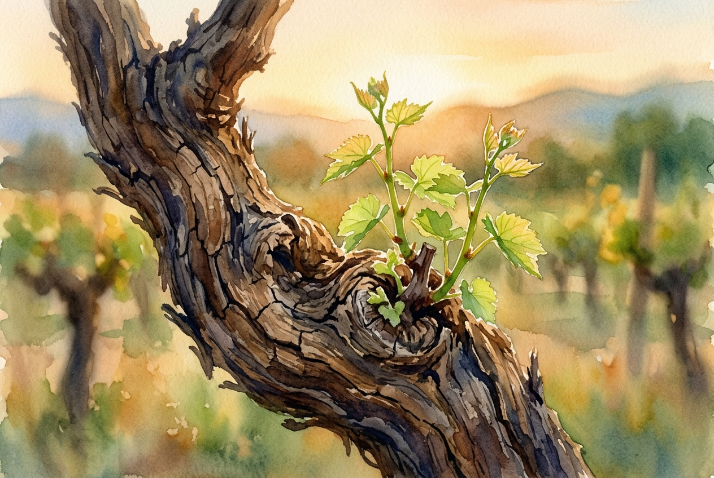

# Daily Reading: John 15:1-11

*April 30, 2026*

> *(Image: A close-up of a weathered grape vine trunk in the soft golden hour light, with vibrant green shoots emerging from the ancient wood.)*

## The Reading (NLT)

**John 15:1-11**

> 1 I am the true grapevine, and my Father is the gardener. 2 He cuts off every branch of mine that doesn't produce fruit, and he prunes the branches that do bear fruit so they will produce even more. 3 You have already been pruned and purified by the message I have given you. 4 Remain in me, and I will remain in you. For a branch cannot produce fruit if it is severed from the vine, and you cannot be fruitful unless you remain in me. 5 Yes, I am the vine; you are the branches. Those who remain in me, and I in them, will produce much fruit. For apart from me you can do nothing. 6 Anyone who does not remain in me is thrown away like a useless branch and withers. Such branches are gathered into a pile to be burned. 7 But if you remain in me and my words remain in you, you may ask for anything you want, and it will be granted! 8 When you produce much fruit, you are my true disciples. This brings great glory to my Father. 9 I have loved you even as the Father has loved me. Remain in my love. 10 When you obey my commandments, you remain in my love, just as I obey my Father's commandments and remain in his love. 11 I have told you these things so that you will be filled with my joy. Yes, your joy will overflow!

## The Story

In ancient agrarian societies, the cultivation of vineyards was a familiar and vital rhythm of life. Tending a vineyard required intimate knowledge of the plants, careful attention to the seasons, and a willingness to cut away dead or overgrown wood. This agricultural imagery serves as a powerful metaphor for the relationship between the divine and humanity. The health of a branch depends entirely on its unbroken connection to the main trunk, drawing all its water and nutrients from that single source. Left to itself, a severed branch quickly loses its vitality, but an attached branch, even when subjected to the sharp shears of the gardener, is being prepared for a heavier harvest.

## Application for Today

We often measure our lives by our independent achievements, striving to produce results through sheer willpower. Yet this passage invites us to shift our focus from frantic production to quiet connection. Growth sometimes feels like loss, especially when comfortable habits or old ways of thinking are stripped away. This pruning process is not a punishment, but a necessary preparation for deeper vitality. When we prioritize staying rooted in divine love, our actions naturally flow from that secure place. The ultimate purpose of this enduring connection is not merely obedience, but a profound and lasting joy that circumstances cannot easily shake.

---

*Scripture quotations are taken from the Holy Bible, New Living Translation, copyright © 1996, 2004, 2015 by Tyndale House Foundation. Used by permission of Tyndale House Publishers.*
