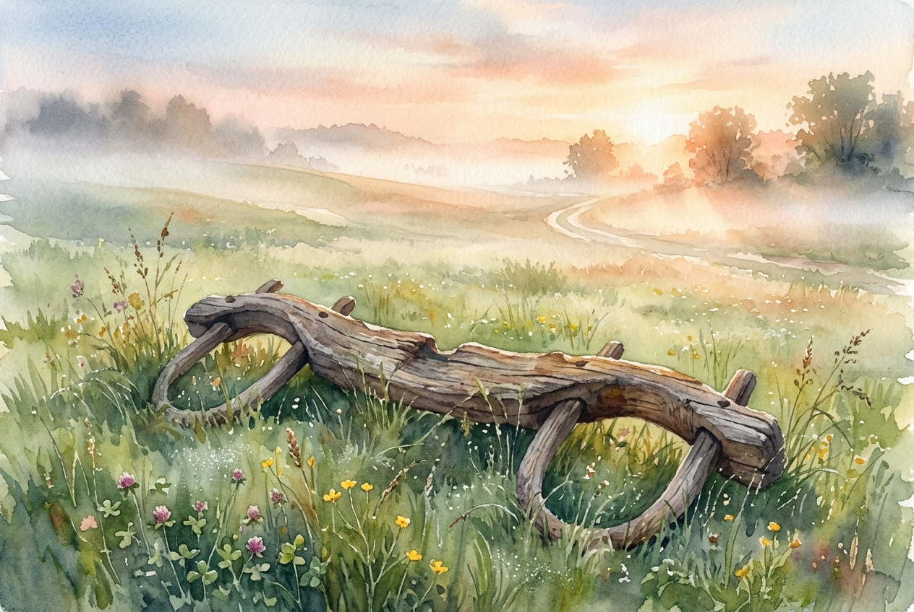

# Daily Reading: Matthew 11:28-30

*April 30, 2026*



> *(Image: A weathered wooden yoke resting gently in a sunlit grassy field at dawn with soft morning mist rolling across the landscape.)*

## The Reading (NLT)

**Matthew 11:28-30**

> Then Jesus said, Come to me, all of you who are weary and carry heavy burdens, and I will give you rest. Take my yoke upon you. Let me teach you, because I am humble and gentle at heart, and you will find rest for your souls. For my yoke is easy to bear, and the burden I give you is light.

## The Story

In the first-century agrarian world, a yoke was an everyday farming tool used to harness two animals together to pull a plow or cart. Religious leaders of the era also used this term metaphorically to describe their specific interpretations of the law. Over time, these interpretations accumulated layers of complex rules, making spiritual devotion feel like an impossible, exhausting labor. Ordinary people understood the physical ache of carrying loads that were simply too heavy to bear alone. Entering into a rabbi's teaching meant adopting their specific rhythm of life and carrying their theological weight. The invitation extended in this passage completely subverts that expectation of religious exhaustion. Instead of adding more demands, the teacher offers a shared harness characterized by profound gentleness.

## Application for Today

We still carry immense weight today, even if our burdens look less like heavy farm equipment and more like chronic anxiety, perfectionism, or the pressure to perform. It is easy to view spiritual life as just another task on our endless to-do list, a place where we must work hard to measure up. The beauty of this passage is the reminder that faith was never meant to be a crushing solitary endeavor. We are invited into a different way of moving through the world, one where the pace is set by compassion rather than relentless achievement. Sharing the load does not mean our responsibilities disappear, but it changes how we carry them. By aligning our lives with a humble guide, we can find a deep, sustaining peace that reaches the very core of who we are. We can finally stop trying to pull the plow all by ourselves.

---

*Scripture quotations are taken from the Holy Bible, New Living Translation, copyright © 1996, 2004, 2015 by Tyndale House Foundation. Used by permission of Tyndale House Publishers.*

## Behind the Scenes: The AI Data

For curiosity: the JSON the generator received from the text model and the prompt used for the image.

```json
{
  "reference": "Matthew 11:28-30",
  "passage": "Then Jesus said, Come to me, all of you who are weary and carry heavy burdens, and I will give you rest. Take my yoke upon you. Let me teach you, because I am humble and gentle at heart, and you will find rest for your souls. For my yoke is easy to bear, and the burden I give you is light.",
  "story": "In the first-century agrarian world, a yoke was an everyday farming tool used to harness two animals together to pull a plow or cart. Religious leaders of the era also used this term metaphorically to describe their specific interpretations of the law. Over time, these interpretations accumulated layers of complex rules, making spiritual devotion feel like an impossible, exhausting labor. Ordinary people understood the physical ache of carrying loads that were simply too heavy to bear alone. Entering into a rabbi's teaching meant adopting their specific rhythm of life and carrying their theological weight. The invitation extended in this passage completely subverts that expectation of religious exhaustion. Instead of adding more demands, the teacher offers a shared harness characterized by profound gentleness.",
  "lesson": "We still carry immense weight today, even if our burdens look less like heavy farm equipment and more like chronic anxiety, perfectionism, or the pressure to perform. It is easy to view spiritual life as just another task on our endless to-do list, a place where we must work hard to measure up. The beauty of this passage is the reminder that faith was never meant to be a crushing solitary endeavor. We are invited into a different way of moving through the world, one where the pace is set by compassion rather than relentless achievement. Sharing the load does not mean our responsibilities disappear, but it changes how we carry them. By aligning our lives with a humble guide, we can find a deep, sustaining peace that reaches the very core of who we are. We can finally stop trying to pull the plow all by ourselves.",
  "tags": [
    "burnout",
    "grace",
    "peace",
    "rest",
    "trust"
  ],
  "image_prompt": "A weathered wooden yoke resting gently in a sunlit grassy field at dawn with soft morning mist rolling across the landscape."
}
```
