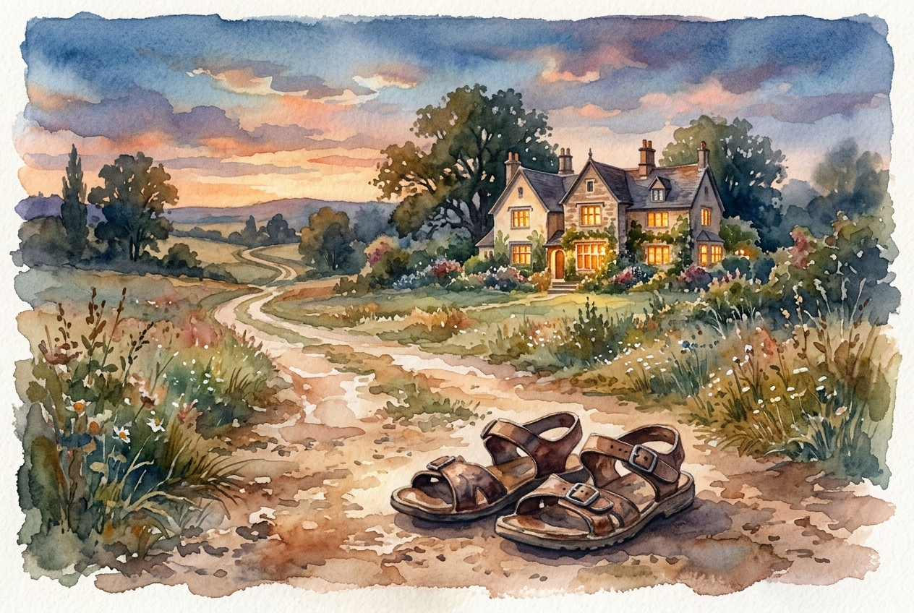

# Daily Reading: Luke 15:11-32

*April 30, 2026*

> *(Image: A pair of worn leather sandals rests on a dusty path leading toward a brightly lit estate under a twilight sky, symbolizing a long journey ending in a welcoming home.)*

## The Reading (NLT)

**Luke 15:11-32**

> 11 To illustrate the point further, Jesus told them this story: A man had two sons. 12 The younger son told his father, ‘I want my share of your estate now before you die.' So his father agreed to divide his wealth between his sons. 13 A few days later this younger son packed all his belongings and moved to a distant land, and there he wasted all his money in wild living. 14 About the time his money ran out, a great famine swept over the land, and he began to starve. 15 He persuaded a local farmer to hire him, and the man sent him into his fields to feed the pigs. 16 The young man became so hungry that even the pods he was feeding the pigs looked good to him. But no one gave him anything. 17 When he finally came to his senses, he said to himself, ‘At home even the hired servants have food enough to spare, and here I am dying of hunger! 18 I will go home to my father and say, Father, I have sinned against both heaven and you, 19 and I am no longer worthy of being called your son. Please take me on as a hired servant.' 20 So he returned home to his father. And while he was still a long way off, his father saw him coming. Filled with love and compassion, he ran to his son, embraced him, and kissed him. 21 His son said to him, ‘Father, I have sinned against both heaven and you, and I am no longer worthy of being called your son.' 22 But his father said to the servants, ‘Quick! Bring the finest robe in the house and put it on him. Get a ring for his finger and sandals for his feet. 23 And kill the calf we have been fattening. We must celebrate with a feast, 24 for this son of mine was dead and has now returned to life. He was lost, but now he is found.' So the party began. 25 Meanwhile, the older son was in the fields working. When he returned home, he heard music and dancing in the house, 26 and he asked one of the servants what was going on. 27 ‘Your brother is back,' he was told, ‘and your father has killed the fattened calf. We are celebrating because of his safe return.' 28 The older brother was angry and wouldn't go in. His father came out and begged him, 29 but he replied, ‘All these years I've slaved for you and never once refused to do a single thing you told me to. And in all that time you never gave me even one young goat for a feast with my friends. 30 Yet when this son of yours comes back after squandering your money on prostitutes, you celebrate by killing the fattened calf!' 31 His father said to him, ‘Look, dear son, you have always stayed by me, and everything I have is yours. 32 We had to celebrate this happy day. For your brother was dead and has come back to life! He was lost, but now he is found!'

## The Story

Jesus shares this narrative in response to religious leaders who criticized his habit of eating with societal outcasts. In first-century Middle Eastern culture, a younger son asking for his inheritance early was deeply offensive, essentially wishing his father dead. The father's response to grant the request breaks social norms, just as his later reaction to the returning son shatters expectations. Patriarchs of that era did not run, as lifting their robes would expose their legs and bring public shame. Yet this father sprints to embrace a son who has squandered everything, absorbing the shame himself to restore the boy to the family. Meanwhile, the older brother remains outside, revealing that physical proximity to the father does not guarantee alignment with his heart. The parable leaves the ending open, challenging the original listeners to decide if they will join the celebration.

## Application for Today

We often find ourselves resembling one of these two brothers. Sometimes we run away, seeking fulfillment in distant places and exhausting our resources until we feel entirely empty. Other times we stay close, fulfilling our duties but harboring resentment toward those who seem to receive grace without effort. The invitation of the father extends to both the rebellious wanderer and the self-righteous worker. He leaves the house to seek out both sons, offering a kind of grace that defies standard fairness. True restoration is not about perfectly earning our place at the table, but allowing ourselves to be found and embraced. We are invited to drop our pride, walk into the warmth of the feast, and accept the relentless love that welcomes us home.

---

*Scripture quotations are taken from the Holy Bible, New Living Translation, copyright © 1996, 2004, 2015 by Tyndale House Foundation. Used by permission of Tyndale House Publishers.*
