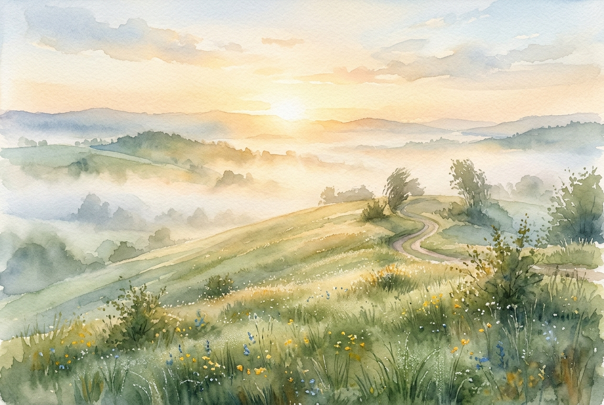

# Leitura Diária: Matthew 5:1-12

*1 de maio de 2026*



> *(Image: A serene landscape at dawn showing a gentle grassy hillside illuminated by soft golden sunlight breaking through morning mist.)*

## A Leitura (PT-NVI)

**Matthew 5:1-12**

> Vendo as multidões, Jesus subiu ao monte e se assentou. Seus discípulos aproximaram-se dele, e ele começou a ensiná-los, dizendo: "Bem-aventurados os pobres em espírito, pois deles é o Reino dos céus. Bem-aventurados os que choram, pois serão consolados. Bem-aventurados os humildes, pois eles receberão a terra por herança. Bem-aventurados os que têm fome e sede de justiça, pois serão satisfeitos. Bem-aventurados os misericordiosos, pois obterão misericórdia. Bem-aventurados os puros de coração, pois verão a Deus. Bem-aventurados os pacificadores, pois serão chamados filhos de Deus. Bem-aventurados os perseguidos por causa da justiça, pois deles é o Reino dos céus. "Bem-aventurados serão vocês quando, por minha causa os insultarem, perseguirem e levantarem todo tipo de calúnia contra vocês. Alegrem-se e regozijem-se, porque grande é a recompensa de vocês nos céus, pois da mesma forma perseguiram os profetas que viveram antes de vocês".

## A História

No mundo antigo, o poder, a riqueza e o status eram os maiores indicadores de uma vida bem-sucedida. Quando um mestre reuniu seus seguidores em uma encosta para anunciar a chegada de uma nova era, o público provavelmente esperava uma convocação militar ou uma promessa de domínio terreno. Em vez disso, a mensagem entregue naquele dia virou do avesso todos os padrões convencionais de sucesso. O orador identificou os esquecidos, os que choram e os gentis como os verdadeiros destinatários do favor divino. Este discurso na montanha serviu como o manifesto fundador de uma comunidade que operaria sob um conjunto de regras totalmente diferente. Foi uma declaração radical de que a presença de Deus se manifesta de forma mais profunda justamente entre aqueles que o mundo considera fracos ou derrotados.

## Aplicação para Hoje

Muitas vezes passamos nossos dias correndo atrás de conquistas, tentando construir uma vida blindada contra a dor e a vulnerabilidade. No entanto, este antigo ensinamento nos convida a parar de fugir da nossa própria fragilidade. Quando vivenciamos uma tristeza profunda, enfrentamos injustiças ou reconhecemos nossa própria pobreza espiritual, não estamos fracassando na vida. Pelo contrário, estamos exatamente no lugar onde a graça divina pode nos alcançar de maneira mais íntima. Adotar uma postura de misericórdia e paz em um mundo cruel pode parecer uma derrota pelos padrões da sociedade. Contudo, é precisamente nessa entrega silenciosa que descobrimos uma satisfação profunda e duradoura que a ambição sozinha jamais poderia proporcionar.

---

*Citações bíblicas extraídas da Nova Versão Internacional (NVI), © 1993, 2000 por Biblica, Inc. Usado com permissão.*

## Nos Bastidores: Os Dados da IA

Por curiosidade: o JSON que o gerador recebeu do modelo de texto e o prompt usado para a imagem.

```json
{
  "reference": "Matthew 5:1-12",
  "passage": "Vendo as multidões, Jesus subiu ao monte e se assentou. Seus discípulos aproximaram-se dele, e ele começou a ensiná-los, dizendo: \"Bem-aventurados os pobres em espírito, pois deles é o Reino dos céus. Bem-aventurados os que choram, pois serão consolados. Bem-aventurados os humildes, pois eles receberão a terra por herança. Bem-aventurados os que têm fome e sede de justiça, pois serão satisfeitos. Bem-aventurados os misericordiosos, pois obterão misericórdia. Bem-aventurados os puros de coração, pois verão a Deus. Bem-aventurados os pacificadores, pois serão chamados filhos de Deus. Bem-aventurados os perseguidos por causa da justiça, pois deles é o Reino dos céus. \"Bem-aventurados serão vocês quando, por minha causa os insultarem, perseguirem e levantarem todo tipo de calúnia contra vocês. Alegrem-se e regozijem-se, porque grande é a recompensa de vocês nos céus, pois da mesma forma perseguiram os profetas que viveram antes de vocês\".",
  "story": "No mundo antigo, o poder, a riqueza e o status eram os maiores indicadores de uma vida bem-sucedida. Quando um mestre reuniu seus seguidores em uma encosta para anunciar a chegada de uma nova era, o público provavelmente esperava uma convocação militar ou uma promessa de domínio terreno. Em vez disso, a mensagem entregue naquele dia virou do avesso todos os padrões convencionais de sucesso. O orador identificou os esquecidos, os que choram e os gentis como os verdadeiros destinatários do favor divino. Este discurso na montanha serviu como o manifesto fundador de uma comunidade que operaria sob um conjunto de regras totalmente diferente. Foi uma declaração radical de que a presença de Deus se manifesta de forma mais profunda justamente entre aqueles que o mundo considera fracos ou derrotados.",
  "lesson": "Muitas vezes passamos nossos dias correndo atrás de conquistas, tentando construir uma vida blindada contra a dor e a vulnerabilidade. No entanto, este antigo ensinamento nos convida a parar de fugir da nossa própria fragilidade. Quando vivenciamos uma tristeza profunda, enfrentamos injustiças ou reconhecemos nossa própria pobreza espiritual, não estamos fracassando na vida. Pelo contrário, estamos exatamente no lugar onde a graça divina pode nos alcançar de maneira mais íntima. Adotar uma postura de misericórdia e paz em um mundo cruel pode parecer uma derrota pelos padrões da sociedade. Contudo, é precisamente nessa entrega silenciosa que descobrimos uma satisfação profunda e duradoura que a ambição sozinha jamais poderia proporcionar.",
  "tags": [
    "consolo",
    "graça",
    "humildade",
    "paz",
    "reino"
  ],
  "image_prompt": "A serene landscape at dawn showing a gentle grassy hillside illuminated by soft golden sunlight breaking through morning mist."
}
```
