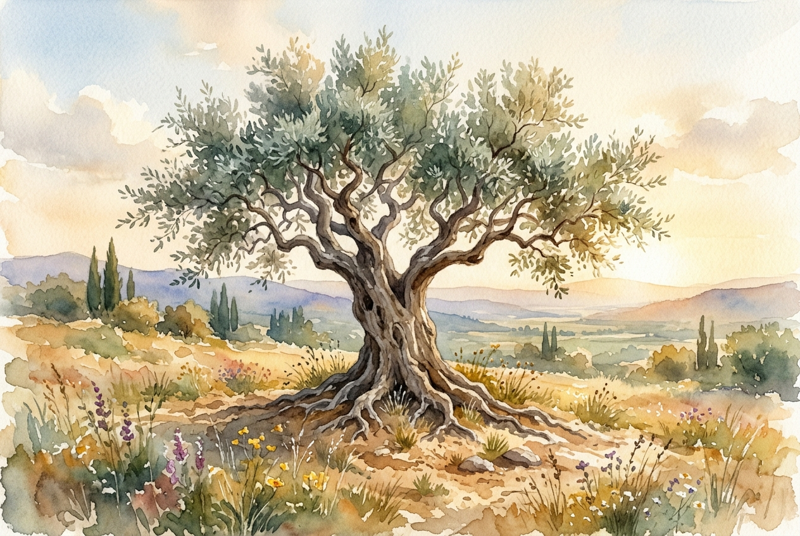

# Leitura Diária: 1 Corinthians 13

*2 de maio de 2026*

> *(Image: A solitary ancient olive tree standing strong in a quiet sunlit field, its deep roots and wide branches symbolizing enduring care and quiet strength.)*

## A Leitura (PT-NVI)

**1 Corinthians 13**

> 1 Ainda que eu fale as línguas dos homens e dos anjos, se não tiver amor, serei como o sino que ressoa ou como o prato que retine. 2 Ainda que eu tenha o dom de profecia e saiba todos os mistérios e todo o conhecimento, e tenha uma fé capaz de mover montanhas, mas não tiver amor, nada serei. 3 Ainda que eu dê aos pobres tudo o que possuo e entregue o meu corpo para ser queimado, mas não tiver amor, nada disso me valerá. 4 O amor é paciente, o amor é bondoso. Não inveja, não se vangloria, não se orgulha. 5 Não maltrata, não procura seus interesses, não se ira facilmente, não guarda rancor. 6 O amor não se alegra com a injustiça, mas se alegra com a verdade. 7 Tudo sofre, tudo crê, tudo espera, tudo suporta. 8 O amor nunca perece; mas as profecias desaparecerão, as línguas cessarão, o conhecimento passará. 9 Pois em parte conhecemos e em parte profetizamos; 10 quando, porém, vier o que é perfeito, o que é imperfeito desaparecerá. 11 Quando eu era menino, falava como menino, pensava como menino e raciocinava como menino. Quando me tornei homem, deixei para trás as coisas de menino. 12 Agora, pois, vemos apenas um reflexo obscuro, como em espelho; mas, então, veremos face a face. Agora conheço em parte; então, conhecerei plenamente, da mesma forma como sou plenamente conhecido. 13 Assim, permanecem agora estes três: a fé, a esperança e o amor. O maior deles, porém, é o amor.

## A História

A comunidade cristã em Corinto era vibrante, mas profundamente dividida e fascinada por status e habilidades espetaculares. Eles valorizavam discursos eloquentes, conhecimento profundo e demonstrações dramáticas de fé, frequentemente usando esses talentos para competir entre si. Paulo escreve a esse grupo fragmentado para mudar radicalmente o foco deles. Ele argumenta que até as realizações espirituais mais impressionantes são vazias se não houver um cuidado genuíno com o próximo. Ao descrever um caminho que abandona o ego e o interesse próprio, ele destaca a paciência, a bondade e a capacidade de suportar as adversidades. Essa foi uma redefinição profunda de valor para uma cultura obcecada por honra e reconhecimento público.

## Aplicação para Hoje

Muitas vezes medimos nosso valor por nossas realizações, nosso intelecto ou pelo impacto visível que causamos no mundo. No entanto, esta carta nos lembra que nossos maiores sucessos são temporários e perdem o sentido sem uma base de cuidado profundo e altruísta. A verdadeira maturidade envolve deixar de lado a necessidade de ter razão, de ser notado ou de ser a pessoa mais capaz do ambiente. Em vez disso, somos convidados a cultivar uma resiliência silenciosa que apoia os outros e celebra a verdade em vez da vitória pessoal. Embora nossa compreensão atual da vida seja limitada e fragmentada, a maneira como tratamos uns aos outros tem um significado eterno. O que realmente importa não é o que conquistamos, mas a profundidade do nosso compromisso com o bem-estar de quem está ao nosso redor.

---

*Citações bíblicas extraídas da Nova Versão Internacional (NVI), © 1993, 2000 por Biblica, Inc. Usado com permissão.*
