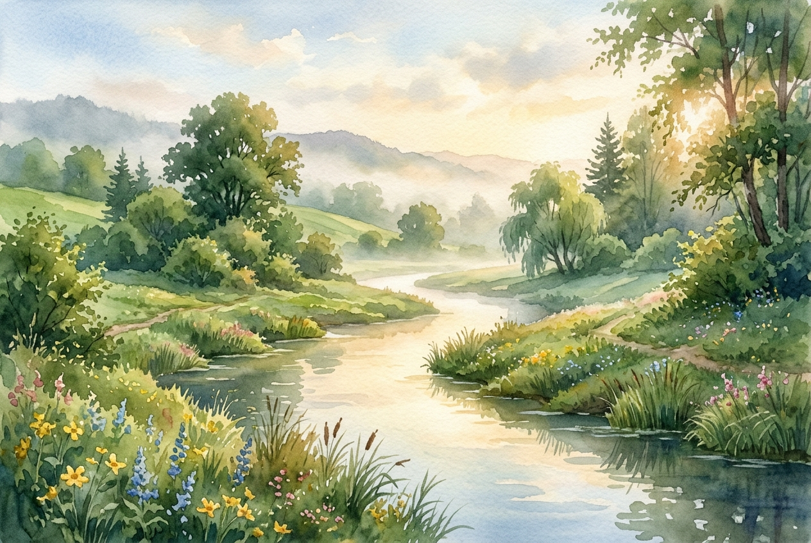

# Daily Reading: Psalm 23

*May 3, 2026*



> *(Image: A quiet, sunlit stream winding through a lush green valley, with gentle morning mist settling over the water.)*

## The Reading (NLT)

**Psalm 23**

> The Lord is my shepherd; I have all that I need. He lets me rest in green meadows; he leads me beside peaceful streams. He renews my strength. He guides me along right paths, bringing honor to his name. Even when I walk through the darkest valley, I will not be afraid, for you are close beside me. Your rod and your staff protect and comfort me. You prepare a feast for me in the presence of my enemies. You honor me by anointing my head with oil. My cup overflows with blessings. Surely your goodness and unfailing love will pursue me all the days of my life, and I will live in the house of the Lord forever.

## The Story

This ancient song was written by someone intimately familiar with the harsh realities of ancient Near Eastern agriculture. Shepherding was not a peaceful, romantic job; it involved navigating arid landscapes, defending flocks from predators, and constantly searching for scarce water and vegetation. The imagery of a guide providing rest, sustenance, and protection reflects a deep understanding of vulnerability in a dangerous world. The poem shifts beautifully from talking about the guide in the third person to addressing him directly as a host, emphasizing a transition from distant provision to intimate presence. It paints a picture of a journey that culminates not just in survival, but in a lavish, welcoming feast.

## Application for Today

We often navigate our own arid landscapes, feeling exhausted by the demands of life and the constant search for security. It is easy to view our journey as a solitary struggle against the elements. Yet, this text invites us to trust that we are not wandering aimlessly, but are being carefully led toward spaces of restoration. Even when our path descends into shadows and uncertainty, the presence of a faithful guide changes how we experience the darkness. We can find moments of quiet renewal and unexpected hospitality right in the middle of our difficulties. Trusting in this care allows us to rest, knowing that goodness and love are actively pursuing us.

---

*Scripture quotations are taken from the Holy Bible, New Living Translation, copyright © 1996, 2004, 2015 by Tyndale House Foundation. Used by permission of Tyndale House Publishers.*

## Behind the Scenes: The AI Data

For curiosity: the JSON the generator received from the text model and the prompt used for the image.

```json
{
  "reference": "Psalm 23",
  "passage": "The Lord is my shepherd; I have all that I need. He lets me rest in green meadows; he leads me beside peaceful streams. He renews my strength. He guides me along right paths, bringing honor to his name. Even when I walk through the darkest valley, I will not be afraid, for you are close beside me. Your rod and your staff protect and comfort me. You prepare a feast for me in the presence of my enemies. You honor me by anointing my head with oil. My cup overflows with blessings. Surely your goodness and unfailing love will pursue me all the days of my life, and I will live in the house of the Lord forever.",
  "story": "This ancient song was written by someone intimately familiar with the harsh realities of ancient Near Eastern agriculture. Shepherding was not a peaceful, romantic job; it involved navigating arid landscapes, defending flocks from predators, and constantly searching for scarce water and vegetation. The imagery of a guide providing rest, sustenance, and protection reflects a deep understanding of vulnerability in a dangerous world. The poem shifts beautifully from talking about the guide in the third person to addressing him directly as a host, emphasizing a transition from distant provision to intimate presence. It paints a picture of a journey that culminates not just in survival, but in a lavish, welcoming feast.",
  "lesson": "We often navigate our own arid landscapes, feeling exhausted by the demands of life and the constant search for security. It is easy to view our journey as a solitary struggle against the elements. Yet, this text invites us to trust that we are not wandering aimlessly, but are being carefully led toward spaces of restoration. Even when our path descends into shadows and uncertainty, the presence of a faithful guide changes how we experience the darkness. We can find moments of quiet renewal and unexpected hospitality right in the middle of our difficulties. Trusting in this care allows us to rest, knowing that goodness and love are actively pursuing us.",
  "tags": [
    "guidance",
    "peace",
    "provision",
    "rest",
    "trust"
  ],
  "image_prompt": "A quiet, sunlit stream winding through a lush green valley, with gentle morning mist settling over the water."
}
```
