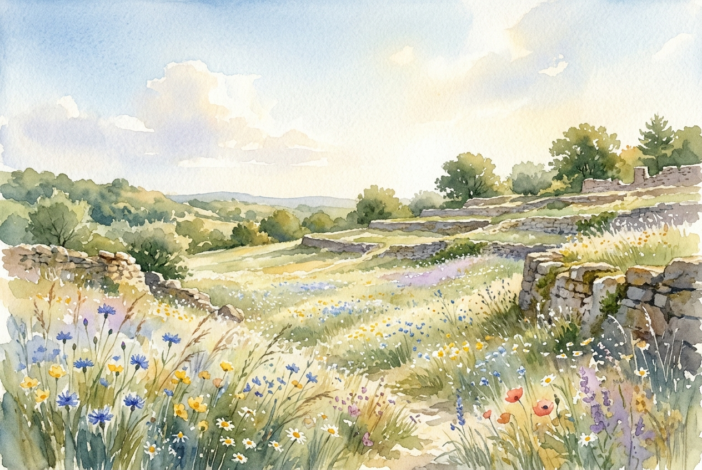

# Leitura Diária: Matthew 6:25-34

*3 de maio de 2026*



> *(Image: A serene, sunlit meadow filled with delicate wildflowers swaying gently in a morning breeze, framed by old stone terraces under a clear, vast sky.)*

## A Leitura (PT-NVI)

**Matthew 6:25-34**

> "Portanto eu lhes digo: não se preocupem com suas próprias vidas, quanto ao que comer ou beber; nem com seus próprios corpos, quanto ao que vestir. Não é a vida mais importante do que a comida, e o corpo mais importante do que a roupa? Observem as aves do céu: não semeiam nem colhem nem armazenam em celeiros; contudo, o Pai celestial as alimenta. Não têm vocês muito mais valor do que elas? Quem de vocês, por mais que se preocupe, pode acrescentar uma hora que seja à sua vida? "Por que vocês se preocupam com roupas? Vejam como crescem os lírios do campo. Eles não trabalham nem tecem. Contudo, eu lhes digo que nem Salomão, em todo o seu esplendor, vestiu-se como um deles. Se Deus veste assim a erva do campo, que hoje existe e amanhã é lançada ao fogo, não vestirá muito mais a vocês, homens de pequena fé? Portanto, não se preocupem, dizendo: ‘Que vamos comer? ’ ou ‘que vamos beber? ’ ou ‘que vamos vestir? ’ Pois os pagãos é que correm atrás dessas coisas; mas o Pai celestial sabe que vocês precisam delas. Busquem, pois, em primeiro lugar o Reino de Deus e a sua justiça, e todas essas coisas lhes serão acrescentadas. Portanto, não se preocupem com o amanhã, pois o amanhã se preocupará consigo mesmo. Basta a cada dia o seu próprio mal".

## A História

No mundo antigo, garantir as necessidades diárias era uma tarefa constante e exaustiva. A maioria dos primeiros ouvintes era composta por camponeses e trabalhadores braçais que viviam no limite da subsistência. Para eles, a ansiedade em relação ao sustento não era um debate filosófico, mas uma dura realidade diária. O ensinamento aponta para o mundo natural, especificamente os pássaros e as flores silvestres, não para romantizar a escassez, mas para reorientar a perspectiva da multidão. O texto destaca a dignidade e o imenso valor que a humanidade tem aos olhos do Criador. A ordem natural é apresentada operando sob o cuidado divino, livre do peso esmagador da ansiedade humana.

## Aplicação para Hoje

É muito fácil deixar a mente correr solta em direção às incertezas do futuro. Muitas vezes, carregamos os fardos do amanhã ainda hoje, esgotando nossas forças antes mesmo de os problemas reais chegarem. O convite é para abrirmos mão do controle sobre aquilo que não podemos mudar e descansarmos no cuidado sustentador de Deus. Isso não significa fugir das nossas responsabilidades, mas sim realinhar nossas prioridades. Ao buscarmos primeiro um relacionamento íntegro com o divino, encontramos uma âncora que permanece firme, independentemente das circunstâncias externas. Somos chamados a viver plenamente a graça que nos é dada hoje, com a certeza de que o amanhã trará consigo a mesma provisão fiel.

---

*Citações bíblicas extraídas da Nova Versão Internacional (NVI), © 1993, 2000 por Biblica, Inc. Usado com permissão.*

## Nos Bastidores: Os Dados da IA

Por curiosidade: o JSON que o gerador recebeu do modelo de texto e o prompt usado para a imagem.

```json
{
  "reference": "Matthew 6:25-34",
  "passage": "\"Portanto eu lhes digo: não se preocupem com suas próprias vidas, quanto ao que comer ou beber; nem com seus próprios corpos, quanto ao que vestir. Não é a vida mais importante do que a comida, e o corpo mais importante do que a roupa? Observem as aves do céu: não semeiam nem colhem nem armazenam em celeiros; contudo, o Pai celestial as alimenta. Não têm vocês muito mais valor do que elas? Quem de vocês, por mais que se preocupe, pode acrescentar uma hora que seja à sua vida? \"Por que vocês se preocupam com roupas? Vejam como crescem os lírios do campo. Eles não trabalham nem tecem. Contudo, eu lhes digo que nem Salomão, em todo o seu esplendor, vestiu-se como um deles. Se Deus veste assim a erva do campo, que hoje existe e amanhã é lançada ao fogo, não vestirá muito mais a vocês, homens de pequena fé? Portanto, não se preocupem, dizendo: ‘Que vamos comer? ’ ou ‘que vamos beber? ’ ou ‘que vamos vestir? ’ Pois os pagãos é que correm atrás dessas coisas; mas o Pai celestial sabe que vocês precisam delas. Busquem, pois, em primeiro lugar o Reino de Deus e a sua justiça, e todas essas coisas lhes serão acrescentadas. Portanto, não se preocupem com o amanhã, pois o amanhã se preocupará consigo mesmo. Basta a cada dia o seu próprio mal\".",
  "story": "No mundo antigo, garantir as necessidades diárias era uma tarefa constante e exaustiva. A maioria dos primeiros ouvintes era composta por camponeses e trabalhadores braçais que viviam no limite da subsistência. Para eles, a ansiedade em relação ao sustento não era um debate filosófico, mas uma dura realidade diária. O ensinamento aponta para o mundo natural, especificamente os pássaros e as flores silvestres, não para romantizar a escassez, mas para reorientar a perspectiva da multidão. O texto destaca a dignidade e o imenso valor que a humanidade tem aos olhos do Criador. A ordem natural é apresentada operando sob o cuidado divino, livre do peso esmagador da ansiedade humana.",
  "lesson": "É muito fácil deixar a mente correr solta em direção às incertezas do futuro. Muitas vezes, carregamos os fardos do amanhã ainda hoje, esgotando nossas forças antes mesmo de os problemas reais chegarem. O convite é para abrirmos mão do controle sobre aquilo que não podemos mudar e descansarmos no cuidado sustentador de Deus. Isso não significa fugir das nossas responsabilidades, mas sim realinhar nossas prioridades. Ao buscarmos primeiro um relacionamento íntegro com o divino, encontramos uma âncora que permanece firme, independentemente das circunstâncias externas. Somos chamados a viver plenamente a graça que nos é dada hoje, com a certeza de que o amanhã trará consigo a mesma provisão fiel.",
  "tags": [
    "ansiedade",
    "confiança",
    "foco",
    "paz",
    "provisão"
  ],
  "image_prompt": "A serene, sunlit meadow filled with delicate wildflowers swaying gently in a morning breeze, framed by old stone terraces under a clear, vast sky."
}
```
