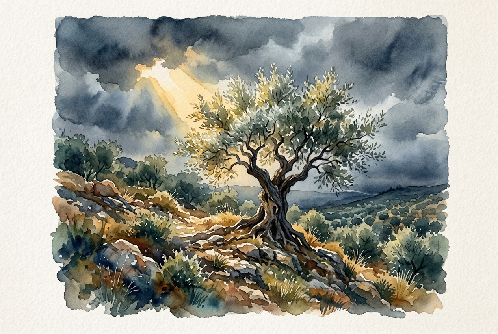

# Daily Reading: Romans 5:1-11

*May 4, 2026*



> *(Image: An ancient olive tree standing firmly on a rocky hillside as a golden ray of sunlight breaks through heavy, dark storm clouds, illuminating its silver-green leaves.)*

## The Reading (NLT)

**Romans 5:1-11**

> Therefore, since we have been made right in God's sight by faith, we have peace with God because of what Jesus Christ our Lord has done for us. Because of our faith, Christ has brought us into this place of undeserved privilege where we now stand, and we confidently and joyfully look forward to sharing God's glory. We can rejoice, too, when we run into problems and trials, for we know that they help us develop endurance. And endurance develops strength of character, and character strengthens our confident hope of salvation. And this hope will not lead to disappointment. For we know how dearly God loves us, because he has given us the Holy Spirit to fill our hearts with his love. When we were utterly helpless, Christ came at just the right time and died for us sinners. Now, most people would not be willing to die for an upright person, though someone might perhaps be willing to die for a person who is especially good. But God showed his great love for us by sending Christ to die for us while we were still sinners. And since we have been made right in God's sight by the blood of Christ, he will certainly save us from God's condemnation. For since our friendship with God was restored by the death of his Son while we were still his enemies, we will certainly be saved through the life of his Son. So now we can rejoice in our wonderful new relationship with God because our Lord Jesus Christ has made us friends of God.

## The Story

In his letter to the Roman church, Paul transitions from laying out a dense theological argument about faith to exploring the profound emotional and relational consequences of that faith. He writes to a community experiencing the friction of cultural divides and the looming threat of imperial persecution. Instead of promising them an easy path, he introduces a radical progression where hardship is actually the raw material for building character. Paul reframes their current struggles not as signs of divine abandonment, but as a crucible that forges a resilient, tested optimism. He anchors this bold claim in a historical reality, reminding his readers that divine love was demonstrated precisely when humanity was at its most fractured and hostile. The ultimate result of this divine initiative is a restored, unshakeable friendship with the Creator.

## Application for Today

It is easy to view peace as the absence of conflict and hope as mere wishful thinking. Yet, the framework offered here suggests that true peace is a secure standing in grace, regardless of external circumstances. When we encounter friction or pain today, we are invited to see these moments not as dead ends, but as an active training ground. The endurance we build in difficult seasons slowly shapes a deeper, more grounded character within us. This kind of character naturally produces a hope that remains steady because it relies on a love already proven, rather than on our ability to keep everything together. We can face our daily challenges knowing that our core relationship with the divine is already secure, built on an unconditional rescue rather than our own performance.

---

*Scripture quotations are taken from the Holy Bible, New Living Translation, copyright © 1996, 2004, 2015 by Tyndale House Foundation. Used by permission of Tyndale House Publishers.*

## Behind the Scenes: The AI Data

For curiosity: the JSON the generator received from the text model and the prompt used for the image.

```json
{
  "reference": "Romans 5:1-11",
  "passage": "Therefore, since we have been made right in God's sight by faith, we have peace with God because of what Jesus Christ our Lord has done for us. Because of our faith, Christ has brought us into this place of undeserved privilege where we now stand, and we confidently and joyfully look forward to sharing God's glory. We can rejoice, too, when we run into problems and trials, for we know that they help us develop endurance. And endurance develops strength of character, and character strengthens our confident hope of salvation. And this hope will not lead to disappointment. For we know how dearly God loves us, because he has given us the Holy Spirit to fill our hearts with his love. When we were utterly helpless, Christ came at just the right time and died for us sinners. Now, most people would not be willing to die for an upright person, though someone might perhaps be willing to die for a person who is especially good. But God showed his great love for us by sending Christ to die for us while we were still sinners. And since we have been made right in God's sight by the blood of Christ, he will certainly save us from God's condemnation. For since our friendship with God was restored by the death of his Son while we were still his enemies, we will certainly be saved through the life of his Son. So now we can rejoice in our wonderful new relationship with God because our Lord Jesus Christ has made us friends of God.",
  "story": "In his letter to the Roman church, Paul transitions from laying out a dense theological argument about faith to exploring the profound emotional and relational consequences of that faith. He writes to a community experiencing the friction of cultural divides and the looming threat of imperial persecution. Instead of promising them an easy path, he introduces a radical progression where hardship is actually the raw material for building character. Paul reframes their current struggles not as signs of divine abandonment, but as a crucible that forges a resilient, tested optimism. He anchors this bold claim in a historical reality, reminding his readers that divine love was demonstrated precisely when humanity was at its most fractured and hostile. The ultimate result of this divine initiative is a restored, unshakeable friendship with the Creator.",
  "lesson": "It is easy to view peace as the absence of conflict and hope as mere wishful thinking. Yet, the framework offered here suggests that true peace is a secure standing in grace, regardless of external circumstances. When we encounter friction or pain today, we are invited to see these moments not as dead ends, but as an active training ground. The endurance we build in difficult seasons slowly shapes a deeper, more grounded character within us. This kind of character naturally produces a hope that remains steady because it relies on a love already proven, rather than on our ability to keep everything together. We can face our daily challenges knowing that our core relationship with the divine is already secure, built on an unconditional rescue rather than our own performance.",
  "tags": [
    "endurance",
    "grace",
    "hope",
    "love",
    "peace",
    "suffering"
  ],
  "image_prompt": "An ancient olive tree standing firmly on a rocky hillside as a golden ray of sunlight breaks through heavy, dark storm clouds, illuminating its silver-green leaves."
}
```
