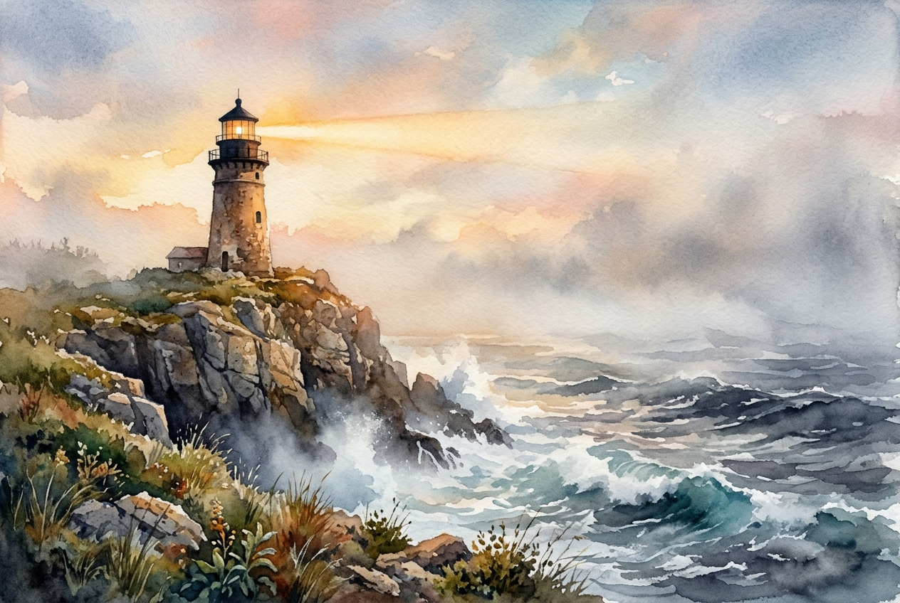

# Leitura Diária: 1 Peter 5:6-11

*4 de maio de 2026*



> *(Image: A solitary, ancient lighthouse standing on a rocky cliff, its bright beam cutting through thick fog and turbulent ocean waves at dawn.)*

## A Leitura (PT-NVI)

**1 Peter 5:6-11**

> Portanto, humilhem-se debaixo da poderosa mão de Deus, para que ele os exalte no tempo devido. Lancem sobre ele toda a sua ansiedade, porque ele tem cuidado de vocês. Sejam sóbrios e vigiem. O diabo, o inimigo de vocês, anda ao redor como leão, rugindo e procurando a quem possa devorar. Resistam-lhe, permanecendo firmes na fé, sabendo que os irmãos que vocês têm em todo o mundo estão passando pelos mesmos sofrimentos. O Deus de toda a graça, que os chamou para a sua glória eterna em Cristo Jesus, depois de terem sofrido durante pouco de tempo, os restaurará, os confirmará, lhes dará forças e os porá sobre firmes alicerces. A ele seja o poder para todo o sempre. Amém.

## A História

Os primeiros cristãos que receberam esta carta estavam espalhados pela Ásia Menor, enfrentando forte pressão social e a ameaça constante de perseguição. Eles provavelmente se sentiam exaustos, ansiosos e profundamente isolados em suas lutas diárias. O autor aborda essa realidade de frente, reconhecendo o medo paralisante que muitas vezes acompanha o sofrimento. Ele usa a imagem vívida de um predador rondando na escuridão para descrever a oposição espiritual que os cercava. No entanto, ele os lembra de que essa experiência não era solitária, conectando a dor local a uma comunidade global de fé que enfrentava as mesmas dificuldades. O foco muda da vulnerabilidade imediata para a força inabalável daquele que os sustenta.

## Aplicação para Hoje

É muito fácil nos sentirmos completamente sozinhos quando a ansiedade e as dificuldades nos cercam. Nossas preocupações costumam agir como um peso enorme, puxando nosso olhar para baixo e nos afastando daqueles que poderiam nos apoiar. Esta passagem nos convida a soltar esse fardo de forma consciente, entregando nossos medos mais profundos a um Deus que se importa intimamente com o nosso bem-estar. Somos chamados a manter a vigilância, reconhecendo que o desespero e o isolamento tentam consumir nossa esperança. Quando lembramos que nossas lutas fazem parte de uma experiência humana compartilhada, o peso se torna um pouco mais leve. Podemos confiar que a dor do momento não é o fim da história, mas um prelúdio para uma restauração profunda e duradoura.

---

*Citações bíblicas extraídas da Nova Versão Internacional (NVI), © 1993, 2000 por Biblica, Inc. Usado com permissão.*

## Nos Bastidores: Os Dados da IA

Por curiosidade: o JSON que o gerador recebeu do modelo de texto e o prompt usado para a imagem.

```json
{
  "reference": "1 Peter 5:6-11",
  "passage": "Portanto, humilhem-se debaixo da poderosa mão de Deus, para que ele os exalte no tempo devido. Lancem sobre ele toda a sua ansiedade, porque ele tem cuidado de vocês. Sejam sóbrios e vigiem. O diabo, o inimigo de vocês, anda ao redor como leão, rugindo e procurando a quem possa devorar. Resistam-lhe, permanecendo firmes na fé, sabendo que os irmãos que vocês têm em todo o mundo estão passando pelos mesmos sofrimentos. O Deus de toda a graça, que os chamou para a sua glória eterna em Cristo Jesus, depois de terem sofrido durante pouco de tempo, os restaurará, os confirmará, lhes dará forças e os porá sobre firmes alicerces. A ele seja o poder para todo o sempre. Amém.",
  "story": "Os primeiros cristãos que receberam esta carta estavam espalhados pela Ásia Menor, enfrentando forte pressão social e a ameaça constante de perseguição. Eles provavelmente se sentiam exaustos, ansiosos e profundamente isolados em suas lutas diárias. O autor aborda essa realidade de frente, reconhecendo o medo paralisante que muitas vezes acompanha o sofrimento. Ele usa a imagem vívida de um predador rondando na escuridão para descrever a oposição espiritual que os cercava. No entanto, ele os lembra de que essa experiência não era solitária, conectando a dor local a uma comunidade global de fé que enfrentava as mesmas dificuldades. O foco muda da vulnerabilidade imediata para a força inabalável daquele que os sustenta.",
  "lesson": "É muito fácil nos sentirmos completamente sozinhos quando a ansiedade e as dificuldades nos cercam. Nossas preocupações costumam agir como um peso enorme, puxando nosso olhar para baixo e nos afastando daqueles que poderiam nos apoiar. Esta passagem nos convida a soltar esse fardo de forma consciente, entregando nossos medos mais profundos a um Deus que se importa intimamente com o nosso bem-estar. Somos chamados a manter a vigilância, reconhecendo que o desespero e o isolamento tentam consumir nossa esperança. Quando lembramos que nossas lutas fazem parte de uma experiência humana compartilhada, o peso se torna um pouco mais leve. Podemos confiar que a dor do momento não é o fim da história, mas um prelúdio para uma restauração profunda e duradoura.",
  "tags": [
    "ansiedade",
    "comunidade",
    "esperança",
    "restauração",
    "sofrimento"
  ],
  "image_prompt": "A solitary, ancient lighthouse standing on a rocky cliff, its bright beam cutting through thick fog and turbulent ocean waves at dawn."
}
```
