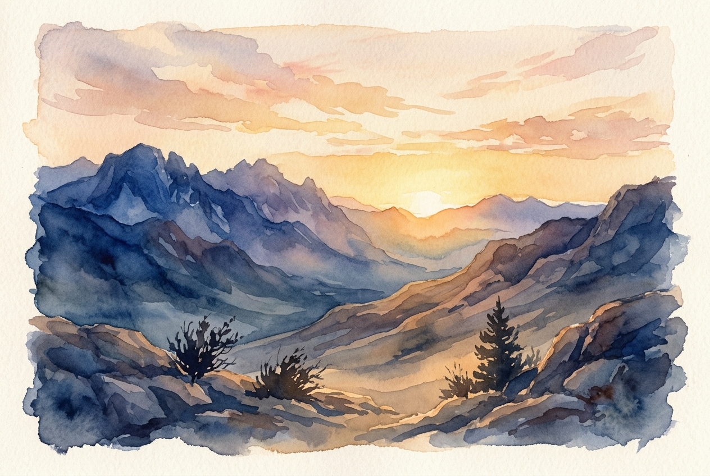

# Daily Reading: Lamentations 3:22-26

*May 5, 2026*

> *(Image: A serene sunrise breaking over a rugged, rocky landscape, casting a soft golden light that slowly pushes back the deep shadows of the valley.)*

## The Reading (NLT)

**Lamentations 3:22-26**

> 22 The faithful love of the Lord never ends! His mercies never cease. 23 Great is his faithfulness; his mercies begin afresh each morning. 24 I say to myself, The Lord is my inheritance; therefore, I will hope in him! 25 The Lord is good to those who depend on him, to those who search for him. 26 So it is good to wait quietly for salvation from the Lord.

## The Story

The book of Lamentations is essentially a funeral dirge for a devastated city. Jerusalem has fallen, and the writer is surrounded by the rubble of everything they once knew and loved. Grief permeates almost every chapter, expressing a profound sense of loss and disorientation. Yet, right in the center of this deep sorrow, the tone abruptly shifts. The poet pauses amidst the wreckage to remember the enduring character of God. This sudden pivot does not erase the surrounding tragedy, but it introduces an anchor of stability.

## Application for Today

We often feel pressured to rush through our grief or find a quick fix for our pain. However, this ancient writer shows us a different way to navigate seasons of profound loss. We can acknowledge the full weight of our sorrow while simultaneously choosing to look for small, daily renewals of grace. Trusting the divine character does not mean pretending everything is fine; it means sitting in the tension of what is broken and what is enduring. When life feels overwhelming, we can practice looking for the dawn of a new day as a symbol of ongoing care. Each sunrise offers a gentle reminder that we are held by a love that outlasts our deepest despair. Resting in this stillness is not passive surrender, but an active, hopeful posture.

---

*Scripture quotations are taken from the Holy Bible, New Living Translation, copyright © 1996, 2004, 2015 by Tyndale House Foundation. Used by permission of Tyndale House Publishers.*
