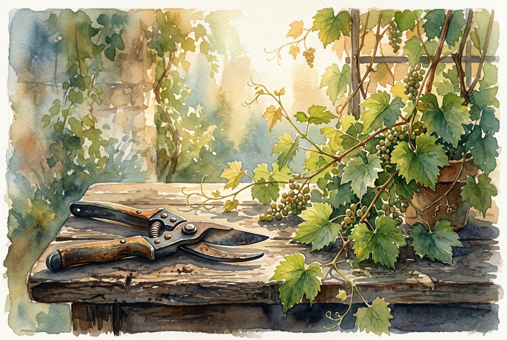

# Daily Reading: John 15:1-11

*May 6, 2026*

> *(Image: A close-up of a weathered pair of pruning shears resting on a rustic wooden table next to a flourishing green grapevine bathed in warm morning sunlight.)*

## The Reading (NLT)

**John 15:1-11**

> 1 I am the true grapevine, and my Father is the gardener. 2 He cuts off every branch of mine that doesn't produce fruit, and he prunes the branches that do bear fruit so they will produce even more. 3 You have already been pruned and purified by the message I have given you. 4 Remain in me, and I will remain in you. For a branch cannot produce fruit if it is severed from the vine, and you cannot be fruitful unless you remain in me. 5 Yes, I am the vine; you are the branches. Those who remain in me, and I in them, will produce much fruit. For apart from me you can do nothing. 6 Anyone who does not remain in me is thrown away like a useless branch and withers. Such branches are gathered into a pile to be burned. 7 But if you remain in me and my words remain in you, you may ask for anything you want, and it will be granted! 8 When you produce much fruit, you are my true disciples. This brings great glory to my Father. 9 I have loved you even as the Father has loved me. Remain in my love. 10 When you obey my commandments, you remain in my love, just as I obey my Father's commandments and remain in his love. 11 I have told you these things so that you will be filled with my joy. Yes, your joy will overflow!

## The Story

Jesus is speaking to his closest friends right before his arrest. Agriculture was central to ancient Judean life, and everyone understood how vineyards worked. A grapevine requires meticulous care, which includes cutting back the dead wood and strategically snipping the healthy parts so energy flows into producing grapes rather than just leaves. Jesus uses this vivid, familiar imagery to describe the relationship between the divine and the human. He positions himself as the source of life, the Father as the careful cultivator, and his followers as the branches meant to bear the harvest.

## Application for Today

We often view being pruned as a punishment, associating it with loss or hardship. Yet, in the garden, pruning is an act of profound care, designed to direct our energy toward what truly matters. Our culture praises endless expansion and self-reliance, urging us to produce results on our own strength. Jesus offers a completely different rhythm: simply remain connected. Before we can produce anything of lasting value, we must first abide in love. When we stay rooted in that quiet, sustaining connection, the fruit and the deep, overflowing joy that follows happen naturally.

---

*Scripture quotations are taken from the Holy Bible, New Living Translation, copyright © 1996, 2004, 2015 by Tyndale House Foundation. Used by permission of Tyndale House Publishers.*
