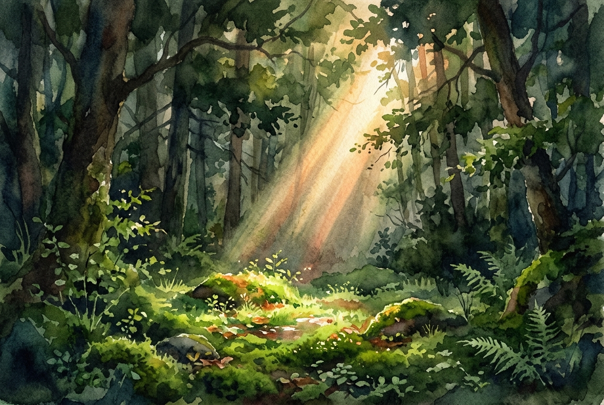

# Leitura Diária: John 3:16-21

*6 de maio de 2026*

> *(Image: A single beam of warm sunlight breaking through a dense, shadowy forest canopy, illuminating a small clearing covered in vibrant green moss.)*

## A Leitura (PT-NVI)

**John 3:16-21**

> 16 "Porque Deus tanto amou o mundo que deu o seu Filho Unigênito, para que todo o que nele crer não pereça, mas tenha a vida eterna. 17 Pois Deus enviou o seu Filho ao mundo, não para condenar o mundo, mas para que este fosse salvo por meio dele. 18 Quem nele crê não é condenado, mas quem não crê já está condenado, por não crer no nome do Filho Unigênito de Deus. 19 Este é o julgamento: a luz veio ao mundo, mas os homens amaram as trevas, e não a luz, porque as suas obras eram más. 20 Quem pratica o mal odeia a luz e não se aproxima da luz, temendo que as suas obras sejam manifestas. 21 Mas quem pratica a verdade vem para a luz, para que se veja claramente que as suas obras são realizadas por intermédio de Deus".

## A História

No mundo antigo, a escuridão oferecia um manto para as coisas que as pessoas queriam manter em segredo. Quando este Evangelho foi escrito, o contraste entre luz e sombra servia como uma metáfora poderosa para a verdade e o engano. O autor enfatiza que a intenção divina nunca foi condenar a humanidade, mas sim resgatá-la. A chegada do divino é descrita como uma iluminação que revela a realidade exatamente como ela é. No entanto, o texto reconhece uma trágica tendência humana de preferir o conforto familiar das sombras ao brilho revelador da verdade.

## Aplicação para Hoje

É fácil esconder as partes quebradas ou vergonhosas de nossas vidas, temendo que, se forem vistas, seremos rejeitados. Esta passagem inverte esse medo ao nos garantir que a luz foi feita para o nosso resgate, não para a nossa ruína. Quando trazemos nosso verdadeiro eu para fora das sombras, encontramos um amor que é vasto o suficiente para acolher todas as nossas imperfeições. A cura começa no momento em que paramos de fingir e nos permitimos ser plenamente conhecidos. Em vez de fugir da luz, podemos deixar que ela nos guie em direção a uma vida de honestidade e paz. O convite é simplesmente dar um passo à frente e confiar na graça que nos espera.

---

*Citações bíblicas extraídas da Nova Versão Internacional (NVI), © 1993, 2000 por Biblica, Inc. Usado com permissão.*
