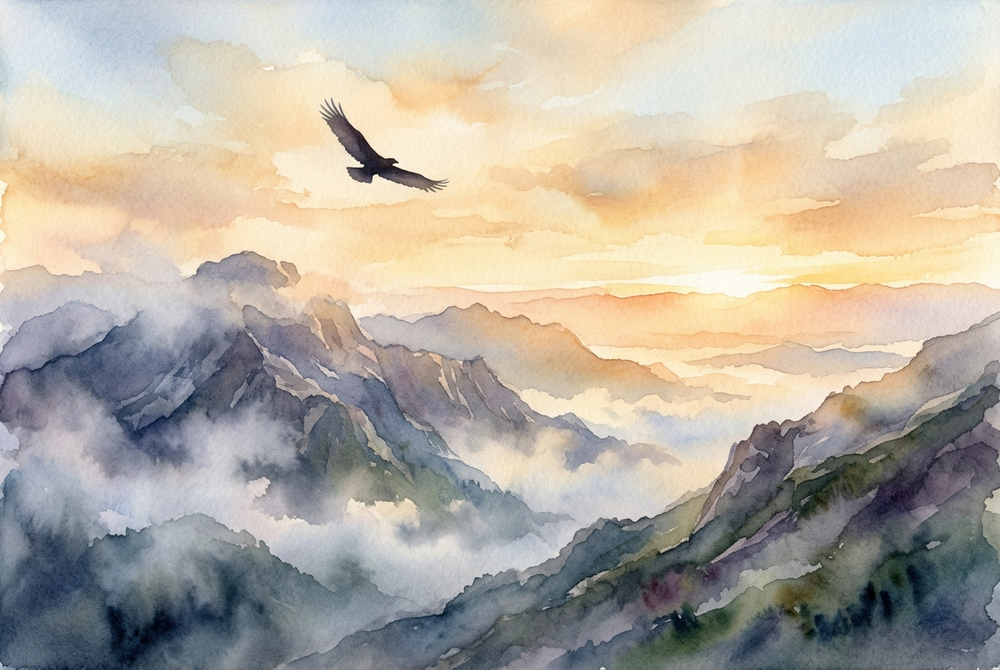

# Leitura Diária: Isaiah 40:28-31

*8 de maio de 2026*

> *(Image: A solitary eagle gliding effortlessly on thermal currents high above a rugged, mist-covered mountain range bathed in the warm, golden light of dawn.)*

## A Leitura (PT-NVI)

**Isaiah 40:28-31**

> 28 Será que você não sabe? Nunca ouviu falar? O Senhor é o Deus eterno, o Criador de toda a terra. Ele não se cansa nem fica exausto, sua sabedoria é insondável. 29 Ele fortalece ao cansado e dá grande vigor ao que está sem forças. 30 Até os jovens se cansam e ficam exaustos, e os moços tropeçam e caem; 31 mas aqueles que esperam no Senhor renovam as suas forças. Voam bem alto como águias; correm e não ficam exaustos, andam e não se cansam.

## A História

Os israelitas estavam no exílio na Babilônia, sentindo-se esquecidos e completamente esgotados. Ao olharem para os imponentes monumentos de seus captores, eles se perguntavam se o seu Deus havia perdido o poder ou simplesmente o interesse por eles. O profeta fala diretamente a essa profunda exaustão coletiva. Ele desvia o olhar do povo de sua realidade política imediata e o direciona para a vastidão do cosmos. É um lembrete de que o Criador não está sujeito às limitações humanas, ao cansaço ou à ascensão e queda dos impérios.

## Aplicação para Hoje

Vivemos em uma cultura que valoriza a produtividade incessante, onde a expectativa é que ultrapassemos nossos limites até o esgotamento total. É muito fácil sentir que estamos funcionando no automático, dependendo apenas das nossas próprias reservas que estão cada vez mais escassas. O texto de hoje nos convida a reconhecer nossa fragilidade natural. O cansaço não é uma falha moral, mas um lembrete de que somos criaturas finitas que precisam de um Criador infinito. Quando paramos de lutar com nossas próprias forças e começamos a descansar na presença divina, encontramos um tipo diferente de resistência. É uma perseverança silenciosa e constante que nos impulsiona quando nosso próprio impulso chega ao fim.

---

*Citações bíblicas extraídas da Nova Versão Internacional (NVI), © 1993, 2000 por Biblica, Inc. Usado com permissão.*
