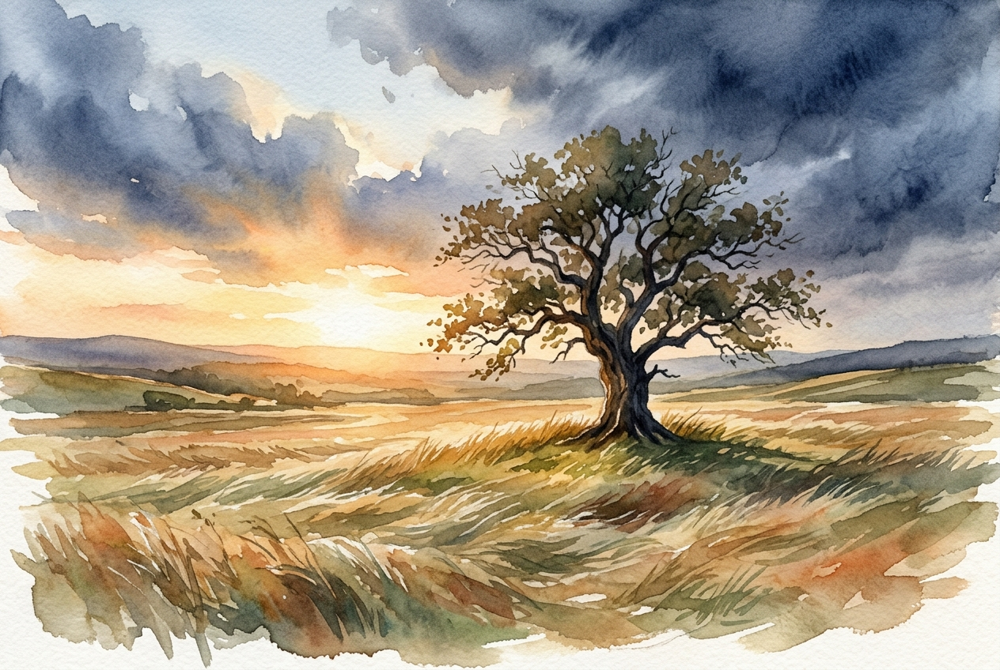

# Leitura Diária: Romans 5:1-11

*9 de maio de 2026*

> *(Image: A solitary, sturdy oak tree standing in a windswept field, bathed in the warm, golden light of dawn piercing through receding storm clouds.)*

## A Leitura (PT-NVI)

**Romans 5:1-11**

> 1 Tendo sido, pois, justificados pela fé, temos paz com Deus, por nosso Senhor Jesus Cristo, 2 por meio de quem obtivemos acesso pela fé a esta graça na qual agora estamos firmes; e nos gloriamos na esperança da glória de Deus. 3 Não só isso, mas também nos gloriamos nas tribulações, porque sabemos que a tribulação produz perseverança; 4 a perseverança, um caráter aprovado; e o caráter aprovado, esperança. 5 E a esperança não nos decepciona, porque Deus derramou seu amor em nossos corações, por meio do Espírito Santo que ele nos concedeu. 6 De fato, no devido tempo, quando ainda éramos fracos, Cristo morreu pelos ímpios. 7 Dificilmente haverá alguém que morra por um justo; pelo homem bom talvez alguém tenha coragem de morrer. 8 Mas Deus demonstra seu amor por nós: Cristo morreu em nosso favor quando ainda éramos pecadores. 9 Como agora fomos justificados por seu sangue, muito mais ainda seremos salvos da ira de Deus por meio dele! 10 Se quando éramos inimigos de Deus fomos reconciliados com ele mediante a morte de seu Filho, quanto mais agora, tendo sido reconciliados, seremos salvos por sua vida! 11 Não apenas isso, mas também nos gloriamos em Deus, por meio de nosso Senhor Jesus Cristo, mediante quem recebemos agora a reconciliação.

## A História

Em sua carta aos primeiros cristãos em Roma, Paulo descreve uma mudança profunda na relação humana com o divino. Ele escreve para uma comunidade que lidava com pressões externas e divisões internas, lembrando-os de que a posição deles diante de Deus não dependia mais de seus próprios esforços frágeis. Em vez disso, eles haviam sido introduzidos em um espaço seguro de graça. O apóstolo constrói uma fascinante cadeia de progressão espiritual, ilustrando como as circunstâncias difíceis não são sinais de abandono divino. Pelo contrário, esses desafios funcionam como um crisol, forjando uma resiliência e um caráter que culminam em uma confiança inabalável. Toda essa sequência se apoia na premissa radical de que a reconciliação foi iniciada por Deus quando a humanidade estava em seu estado mais distante e indigno.

## Aplicação para Hoje

É comum presumirmos que uma relação restaurada com o divino significa viver sem atritos, mas este texto nos oferece uma visão muito mais robusta. Somos convidados a enxergar nossas lutas atuais não como um sofrimento sem sentido, mas como o próprio solo onde nosso caráter é cultivado. Quando enfrentamos obstáculos, podemos permanecer firmes, sabendo que nossa segurança final não depende de nosso desempenho ou perfeição. O amor descrito aqui é proativo, alcançando-nos antes mesmo de termos a chance de consertar nossos próprios erros. Podemos encarar as incertezas de hoje com uma alegria serena, confiando que a mesma graça que nos buscou em nossos piores momentos nos sustentará em tudo o que vier pela frente.

---

*Citações bíblicas extraídas da Nova Versão Internacional (NVI), © 1993, 2000 por Biblica, Inc. Usado com permissão.*
