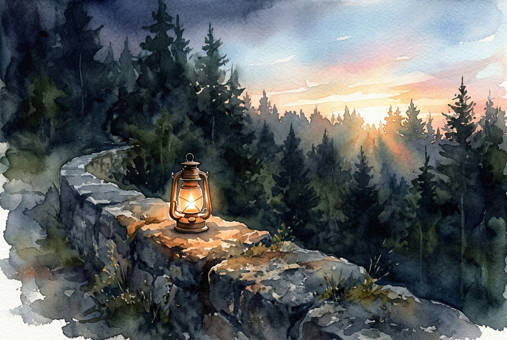

# Leitura Diária: 1 Peter 5:6-11

*9 de maio de 2026*



> *(Image: A solitary lantern resting on a weathered stone wall, glowing warmly against a dark encroaching forest, with the first light of dawn breaking through the trees.)*

## A Leitura (PT-NVI)

**1 Peter 5:6-11**

> Portanto, humilhem-se debaixo da poderosa mão de Deus, para que ele os exalte no tempo devido. Lancem sobre ele toda a sua ansiedade, porque ele tem cuidado de vocês. Sejam sóbrios e vigiem. O diabo, o inimigo de vocês, anda ao redor como leão, rugindo e procurando a quem possa devorar. Resistam-lhe, permanecendo firmes na fé, sabendo que os irmãos que vocês têm em todo o mundo estão passando pelos mesmos sofrimentos. O Deus de toda a graça, que os chamou para a sua glória eterna em Cristo Jesus, depois de terem sofrido durante pouco de tempo, os restaurará, os confirmará, lhes dará forças e os porá sobre firmes alicerces. A ele seja o poder para todo o sempre. Amém.

## A História

Os primeiros cristãos que receberam esta carta estavam espalhados pela Ásia Menor, enfrentando severa alienação social e hostilidade por causa de sua fé. É provável que se sentissem isolados, imaginando se o seu sofrimento silencioso passava despercebido ou se eram os únicos a enfrentar tamanha oposição. O autor escreve para lembrá-los de uma realidade profunda: suas lutas são compartilhadas por uma comunidade global de fiéis. Em vez de lutarem por uma justificação imediata com as próprias mãos, eles são convidados a ceder ao tempo de Deus. São alertados de que a oposição espiritual se alimenta do medo e do isolamento, buscando consumir aqueles que perdem o equilíbrio. No entanto, a promessa central é de atenção divina e restauração garantida.

## Aplicação para Hoje

É incrivelmente fácil deixar que a ansiedade nos convença de que estamos completamente sozinhos em nossas lutas. Quando enfrentamos dificuldades, nosso instinto muitas vezes é carregar o peso por conta própria, o que apenas nos torna mais vulneráveis ao desespero e à exaustão espiritual. Esta passagem oferece uma correção suave, mas firme, lembrando-nos de que Deus está ativamente atento às nossas preocupações e nos convida a entregá-las totalmente a Ele. Somos chamados a manter a mente clara e a resiliência, reconhecendo que nossas adversidades fazem parte de uma experiência humana e espiritual compartilhada. A esperança que guardamos é que a dor do presente não é a palavra final. Deus está trabalhando para reconstruir nossa força, firmar nossos passos e nos colocar em um terreno que não cederá.

---

*Citações bíblicas extraídas da Nova Versão Internacional (NVI), © 1993, 2000 por Biblica, Inc. Usado com permissão.*

## Nos Bastidores: Os Dados da IA

Por curiosidade: o JSON que o gerador recebeu do modelo de texto e o prompt usado para a imagem.

```json
{
  "reference": "1 Peter 5:6-11",
  "passage": "Portanto, humilhem-se debaixo da poderosa mão de Deus, para que ele os exalte no tempo devido. Lancem sobre ele toda a sua ansiedade, porque ele tem cuidado de vocês. Sejam sóbrios e vigiem. O diabo, o inimigo de vocês, anda ao redor como leão, rugindo e procurando a quem possa devorar. Resistam-lhe, permanecendo firmes na fé, sabendo que os irmãos que vocês têm em todo o mundo estão passando pelos mesmos sofrimentos. O Deus de toda a graça, que os chamou para a sua glória eterna em Cristo Jesus, depois de terem sofrido durante pouco de tempo, os restaurará, os confirmará, lhes dará forças e os porá sobre firmes alicerces. A ele seja o poder para todo o sempre. Amém.",
  "story": "Os primeiros cristãos que receberam esta carta estavam espalhados pela Ásia Menor, enfrentando severa alienação social e hostilidade por causa de sua fé. É provável que se sentissem isolados, imaginando se o seu sofrimento silencioso passava despercebido ou se eram os únicos a enfrentar tamanha oposição. O autor escreve para lembrá-los de uma realidade profunda: suas lutas são compartilhadas por uma comunidade global de fiéis. Em vez de lutarem por uma justificação imediata com as próprias mãos, eles são convidados a ceder ao tempo de Deus. São alertados de que a oposição espiritual se alimenta do medo e do isolamento, buscando consumir aqueles que perdem o equilíbrio. No entanto, a promessa central é de atenção divina e restauração garantida.",
  "lesson": "É incrivelmente fácil deixar que a ansiedade nos convença de que estamos completamente sozinhos em nossas lutas. Quando enfrentamos dificuldades, nosso instinto muitas vezes é carregar o peso por conta própria, o que apenas nos torna mais vulneráveis ao desespero e à exaustão espiritual. Esta passagem oferece uma correção suave, mas firme, lembrando-nos de que Deus está ativamente atento às nossas preocupações e nos convida a entregá-las totalmente a Ele. Somos chamados a manter a mente clara e a resiliência, reconhecendo que nossas adversidades fazem parte de uma experiência humana e espiritual compartilhada. A esperança que guardamos é que a dor do presente não é a palavra final. Deus está trabalhando para reconstruir nossa força, firmar nossos passos e nos colocar em um terreno que não cederá.",
  "tags": [
    "ansiedade",
    "confiança",
    "humildade",
    "restauração",
    "sofrimento"
  ],
  "image_prompt": "A solitary lantern resting on a weathered stone wall, glowing warmly against a dark encroaching forest, with the first light of dawn breaking through the trees."
}
```
