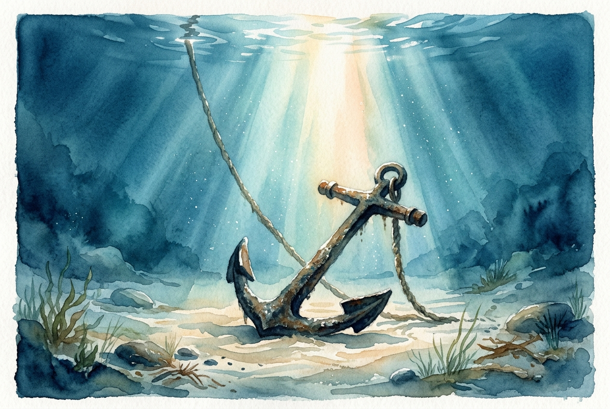

# Daily Reading: Romans 8:31-39

*May 10, 2026*



> *(Image: A sturdy ancient anchor resting gently on the ocean floor, illuminated by a single bright shaft of sunlight breaking through the deep blue water.)*

## The Reading (NLT)

**Romans 8:31-39**

> What shall we say about such wonderful things as these? If God is for us, who can ever be against us? Since he did not spare even his own Son but gave him up for us all, won't he also give us everything else? Who dares accuse us whom God has chosen for his own? No one for God himself has given us right standing with himself. Who then will condemn us? No one for Christ Jesus died for us and was raised to life for us, and he is sitting in the place of honor at God's right hand, pleading for us. Can anything ever separate us from Christ's love? Does it mean he no longer loves us if we have trouble or calamity, or are persecuted, or hungry, or destitute, or in danger, or threatened with death? (As the Scriptures say, For your sake we are killed every day; we are being slaughtered like sheep.) No, despite all these things, overwhelming victory is ours through Christ, who loved us. And I am convinced that nothing can ever separate us from God's love. Neither death nor life, neither angels nor demons, neither our fears for today nor our worries about tomorrow not even the powers of hell can separate us from God's love. No power in the sky above or in the earth below indeed, nothing in all creation will ever be able to separate us from the love of God that is revealed in Christ Jesus our Lord.

## The Story

Paul wrote this letter to a diverse community in Rome facing immense pressure from both within and outside the church. In the ancient Roman world, power was often demonstrated through dominance, and the threat of political or social persecution was a daily reality. The believers there were vulnerable to anxiety, wondering if their suffering meant they had been abandoned by the divine. Paul addresses this fear head-on by presenting a metaphorical courtroom scene where all accusations fall flat. He builds a soaring rhetorical crescendo to assure them that their security does not depend on their circumstances. Instead, their ultimate safety is anchored in a love that has already proven its depth through the ultimate sacrifice.

## Application for Today

It is easy to look at our own struggles and assume we have somehow lost favor or been left behind. When we face illness, financial hardship, or deep loneliness, a quiet voice often whispers that we are entirely on our own. Yet this passage reminds us that our present difficulties are not a measure of our spiritual standing or worth. The love described here is not a fragile emotion that retreats when life gets hard, but a relentless force that holds us fast. We can face our daily anxieties with a quiet confidence, knowing that no earthly or spiritual barrier can sever the tie between us and the Creator. Our ultimate security is found not in a trouble-free life, but in an unshakable presence.

---

*Scripture quotations are taken from the Holy Bible, New Living Translation, copyright © 1996, 2004, 2015 by Tyndale House Foundation. Used by permission of Tyndale House Publishers.*

## Behind the Scenes: The AI Data

For curiosity: the JSON the generator received from the text model and the prompt used for the image.

```json
{
  "reference": "Romans 8:31-39",
  "passage": "What shall we say about such wonderful things as these? If God is for us, who can ever be against us? Since he did not spare even his own Son but gave him up for us all, won't he also give us everything else? Who dares accuse us whom God has chosen for his own? No one for God himself has given us right standing with himself. Who then will condemn us? No one for Christ Jesus died for us and was raised to life for us, and he is sitting in the place of honor at God's right hand, pleading for us. Can anything ever separate us from Christ's love? Does it mean he no longer loves us if we have trouble or calamity, or are persecuted, or hungry, or destitute, or in danger, or threatened with death? (As the Scriptures say, For your sake we are killed every day; we are being slaughtered like sheep.) No, despite all these things, overwhelming victory is ours through Christ, who loved us. And I am convinced that nothing can ever separate us from God's love. Neither death nor life, neither angels nor demons, neither our fears for today nor our worries about tomorrow not even the powers of hell can separate us from God's love. No power in the sky above or in the earth below indeed, nothing in all creation will ever be able to separate us from the love of God that is revealed in Christ Jesus our Lord.",
  "story": "Paul wrote this letter to a diverse community in Rome facing immense pressure from both within and outside the church. In the ancient Roman world, power was often demonstrated through dominance, and the threat of political or social persecution was a daily reality. The believers there were vulnerable to anxiety, wondering if their suffering meant they had been abandoned by the divine. Paul addresses this fear head-on by presenting a metaphorical courtroom scene where all accusations fall flat. He builds a soaring rhetorical crescendo to assure them that their security does not depend on their circumstances. Instead, their ultimate safety is anchored in a love that has already proven its depth through the ultimate sacrifice.",
  "lesson": "It is easy to look at our own struggles and assume we have somehow lost favor or been left behind. When we face illness, financial hardship, or deep loneliness, a quiet voice often whispers that we are entirely on our own. Yet this passage reminds us that our present difficulties are not a measure of our spiritual standing or worth. The love described here is not a fragile emotion that retreats when life gets hard, but a relentless force that holds us fast. We can face our daily anxieties with a quiet confidence, knowing that no earthly or spiritual barrier can sever the tie between us and the Creator. Our ultimate security is found not in a trouble-free life, but in an unshakable presence.",
  "tags": [
    "assurance",
    "hope",
    "love",
    "security",
    "suffering"
  ],
  "image_prompt": "A sturdy ancient anchor resting gently on the ocean floor, illuminated by a single bright shaft of sunlight breaking through the deep blue water."
}
```
