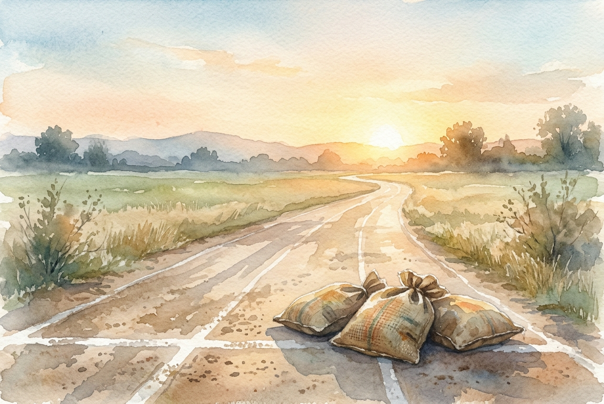

# Daily Reading: Hebrews 12:1-3

*May 11, 2026*



> *(Image: A long, dusty athletic track stretching toward a bright, golden sunrise, with heavy woven sacks left behind on the starting line.)*

## The Reading (NLT)

**Hebrews 12:1-3**

> Therefore, since we are surrounded by such a huge crowd of witnesses to the life of faith, let us strip off every weight that slows us down, especially the sin that so easily trips us up. And let us run with endurance the race God has set before us. We do this by keeping our eyes on Jesus, the champion who initiates and perfects our faith. Because of the joy awaiting him, he endured the cross, disregarding its shame. Now he is seated in the place of honor beside God's throne. Think of all the hostility he endured from sinful people; then you won't become weary and give up.

## The Story

The writer of Hebrews uses the vivid imagery of a Greco-Roman athletic stadium. The audience is imagined as runners on a track, cheered on by a massive crowd of ancestors who have already finished their own grueling events. But a runner cannot sprint while carrying heavy baggage or wearing tangled robes. To move forward, they must strip away anything that hinders their stride, whether it is outright failure or simply unnecessary burdens. The ultimate coach and model for this race is Jesus himself, who already ran the hardest course imaginable.

## Application for Today

Life often requires the kind of stamina needed for a long, grueling journey. We easily accumulate invisible weights, such as anxieties, grudges, or distractions, that slow our spiritual momentum. When exhaustion sets in and we want to stop, this passage invites us to shift our attention. Instead of staring at our own tired feet or the immediate obstacles, we are encouraged to look ahead to Jesus. He endured ultimate suffering by focusing on the joy of reconciliation that lay beyond it, offering us a steadying model for our own difficult seasons.

---

*Scripture quotations are taken from the Holy Bible, New Living Translation, copyright © 1996, 2004, 2015 by Tyndale House Foundation. Used by permission of Tyndale House Publishers.*

## Behind the Scenes: The AI Data

For curiosity: the JSON the generator received from the text model and the prompt used for the image.

```json
{
  "reference": "Hebrews 12:1-3",
  "passage": "Therefore, since we are surrounded by such a huge crowd of witnesses to the life of faith, let us strip off every weight that slows us down, especially the sin that so easily trips us up. And let us run with endurance the race God has set before us. We do this by keeping our eyes on Jesus, the champion who initiates and perfects our faith. Because of the joy awaiting him, he endured the cross, disregarding its shame. Now he is seated in the place of honor beside God's throne. Think of all the hostility he endured from sinful people; then you won't become weary and give up.",
  "story": "The writer of Hebrews uses the vivid imagery of a Greco-Roman athletic stadium. The audience is imagined as runners on a track, cheered on by a massive crowd of ancestors who have already finished their own grueling events. But a runner cannot sprint while carrying heavy baggage or wearing tangled robes. To move forward, they must strip away anything that hinders their stride, whether it is outright failure or simply unnecessary burdens. The ultimate coach and model for this race is Jesus himself, who already ran the hardest course imaginable.",
  "lesson": "Life often requires the kind of stamina needed for a long, grueling journey. We easily accumulate invisible weights, such as anxieties, grudges, or distractions, that slow our spiritual momentum. When exhaustion sets in and we want to stop, this passage invites us to shift our attention. Instead of staring at our own tired feet or the immediate obstacles, we are encouraged to look ahead to Jesus. He endured ultimate suffering by focusing on the joy of reconciliation that lay beyond it, offering us a steadying model for our own difficult seasons.",
  "tags": [
    "endurance",
    "faith",
    "focus",
    "perseverance"
  ],
  "image_prompt": "A long, dusty athletic track stretching toward a bright, golden sunrise, with heavy woven sacks left behind on the starting line."
}
```
