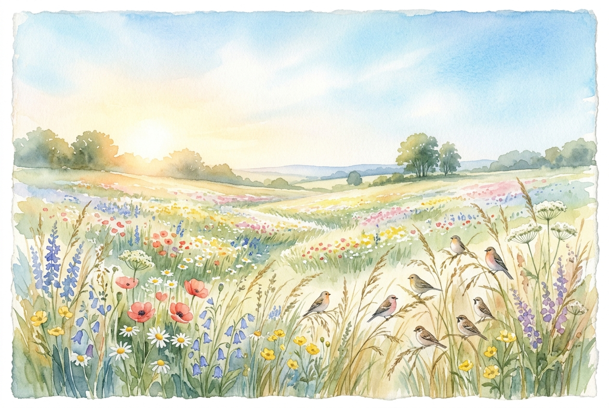

# Leitura Diária: Matthew 6:25-34

*11 de maio de 2026*



> *(Image: A serene, sunlit meadow filled with scattered wildflowers swaying gently in the wind, with a few small birds resting softly on tall grass under a clear morning sky.)*

## A Leitura (PT-NVI)

**Matthew 6:25-34**

> "Portanto eu lhes digo: não se preocupem com suas próprias vidas, quanto ao que comer ou beber; nem com seus próprios corpos, quanto ao que vestir. Não é a vida mais importante do que a comida, e o corpo mais importante do que a roupa? Observem as aves do céu: não semeiam nem colhem nem armazenam em celeiros; contudo, o Pai celestial as alimenta. Não têm vocês muito mais valor do que elas? Quem de vocês, por mais que se preocupe, pode acrescentar uma hora que seja à sua vida? "Por que vocês se preocupam com roupas? Vejam como crescem os lírios do campo. Eles não trabalham nem tecem. Contudo, eu lhes digo que nem Salomão, em todo o seu esplendor, vestiu-se como um deles. Se Deus veste assim a erva do campo, que hoje existe e amanhã é lançada ao fogo, não vestirá muito mais a vocês, homens de pequena fé? Portanto, não se preocupem, dizendo: ‘Que vamos comer? ’ ou ‘que vamos beber? ’ ou ‘que vamos vestir? ’ Pois os pagãos é que correm atrás dessas coisas; mas o Pai celestial sabe que vocês precisam delas. Busquem, pois, em primeiro lugar o Reino de Deus e a sua justiça, e todas essas coisas lhes serão acrescentadas. Portanto, não se preocupem com o amanhã, pois o amanhã se preocupará consigo mesmo. Basta a cada dia o seu próprio mal".

## A História

No mundo antigo, a sobrevivência diária era uma preocupação genuína e constante para a maioria das pessoas. Grande parte da multidão que ouvia esses ensinamentos vivia com o que ganhava no dia, dependendo de salários incertos e ciclos agrícolas imprevisíveis. Eles conheciam intimamente a dura realidade da escassez e da falta de recursos básicos. No entanto, o discurso os convida a observar atentamente o mundo natural ao seu redor. Ao destacar a existência simples da fauna e da flora locais, a mensagem cria um contraste nítido entre a ansiedade humana e a ordem da natureza. A conclusão é que um universo sustentado por um criador cuidadoso não deixa espaço para um desespero que consome a mente.

## Aplicação para Hoje

Ainda carregamos o fardo pesado do medo do futuro em nossas vidas modernas, mesmo que nossas aflições pareçam diferentes daquelas do passado. Nossas mentes correm para antecipar todos os desastres possíveis, tentando controlar o que é imprevisível. Mas a ansiedade raramente muda nossas circunstâncias; ela apenas esgota nossa força atual. Somos convidados a soltar as rédeas do amanhã e redirecionar nosso foco para o que está bem diante de nós. Confiar no cuidado divino não significa ignorar nossas responsabilidades, mas sim encará-las sem o peso esmagador do medo. Quando centramos nossas vidas em valores duradouros em vez de segurança passageira, encontramos a graça para viver plenamente o dia de hoje.

---

*Citações bíblicas extraídas da Nova Versão Internacional (NVI), © 1993, 2000 por Biblica, Inc. Usado com permissão.*

## Nos Bastidores: Os Dados da IA

Por curiosidade: o JSON que o gerador recebeu do modelo de texto e o prompt usado para a imagem.

```json
{
  "reference": "Matthew 6:25-34",
  "passage": "\"Portanto eu lhes digo: não se preocupem com suas próprias vidas, quanto ao que comer ou beber; nem com seus próprios corpos, quanto ao que vestir. Não é a vida mais importante do que a comida, e o corpo mais importante do que a roupa? Observem as aves do céu: não semeiam nem colhem nem armazenam em celeiros; contudo, o Pai celestial as alimenta. Não têm vocês muito mais valor do que elas? Quem de vocês, por mais que se preocupe, pode acrescentar uma hora que seja à sua vida? \"Por que vocês se preocupam com roupas? Vejam como crescem os lírios do campo. Eles não trabalham nem tecem. Contudo, eu lhes digo que nem Salomão, em todo o seu esplendor, vestiu-se como um deles. Se Deus veste assim a erva do campo, que hoje existe e amanhã é lançada ao fogo, não vestirá muito mais a vocês, homens de pequena fé? Portanto, não se preocupem, dizendo: ‘Que vamos comer? ’ ou ‘que vamos beber? ’ ou ‘que vamos vestir? ’ Pois os pagãos é que correm atrás dessas coisas; mas o Pai celestial sabe que vocês precisam delas. Busquem, pois, em primeiro lugar o Reino de Deus e a sua justiça, e todas essas coisas lhes serão acrescentadas. Portanto, não se preocupem com o amanhã, pois o amanhã se preocupará consigo mesmo. Basta a cada dia o seu próprio mal\".",
  "story": "No mundo antigo, a sobrevivência diária era uma preocupação genuína e constante para a maioria das pessoas. Grande parte da multidão que ouvia esses ensinamentos vivia com o que ganhava no dia, dependendo de salários incertos e ciclos agrícolas imprevisíveis. Eles conheciam intimamente a dura realidade da escassez e da falta de recursos básicos. No entanto, o discurso os convida a observar atentamente o mundo natural ao seu redor. Ao destacar a existência simples da fauna e da flora locais, a mensagem cria um contraste nítido entre a ansiedade humana e a ordem da natureza. A conclusão é que um universo sustentado por um criador cuidadoso não deixa espaço para um desespero que consome a mente.",
  "lesson": "Ainda carregamos o fardo pesado do medo do futuro em nossas vidas modernas, mesmo que nossas aflições pareçam diferentes daquelas do passado. Nossas mentes correm para antecipar todos os desastres possíveis, tentando controlar o que é imprevisível. Mas a ansiedade raramente muda nossas circunstâncias; ela apenas esgota nossa força atual. Somos convidados a soltar as rédeas do amanhã e redirecionar nosso foco para o que está bem diante de nós. Confiar no cuidado divino não significa ignorar nossas responsabilidades, mas sim encará-las sem o peso esmagador do medo. Quando centramos nossas vidas em valores duradouros em vez de segurança passageira, encontramos a graça para viver plenamente o dia de hoje.",
  "tags": [
    "ansiedade",
    "confiança",
    "paz",
    "presente",
    "provisão"
  ],
  "image_prompt": "A serene, sunlit meadow filled with scattered wildflowers swaying gently in the wind, with a few small birds resting softly on tall grass under a clear morning sky."
}
```
