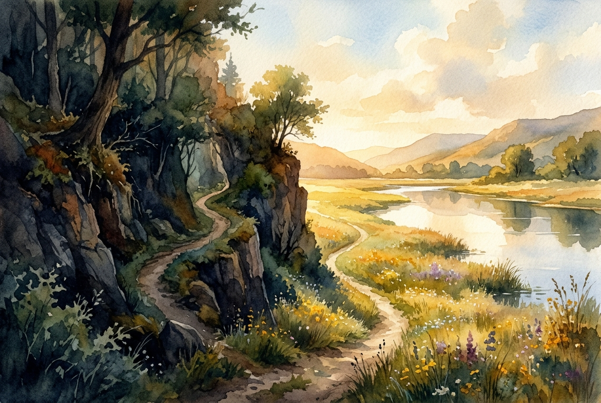

# Daily Reading: Psalm 23

*May 12, 2026*



> *(Image: A serene landscape painting of a winding dirt path passing through a deep shadowed ravine and emerging into a sunlit meadow beside a calm reflective river.)*

## The Reading (NLT)

**Psalm 23**

> The Lord is my shepherd; I have all that I need. He lets me rest in green meadows; he leads me beside peaceful streams. He renews my strength. He guides me along right paths, bringing honor to his name. Even when I walk through the darkest valley, I will not be afraid, for you are close beside me. Your rod and your staff protect and comfort me. You prepare a feast for me in the presence of my enemies. You honor me by anointing my head with oil. My cup overflows with blessings. Surely your goodness and unfailing love will pursue me all the days of my life, and I will live in the house of the Lord forever.

## The Story

In the ancient Near East, kings and deities were often described using the metaphor of a shepherd. This imagery carried immense weight in a rugged, arid landscape where survival depended entirely on finding scarce water and safe grazing. The psalmist adopts this familiar cultural symbol but makes it deeply personal. Instead of a distant ruler managing a vast flock, the divine presence is portrayed as an intimate guide who knows the terrain perfectly. The poem shifts from talking about this guide in the third person to addressing them directly when the journey enters treacherous, shadowed valleys. It concludes by blending the rural imagery with the hospitality of a generous host, offering sanctuary and abundance even when threats linger nearby.

## Application for Today

We often live as though we are entirely responsible for our own provision and safety. The pace of modern life demands constant vigilance, leaving us exhausted and anxious about what lies ahead. This ancient song invites us to relinquish the exhausting role of being our own ultimate protector. It suggests that true restoration begins when we trust that we are being guided, even when the path dips into terrifying obscurity. We do not have to deny the presence of danger or adversity in our lives to experience profound peace. Instead, we can choose to rest in the quiet assurance that we are accompanied, protected, and deeply loved every step of the way.

---

*Scripture quotations are taken from the Holy Bible, New Living Translation, copyright © 1996, 2004, 2015 by Tyndale House Foundation. Used by permission of Tyndale House Publishers.*

## Behind the Scenes: The AI Data

For curiosity: the JSON the generator received from the text model and the prompt used for the image.

```json
{
  "reference": "Psalm 23",
  "passage": "The Lord is my shepherd; I have all that I need. He lets me rest in green meadows; he leads me beside peaceful streams. He renews my strength. He guides me along right paths, bringing honor to his name. Even when I walk through the darkest valley, I will not be afraid, for you are close beside me. Your rod and your staff protect and comfort me. You prepare a feast for me in the presence of my enemies. You honor me by anointing my head with oil. My cup overflows with blessings. Surely your goodness and unfailing love will pursue me all the days of my life, and I will live in the house of the Lord forever.",
  "story": "In the ancient Near East, kings and deities were often described using the metaphor of a shepherd. This imagery carried immense weight in a rugged, arid landscape where survival depended entirely on finding scarce water and safe grazing. The psalmist adopts this familiar cultural symbol but makes it deeply personal. Instead of a distant ruler managing a vast flock, the divine presence is portrayed as an intimate guide who knows the terrain perfectly. The poem shifts from talking about this guide in the third person to addressing them directly when the journey enters treacherous, shadowed valleys. It concludes by blending the rural imagery with the hospitality of a generous host, offering sanctuary and abundance even when threats linger nearby.",
  "lesson": "We often live as though we are entirely responsible for our own provision and safety. The pace of modern life demands constant vigilance, leaving us exhausted and anxious about what lies ahead. This ancient song invites us to relinquish the exhausting role of being our own ultimate protector. It suggests that true restoration begins when we trust that we are being guided, even when the path dips into terrifying obscurity. We do not have to deny the presence of danger or adversity in our lives to experience profound peace. Instead, we can choose to rest in the quiet assurance that we are accompanied, protected, and deeply loved every step of the way.",
  "tags": [
    "comfort",
    "guidance",
    "peace",
    "rest",
    "trust"
  ],
  "image_prompt": "A serene landscape painting of a winding dirt path passing through a deep shadowed ravine and emerging into a sunlit meadow beside a calm reflective river."
}
```
