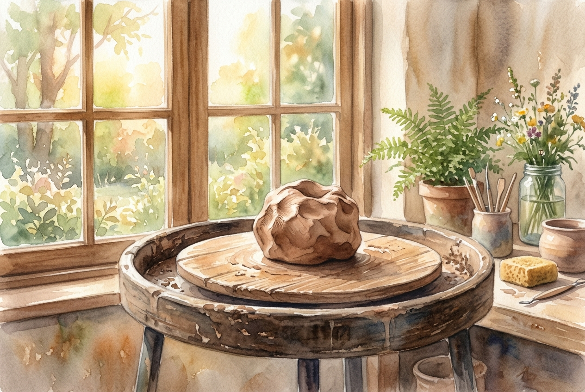

# Leitura Diária: Romans 12:1-2

*13 de maio de 2026*



> *(Image: A piece of raw clay resting on a wooden potter's wheel, illuminated by warm morning sunlight streaming through a nearby window, symbolizing gentle transformation.)*

## A Leitura (PT-NVI)

**Romans 12:1-2**

> Portanto, irmãos, rogo-lhes pelas misericórdias de Deus que se ofereçam em sacrifício vivo, santo e agradável a Deus; este é o culto racional de vocês. Não se amoldem ao padrão deste mundo, mas transformem-se pela renovação da sua mente, para que sejam capazes de experimentar e comprovar a boa, agradável e perfeita vontade de Deus.

## A História

Paulo escreve estas palavras como um grande ponto de transição em sua carta à igreja primitiva em Roma. Depois de passar vários capítulos explicando a profunda misericórdia e graça de Deus, ele muda o foco para o que isso significa na vida cotidiana. O apóstolo usa a imagem religiosa familiar dos sacrifícios no templo, mas a inverte completamente. Em vez de levar um animal a um altar para ser morto, os cristãos são convidados a entregar suas próprias vidas, plenamente vivas e ativas. Esse ato de oferecer a si mesmo é descrito como a forma mais lógica e autêntica de adoração. É algo que tira a fé de dentro de um edifício e a coloca na realidade da existência diária.

## Aplicação para Hoje

É incrivelmente fácil deixar que a cultura ao nosso redor dite nossos valores, hábitos e desejos. Somos constantemente pressionados a nos encaixar em moldes definidos pelo sucesso, pela polarização ou pelo consumo. No entanto, o convite aqui é para resistir a essa pressão externa, permitindo que ocorra uma transformação interna. Quando abrimos nossa mente para ser renovada pela graça divina, nossa perspectiva começa a mudar. Passamos a ver nosso tempo, energia e corpo não como ferramentas para o próprio avanço, mas como instrumentos de amor. Ao fazer isso, descobrimos uma maneira de viver que está profundamente alinhada com o que é bom e traz vida.

---

*Citações bíblicas extraídas da Nova Versão Internacional (NVI), © 1993, 2000 por Biblica, Inc. Usado com permissão.*

## Nos Bastidores: Os Dados da IA

Por curiosidade: o JSON que o gerador recebeu do modelo de texto e o prompt usado para a imagem.

```json
{
  "reference": "Romans 12:1-2",
  "passage": "Portanto, irmãos, rogo-lhes pelas misericórdias de Deus que se ofereçam em sacrifício vivo, santo e agradável a Deus; este é o culto racional de vocês. Não se amoldem ao padrão deste mundo, mas transformem-se pela renovação da sua mente, para que sejam capazes de experimentar e comprovar a boa, agradável e perfeita vontade de Deus.",
  "story": "Paulo escreve estas palavras como um grande ponto de transição em sua carta à igreja primitiva em Roma. Depois de passar vários capítulos explicando a profunda misericórdia e graça de Deus, ele muda o foco para o que isso significa na vida cotidiana. O apóstolo usa a imagem religiosa familiar dos sacrifícios no templo, mas a inverte completamente. Em vez de levar um animal a um altar para ser morto, os cristãos são convidados a entregar suas próprias vidas, plenamente vivas e ativas. Esse ato de oferecer a si mesmo é descrito como a forma mais lógica e autêntica de adoração. É algo que tira a fé de dentro de um edifício e a coloca na realidade da existência diária.",
  "lesson": "É incrivelmente fácil deixar que a cultura ao nosso redor dite nossos valores, hábitos e desejos. Somos constantemente pressionados a nos encaixar em moldes definidos pelo sucesso, pela polarização ou pelo consumo. No entanto, o convite aqui é para resistir a essa pressão externa, permitindo que ocorra uma transformação interna. Quando abrimos nossa mente para ser renovada pela graça divina, nossa perspectiva começa a mudar. Passamos a ver nosso tempo, energia e corpo não como ferramentas para o próprio avanço, mas como instrumentos de amor. Ao fazer isso, descobrimos uma maneira de viver que está profundamente alinhada com o que é bom e traz vida.",
  "tags": [
    "adoração",
    "entrega",
    "mentalidade",
    "transformação"
  ],
  "image_prompt": "A piece of raw clay resting on a wooden potter's wheel, illuminated by warm morning sunlight streaming through a nearby window, symbolizing gentle transformation."
}
```
