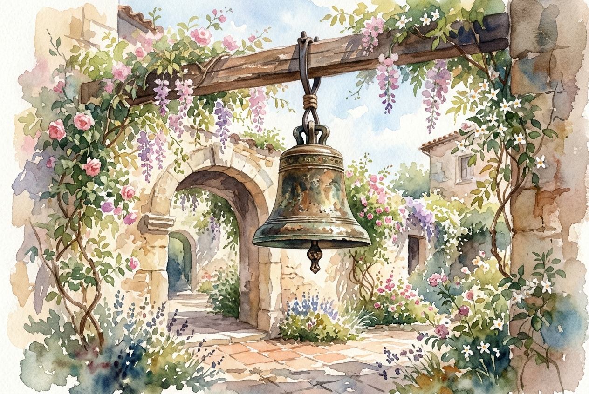

# Leitura Diária: 1 Corinthians 13

*13 de maio de 2026*

> *(Image: A weathered bronze bell hanging silently in a sunlit courtyard, surrounded by blooming vines.)*

## A Leitura (PT-NVI)

**1 Corinthians 13**

> 1 Ainda que eu fale as línguas dos homens e dos anjos, se não tiver amor, serei como o sino que ressoa ou como o prato que retine. 2 Ainda que eu tenha o dom de profecia e saiba todos os mistérios e todo o conhecimento, e tenha uma fé capaz de mover montanhas, mas não tiver amor, nada serei. 3 Ainda que eu dê aos pobres tudo o que possuo e entregue o meu corpo para ser queimado, mas não tiver amor, nada disso me valerá. 4 O amor é paciente, o amor é bondoso. Não inveja, não se vangloria, não se orgulha. 5 Não maltrata, não procura seus interesses, não se ira facilmente, não guarda rancor. 6 O amor não se alegra com a injustiça, mas se alegra com a verdade. 7 Tudo sofre, tudo crê, tudo espera, tudo suporta. 8 O amor nunca perece; mas as profecias desaparecerão, as línguas cessarão, o conhecimento passará. 9 Pois em parte conhecemos e em parte profetizamos; 10 quando, porém, vier o que é perfeito, o que é imperfeito desaparecerá. 11 Quando eu era menino, falava como menino, pensava como menino e raciocinava como menino. Quando me tornei homem, deixei para trás as coisas de menino. 12 Agora, pois, vemos apenas um reflexo obscuro, como em espelho; mas, então, veremos face a face. Agora conheço em parte; então, conhecerei plenamente, da mesma forma como sou plenamente conhecido. 13 Assim, permanecem agora estes três: a fé, a esperança e o amor. O maior deles, porém, é o amor.

## A História

A igreja primitiva em Corinto era uma comunidade vibrante, mas caótica, profundamente dividida por status, experiências espirituais e orgulho intelectual. O apóstolo Paulo escreveu a eles porque estavam classificando seus dons, tratando habilidades espetaculares como sinais de uma fé superior. Nesta carta, ele muda radicalmente a perspectiva do grupo ao retirar o valor de qualquer ação ou talento que não esteja enraizado no cuidado genuíno com o próximo. Ele contrasta a natureza temporária do conhecimento humano e das demonstrações espirituais com a permanência eterna do amor. Para Paulo, a obsessão da comunidade em parecer espiritual estava, na verdade, destruindo o alicerce de sua comunhão. Ele os lembra de que a compreensão atual que possuem do divino é fragmentada e incompleta, semelhante a observar um reflexo obscurecido.

## Aplicação para Hoje

É notavelmente fácil construir uma vida que pareça impressionante por fora, mas que permaneça totalmente vazia por dentro. Muitas vezes medimos nosso valor por nossas realizações, nossa inteligência ou até mesmo por nossa devoção religiosa, assumindo que essas coisas nos dão um valor duradouro. No entanto, este texto descarta nossos currículos e faz uma pergunta muito mais simples e difícil sobre como tratamos as pessoas ao nosso redor. A paciência, a bondade e a humildade não são apenas belos ideais; são as únicas coisas que sobreviverão ao teste do tempo. Quando abrimos mão da nossa necessidade de ter razão, de sermos notados ou de estarmos no controle, abrimos espaço para o tipo de amor que cura relacionamentos fraturados. No fim das contas, nossas conquistas mais brilhantes desaparecerão, mas as maneiras silenciosas e firmes que escolhemos para amar ecoarão pela eternidade.

---

*Citações bíblicas extraídas da Nova Versão Internacional (NVI), © 1993, 2000 por Biblica, Inc. Usado com permissão.*
