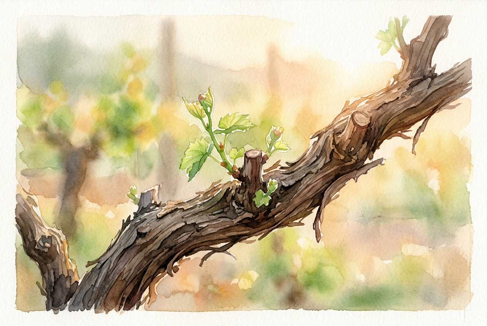

# Leitura Diária: John 15:1-11

*15 de maio de 2026*

> *(Image: A close up view of a thick ancient grapevine bathed in warm morning sunlight with small green shoots emerging from a carefully pruned branch.)*

## A Leitura (PT-NVI)

**John 15:1-11**

> 1 "Eu sou a videira verdadeira, e meu Pai é o agricultor. 2 Todo ramo que, estando em mim, não dá fruto, ele corta; e todo que dá fruto ele poda, para que dê mais fruto ainda. 3 Vocês já estão limpos, pela palavra que lhes tenho falado. 4 Permaneçam em mim, e eu permanecerei em vocês. Nenhum ramo pode dar fruto por si mesmo, se não permanecer na videira. Vocês também não podem dar fruto, se não permanecerem em mim. 5 "Eu sou a videira; vocês são os ramos. Se alguém permanecer em mim e eu nele, esse dá muito fruto; pois sem mim vocês não podem fazer coisa alguma. 6 Se alguém não permanecer em mim, será como o ramo que é jogado fora e seca. Tais ramos são apanhados, lançados ao fogo e queimados. 7 Se vocês permanecerem em mim, e as minhas palavras permanecerem em vocês, pedirão o que quiserem, e lhes será concedido. 8 Meu Pai é glorificado pelo fato de vocês darem muito fruto; e assim serão meus discípulos. 9 "Como o Pai me amou, assim eu os amei; permaneçam no meu amor. 10 Se vocês obedecerem aos meus mandamentos, permanecerão no meu amor, assim como tenho obedecido aos mandamentos de meu Pai e em seu amor permaneço. 11 Tenho lhes dito estas palavras para que a minha alegria esteja em vocês e a alegria de vocês seja completa.

## A História

No antigo mundo mediterrâneo, os vinhedos eram fundamentais para a vida cotidiana e a economia. O cultivo das uvas exigia uma atenção contínua e meticulosa de um agricultor dedicado. Esse processo envolvia não apenas regar as plantas, mas também cortar os galhos secos e aparar até mesmo os brotos mais saudáveis. Para um observador casual, essa poda agressiva poderia parecer destrutiva ou cruel. No entanto, os viticultores sabiam que, sem essa intervenção, a energia da videira seria desperdiçada na produção de folhas em vez de frutos doces. Jesus utiliza esse ritmo agrícola tão familiar para ilustrar a dinâmica da vitalidade espiritual pouco antes de sua partida.

## Aplicação para Hoje

É comum confundirmos as fases difíceis da vida com abandono divino, mas o texto nos convida a enxergá-las como um processo de cultivo intencional. O agricultor não corta para ferir, mas para redirecionar nossa energia rumo àquilo que tem valor real. Nossa principal responsabilidade não é forçar um desenvolvimento pessoal ou fabricar resultados. Somos chamados simplesmente a manter nossa conexão com a fonte da vida. Quando nosso foco está em continuar enraizados nesse amor sustentador, o amadurecimento ocorre de forma orgânica. O propósito final dessa união e desse refinamento é uma alegria profunda e inabalável.

---

*Citações bíblicas extraídas da Nova Versão Internacional (NVI), © 1993, 2000 por Biblica, Inc. Usado com permissão.*
