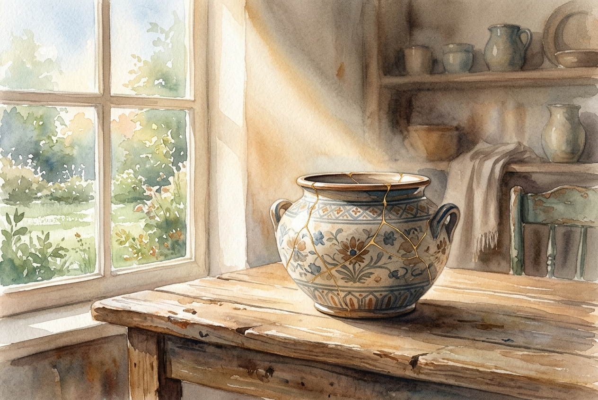

# Daily Reading: Ephesians 2:1-10

*May 17, 2026*

> *(Image: A beautiful, intricately restored piece of pottery resting on a rustic wooden table, illuminated by a warm beam of morning sunlight shining through a window.)*

## The Reading (NLT)

**Ephesians 2:1-10**

> 1 Once you were dead because of your disobedience and your many sins. 2 You used to live in sin, just like the rest of the world, obeying the devil the commander of the powers in the unseen world. He is the spirit at work in the hearts of those who refuse to obey God. 3 All of us used to live that way, following the passionate desires and inclinations of our sinful nature. By our very nature we were subject to God's anger, just like everyone else. 4 But God is so rich in mercy, and he loved us so much, 5 that even though we were dead because of our sins, he gave us life when he raised Christ from the dead. (It is only by God's grace that you have been saved!) 6 For he raised us from the dead along with Christ and seated us with him in the heavenly realms because we are united with Christ Jesus. 7 So God can point to us in all future ages as examples of the incredible wealth of his grace and kindness toward us, as shown in all he has done for us who are united with Christ Jesus. 8 God saved you by his grace when you believed. And you can't take credit for this; it is a gift from God. 9 Salvation is not a reward for the good things we have done, so none of us can boast about it. 10 For we are God's masterpiece. He has created us anew in Christ Jesus, so we can do the good things he planned for us long ago.

## The Story

The letter to the Ephesians paints a stark contrast between a past defined by spiritual lifelessness and a present defined by vibrant renewal. The author reminds his readers that they were once trapped in destructive patterns, entirely unable to rescue themselves. The turning point of the passage hinges on abundant divine mercy, which interrupts this hopeless trajectory. Instead of demanding that the people clean themselves up first, the Creator acts to bring them back to life. This rescue is framed as an absolute gift, dismantling any human tendency to brag about spiritual achievements. Finally, the text shifts focus from what people cannot do to what they are newly made to do, describing them as divine artwork.

## Application for Today

It is incredibly easy to treat faith like a transaction, keeping a mental scorecard of our good deeds to ensure we stay in good standing. We often carry the exhausting burden of trying to prove our worth through our achievements. This passage offers a profound exhale, reminding us that our rescue is a pure gift, completely separate from our performance. We do not have to earn our way into being loved. Instead, we are invited to see ourselves as carefully crafted works of art, remade with intention. The good we do in the world is no longer a desperate attempt to gain approval, but a joyful response to the grace we have already received.

---

*Scripture quotations are taken from the Holy Bible, New Living Translation, copyright © 1996, 2004, 2015 by Tyndale House Foundation. Used by permission of Tyndale House Publishers.*
