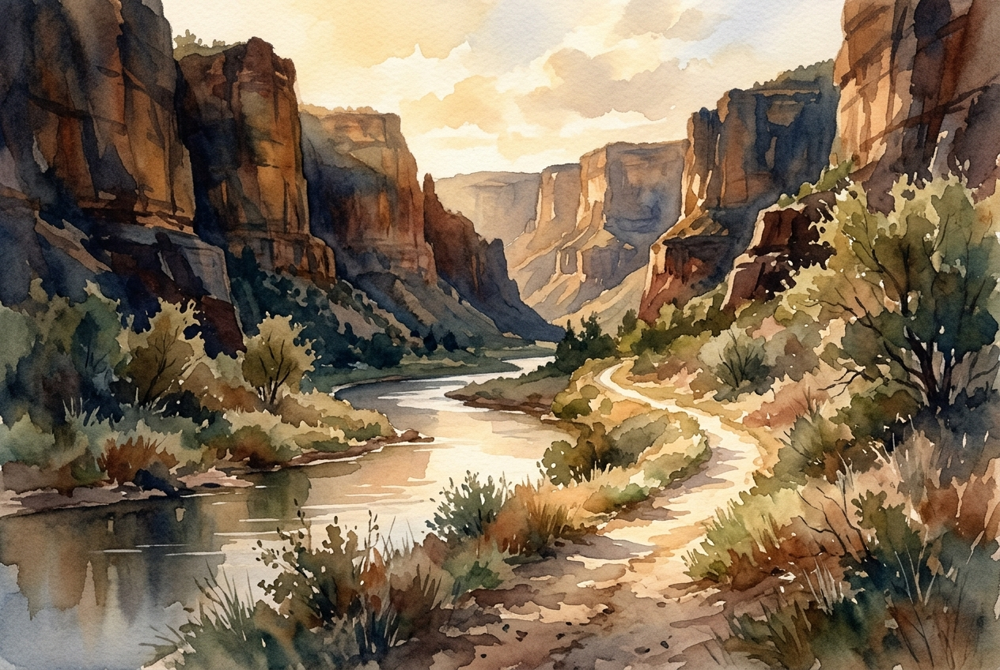

# Leitura Diária: Psalm 23

*17 de maio de 2026*



> *(Image: A sunlit path winding through a deep, shadowed canyon beside a calm river, painted in a soft, impressionistic style.)*

## A Leitura (PT-NVI)

**Psalm 23**

> O Senhor é o meu pastor; de nada terei falta. Em verdes pastagens me faz repousar e me conduz a águas tranqüilas; restaura-me o vigor. Guia-me nas veredas da justiça por amor do seu nome. Mesmo quando eu andar por um vale de trevas e morte, não temerei perigo algum, pois tu estás comigo; a tua vara e o teu cajado me protegem. Preparas um banquete para mim à vista dos meus inimigos. Tu me honras, ungindo a minha cabeça com óleo e fazendo transbordar o meu cálice. Sei que a bondade e a fidelidade me acompanharão todos os dias da minha vida, e voltarei à casa do Senhor enquanto eu viver.

## A História

Na antiga cultura do Oriente Médio, a relação entre um pastor e seu rebanho era de cuidado constante e profundo. O relevo da Judeia era acidentado e perigoso, repleto de ravinas íngremes, desertos áridos e predadores repentinos. Um bom cuidador precisava conhecer intimamente os locais onde encontrar água segura e pastos escondidos para sustentar os animais. Além disso, essa figura se transformava na de um anfitrião generoso quando viajantes buscavam refúgio. Oferecer uma refeição farta e ungir um hóspede com óleo perfumado eram símbolos culturais fortíssimos de proteção absoluta e provisão abundante. O anfitrião assumia responsabilidade total pela segurança de quem estivesse sob seu teto, mesmo que adversários aguardassem do lado de fora.

## Aplicação para Hoje

Muitas vezes desejamos que nossa jornada espiritual seja apenas uma sequência de dias tranquilos e ensolarados. No entanto, este texto reconhece que as descidas profundas e as ameaças iminentes são partes inevitáveis da experiência humana. A promessa que encontramos aqui não é a ausência de perigo, mas a presença de um guia fiel que caminha ao nosso lado. Quando a ansiedade ou a oposição cercarem você, não é preciso se desesperar tentando garantir sua própria defesa ou sustento. Existe uma provisão silenciosa e constante disponível bem no meio da dificuldade. Você pode se sentar, descansar e se alimentar mesmo enquanto a tempestade ruge lá fora. A verdadeira segurança vem de saber quem está recebendo você à mesa.

---

*Citações bíblicas extraídas da Nova Versão Internacional (NVI), © 1993, 2000 por Biblica, Inc. Usado com permissão.*

## Nos Bastidores: Os Dados da IA

Por curiosidade: o JSON que o gerador recebeu do modelo de texto e o prompt usado para a imagem.

```json
{
  "reference": "Psalm 23",
  "passage": "O Senhor é o meu pastor; de nada terei falta. Em verdes pastagens me faz repousar e me conduz a águas tranqüilas; restaura-me o vigor. Guia-me nas veredas da justiça por amor do seu nome. Mesmo quando eu andar por um vale de trevas e morte, não temerei perigo algum, pois tu estás comigo; a tua vara e o teu cajado me protegem. Preparas um banquete para mim à vista dos meus inimigos. Tu me honras, ungindo a minha cabeça com óleo e fazendo transbordar o meu cálice. Sei que a bondade e a fidelidade me acompanharão todos os dias da minha vida, e voltarei à casa do Senhor enquanto eu viver.",
  "story": "Na antiga cultura do Oriente Médio, a relação entre um pastor e seu rebanho era de cuidado constante e profundo. O relevo da Judeia era acidentado e perigoso, repleto de ravinas íngremes, desertos áridos e predadores repentinos. Um bom cuidador precisava conhecer intimamente os locais onde encontrar água segura e pastos escondidos para sustentar os animais. Além disso, essa figura se transformava na de um anfitrião generoso quando viajantes buscavam refúgio. Oferecer uma refeição farta e ungir um hóspede com óleo perfumado eram símbolos culturais fortíssimos de proteção absoluta e provisão abundante. O anfitrião assumia responsabilidade total pela segurança de quem estivesse sob seu teto, mesmo que adversários aguardassem do lado de fora.",
  "lesson": "Muitas vezes desejamos que nossa jornada espiritual seja apenas uma sequência de dias tranquilos e ensolarados. No entanto, este texto reconhece que as descidas profundas e as ameaças iminentes são partes inevitáveis da experiência humana. A promessa que encontramos aqui não é a ausência de perigo, mas a presença de um guia fiel que caminha ao nosso lado. Quando a ansiedade ou a oposição cercarem você, não é preciso se desesperar tentando garantir sua própria defesa ou sustento. Existe uma provisão silenciosa e constante disponível bem no meio da dificuldade. Você pode se sentar, descansar e se alimentar mesmo enquanto a tempestade ruge lá fora. A verdadeira segurança vem de saber quem está recebendo você à mesa.",
  "tags": [
    "confiança",
    "consolo",
    "orientação",
    "paz",
    "provisão"
  ],
  "image_prompt": "A sunlit path winding through a deep, shadowed canyon beside a calm river, painted in a soft, impressionistic style."
}
```
