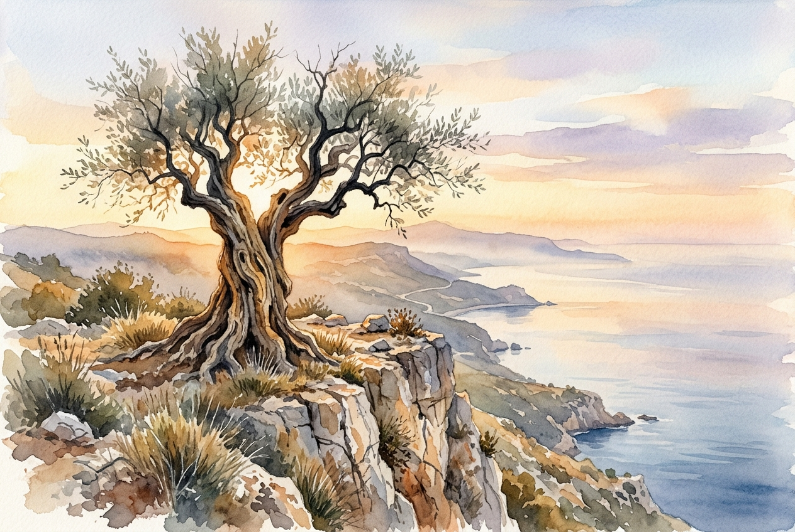

# Leitura Diária: 2 Corinthians 4:16-18

*18 de maio de 2026*



> *(Image: A weathered, ancient olive tree stands firmly on a rocky cliff, its deeply grooved bark illuminated by the warm, golden light of a breaking dawn.)*

## A Leitura (PT-NVI)

**2 Corinthians 4:16-18**

> Por isso não desanimamos. Embora exteriormente estejamos a desgastar-nos, interiormente estamos sendo renovados dia após dia, pois os nossos sofrimentos leves e momentâneos estão produzindo para nós uma glória eterna que pesa mais do que todos eles. Assim, fixamos os olhos, não naquilo que se vê, mas no que não se vê, pois o que se vê é transitório, mas o que não se vê é eterno.

## A História

Paulo escreveu à comunidade de Corinto durante um período de extrema dificuldade pessoal e vulnerabilidade física. Ele lidava constantemente com perseguições, doenças e a dura realidade do envelhecimento. No mundo antigo, o sofrimento físico era frequentemente interpretado como um sinal de desaprovação divina ou fracasso. No entanto, o apóstolo inverte totalmente essa lógica cultural. Ele apresenta um contraste profundo entre o desgaste externo do corpo e a constante transformação interior do espírito. Em vez de ignorar sua dor, ele a coloca em uma balança contra um futuro inimaginável e duradouro.

## Aplicação para Hoje

É muito fácil nos sentirmos esmagados pelas lutas tangíveis que estão bem diante dos nossos olhos. Doenças, preocupações financeiras e o cansaço do tempo são realidades visíveis e pesadas que exigem nossa atenção diária. O texto nos convida a mudar nosso ponto de foco, sem que para isso precisemos invalidar nossa dor. Ao voltarmos nossa atenção para o trabalho espiritual que acontece silenciosamente sob a superfície, encontramos uma âncora firme. As dificuldades de hoje são reais, mas não têm a palavra final sobre a nossa história. Somos chamados a confiar que uma restauração silenciosa e eterna está em andamento, superando tudo aquilo que podemos tocar ou medir no presente.

---

*Citações bíblicas extraídas da Nova Versão Internacional (NVI), © 1993, 2000 por Biblica, Inc. Usado com permissão.*

## Nos Bastidores: Os Dados da IA

Por curiosidade: o JSON que o gerador recebeu do modelo de texto e o prompt usado para a imagem.

```json
{
  "reference": "2 Corinthians 4:16-18",
  "passage": "Por isso não desanimamos. Embora exteriormente estejamos a desgastar-nos, interiormente estamos sendo renovados dia após dia, pois os nossos sofrimentos leves e momentâneos estão produzindo para nós uma glória eterna que pesa mais do que todos eles. Assim, fixamos os olhos, não naquilo que se vê, mas no que não se vê, pois o que se vê é transitório, mas o que não se vê é eterno.",
  "story": "Paulo escreveu à comunidade de Corinto durante um período de extrema dificuldade pessoal e vulnerabilidade física. Ele lidava constantemente com perseguições, doenças e a dura realidade do envelhecimento. No mundo antigo, o sofrimento físico era frequentemente interpretado como um sinal de desaprovação divina ou fracasso. No entanto, o apóstolo inverte totalmente essa lógica cultural. Ele apresenta um contraste profundo entre o desgaste externo do corpo e a constante transformação interior do espírito. Em vez de ignorar sua dor, ele a coloca em uma balança contra um futuro inimaginável e duradouro.",
  "lesson": "É muito fácil nos sentirmos esmagados pelas lutas tangíveis que estão bem diante dos nossos olhos. Doenças, preocupações financeiras e o cansaço do tempo são realidades visíveis e pesadas que exigem nossa atenção diária. O texto nos convida a mudar nosso ponto de foco, sem que para isso precisemos invalidar nossa dor. Ao voltarmos nossa atenção para o trabalho espiritual que acontece silenciosamente sob a superfície, encontramos uma âncora firme. As dificuldades de hoje são reais, mas não têm a palavra final sobre a nossa história. Somos chamados a confiar que uma restauração silenciosa e eterna está em andamento, superando tudo aquilo que podemos tocar ou medir no presente.",
  "tags": [
    "esperança",
    "eternidade",
    "perspectiva",
    "renovação",
    "sofrimento"
  ],
  "image_prompt": "A weathered, ancient olive tree stands firmly on a rocky cliff, its deeply grooved bark illuminated by the warm, golden light of a breaking dawn."
}
```
