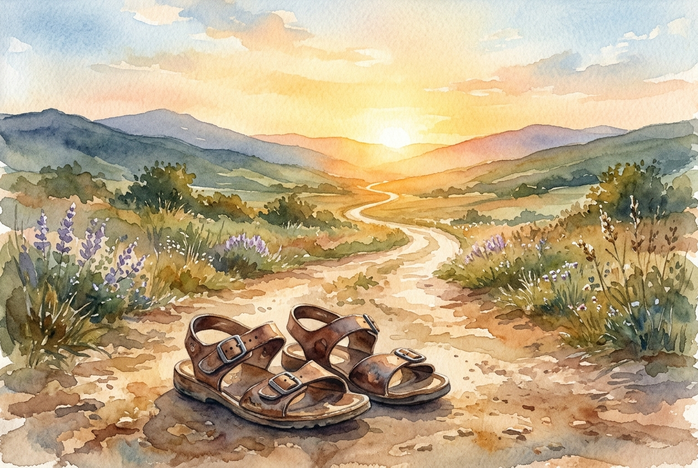

# Leitura Diária: Hebrews 12:1-3

*19 de maio de 2026*



> *(Image: A pair of worn leather sandals left behind on a dusty path, with the trail winding forward toward a bright, golden sunrise over distant hills.)*

## A Leitura (PT-NVI)

**Hebrews 12:1-3**

> Portanto, também nós, uma vez que estamos rodeados por tão grande nuvem de testemunhas, livremo-nos de tudo o que nos atrapalha e do pecado que nos envolve, e corramos com perseverança a corrida que nos é proposta, tendo os olhos fitos em Jesus, autor e consumador da nossa fé. Ele, pela alegria que lhe fora proposta, suportou a cruz, desprezando a vergonha, e assentou-se à direita do trono de Deus. Pensem bem naquele que suportou tal oposição dos pecadores contra si mesmo, para que vocês não se cansem nem se desanimem.

## A História

O autor de Hebreus se dirige a uma comunidade exausta pelas dificuldades e pelo desgaste diário de sua jornada espiritual. Para encorajá-los, o texto evoca a atmosfera de um antigo estádio atlético repleto de figuras lendárias que já concluíram suas próprias provas rigorosas. Os leitores são descritos como corredores atuais que precisam se desfazer de qualquer equipamento desnecessário ou vestimenta emaranhada que possa causar tropeços. A estratégia definitiva para esse desafio de longa distância é o foco singular. Eles são orientados a fixar o olhar naquele que abriu o caminho e enfrentou a hostilidade suprema. Ao lembrar de sua capacidade de enxergar além da vergonha imediata em direção à alegria futura, o público cansado pode encontrar forças para continuar avançando.

## Aplicação para Hoje

Muitas vezes acumulamos detritos emocionais e espirituais desnecessários ao longo dos anos. Antigos ressentimentos, ansiedades profundas e hábitos destrutivos familiares agem como âncoras pesadas, fazendo com que a jornada diária pareça incrivelmente íngreme. A sabedoria aqui nos convida a fazer um inventário rigoroso do que carregamos e a abandonar intencionalmente tudo o que esgota nossa vitalidade. Não conseguimos manter o ritmo se passarmos os dias olhando para os nossos próprios tropeços ou obcecados com a nossa fadiga. A verdadeira resistência surge quando voltamos nossa atenção para o pioneiro que percorreu a estrada mais escura antes de nós. Quando nossa energia acaba e o mundo parece esmagador, seu exemplo de resiliência silenciosa fornece exatamente o fôlego necessário para continuarmos avançando.

---

*Citações bíblicas extraídas da Nova Versão Internacional (NVI), © 1993, 2000 por Biblica, Inc. Usado com permissão.*

## Nos Bastidores: Os Dados da IA

Por curiosidade: o JSON que o gerador recebeu do modelo de texto e o prompt usado para a imagem.

```json
{
  "reference": "Hebrews 12:1-3",
  "passage": "Portanto, também nós, uma vez que estamos rodeados por tão grande nuvem de testemunhas, livremo-nos de tudo o que nos atrapalha e do pecado que nos envolve, e corramos com perseverança a corrida que nos é proposta, tendo os olhos fitos em Jesus, autor e consumador da nossa fé. Ele, pela alegria que lhe fora proposta, suportou a cruz, desprezando a vergonha, e assentou-se à direita do trono de Deus. Pensem bem naquele que suportou tal oposição dos pecadores contra si mesmo, para que vocês não se cansem nem se desanimem.",
  "story": "O autor de Hebreus se dirige a uma comunidade exausta pelas dificuldades e pelo desgaste diário de sua jornada espiritual. Para encorajá-los, o texto evoca a atmosfera de um antigo estádio atlético repleto de figuras lendárias que já concluíram suas próprias provas rigorosas. Os leitores são descritos como corredores atuais que precisam se desfazer de qualquer equipamento desnecessário ou vestimenta emaranhada que possa causar tropeços. A estratégia definitiva para esse desafio de longa distância é o foco singular. Eles são orientados a fixar o olhar naquele que abriu o caminho e enfrentou a hostilidade suprema. Ao lembrar de sua capacidade de enxergar além da vergonha imediata em direção à alegria futura, o público cansado pode encontrar forças para continuar avançando.",
  "lesson": "Muitas vezes acumulamos detritos emocionais e espirituais desnecessários ao longo dos anos. Antigos ressentimentos, ansiedades profundas e hábitos destrutivos familiares agem como âncoras pesadas, fazendo com que a jornada diária pareça incrivelmente íngreme. A sabedoria aqui nos convida a fazer um inventário rigoroso do que carregamos e a abandonar intencionalmente tudo o que esgota nossa vitalidade. Não conseguimos manter o ritmo se passarmos os dias olhando para os nossos próprios tropeços ou obcecados com a nossa fadiga. A verdadeira resistência surge quando voltamos nossa atenção para o pioneiro que percorreu a estrada mais escura antes de nós. Quando nossa energia acaba e o mundo parece esmagador, seu exemplo de resiliência silenciosa fornece exatamente o fôlego necessário para continuarmos avançando.",
  "tags": [
    "foco",
    "fé",
    "liberdade",
    "perseverança",
    "resiliência"
  ],
  "image_prompt": "A pair of worn leather sandals left behind on a dusty path, with the trail winding forward toward a bright, golden sunrise over distant hills."
}
```
