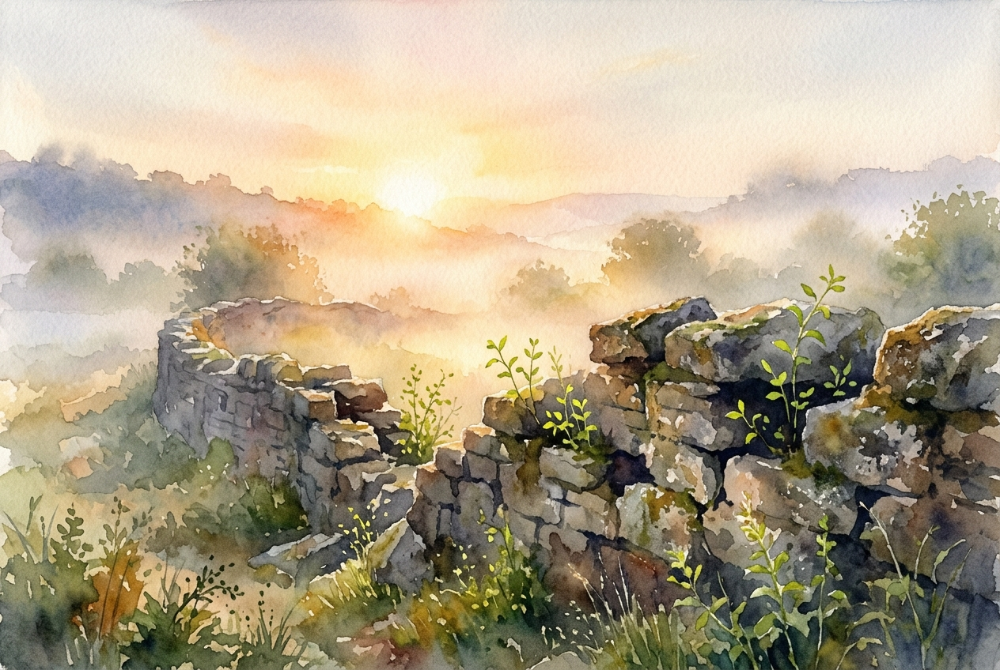

# Leitura Diária: Lamentations 3:22-26

*20 de maio de 2026*



> *(Image: A gentle golden sunrise breaking through the mist over a crumbling ancient stone wall, illuminating small green shoots growing from the cracks.)*

## A Leitura (PT-NVI)

**Lamentations 3:22-26**

> Graças ao grande amor do Senhor é que não somos consumidos, pois as suas misericórdias são inesgotáveis. Renovam-se cada manhã; grande é a tua fidelidade! Digo a mim mesmo: A minha porção é o Senhor; portanto, nele porei a minha esperança. O Senhor é bom para com aqueles cuja esperança está nele, para com aqueles que o buscam; é bom esperar tranqüilo pela salvação do Senhor.

## A História

O livro de Lamentações foi escrito logo após um trauma nacional devastador. Jerusalém havia sido saqueada, seu templo destruído e o povo levado para o exílio. O poeta passa capítulos inteiros derramando uma dor crua e profunda sobre a perda de tudo o que conhecia. No entanto, bem no centro estrutural dessa coleção de lamentos, o tom muda de repente. Cercado pelos escombros literais e figurativos de seu mundo, o escritor faz uma escolha consciente de lembrar do caráter constante de seu Criador.

## Aplicação para Hoje

É profundamente difícil procurar por luz quando tudo ao nosso redor parece estar desmoronando. Muitas vezes, presumimos que a fé exige ignorar a nossa dor ou fingir que as ruínas não são reais. Mas este antigo poeta nos mostra um caminho diferente, reconhecendo a tristeza enquanto ancora sua mente em uma realidade mais profunda. Escolher o silêncio e a quietude não é uma resignação passiva, mas uma postura ativa e corajosa de confiança. Quando acordamos para enfrentar mais um dia difícil, a própria manhã se torna um testemunho de um amor que sobrevive às nossas noites mais escuras.

---

*Citações bíblicas extraídas da Nova Versão Internacional (NVI), © 1993, 2000 por Biblica, Inc. Usado com permissão.*

## Nos Bastidores: Os Dados da IA

Por curiosidade: o JSON que o gerador recebeu do modelo de texto e o prompt usado para a imagem.

```json
{
  "reference": "Lamentations 3:22-26",
  "passage": "Graças ao grande amor do Senhor é que não somos consumidos, pois as suas misericórdias são inesgotáveis. Renovam-se cada manhã; grande é a tua fidelidade! Digo a mim mesmo: A minha porção é o Senhor; portanto, nele porei a minha esperança. O Senhor é bom para com aqueles cuja esperança está nele, para com aqueles que o buscam; é bom esperar tranqüilo pela salvação do Senhor.",
  "story": "O livro de Lamentações foi escrito logo após um trauma nacional devastador. Jerusalém havia sido saqueada, seu templo destruído e o povo levado para o exílio. O poeta passa capítulos inteiros derramando uma dor crua e profunda sobre a perda de tudo o que conhecia. No entanto, bem no centro estrutural dessa coleção de lamentos, o tom muda de repente. Cercado pelos escombros literais e figurativos de seu mundo, o escritor faz uma escolha consciente de lembrar do caráter constante de seu Criador.",
  "lesson": "É profundamente difícil procurar por luz quando tudo ao nosso redor parece estar desmoronando. Muitas vezes, presumimos que a fé exige ignorar a nossa dor ou fingir que as ruínas não são reais. Mas este antigo poeta nos mostra um caminho diferente, reconhecendo a tristeza enquanto ancora sua mente em uma realidade mais profunda. Escolher o silêncio e a quietude não é uma resignação passiva, mas uma postura ativa e corajosa de confiança. Quando acordamos para enfrentar mais um dia difícil, a própria manhã se torna um testemunho de um amor que sobrevive às nossas noites mais escuras.",
  "tags": [
    "confiança",
    "espera",
    "esperança",
    "luto",
    "misericórdia"
  ],
  "image_prompt": "A gentle golden sunrise breaking through the mist over a crumbling ancient stone wall, illuminating small green shoots growing from the cracks."
}
```
