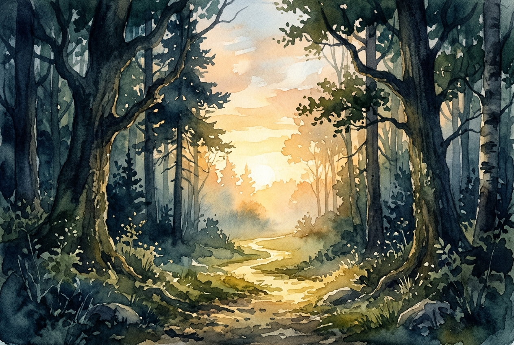

# Leitura Diária: John 3:16-21

*21 de maio de 2026*

> *(Image: A gentle golden sunrise breaking through a dense, shadowy forest, illuminating a clear path forward.)*

## A Leitura (PT-NVI)

**John 3:16-21**

> 16 "Porque Deus tanto amou o mundo que deu o seu Filho Unigênito, para que todo o que nele crer não pereça, mas tenha a vida eterna. 17 Pois Deus enviou o seu Filho ao mundo, não para condenar o mundo, mas para que este fosse salvo por meio dele. 18 Quem nele crê não é condenado, mas quem não crê já está condenado, por não crer no nome do Filho Unigênito de Deus. 19 Este é o julgamento: a luz veio ao mundo, mas os homens amaram as trevas, e não a luz, porque as suas obras eram más. 20 Quem pratica o mal odeia a luz e não se aproxima da luz, temendo que as suas obras sejam manifestas. 21 Mas quem pratica a verdade vem para a luz, para que se veja claramente que as suas obras são realizadas por intermédio de Deus".

## A História

O Evangelho de João frequentemente utiliza contrastes marcantes para ilustrar realidades espirituais, e aqui a imagem da luz contra as trevas ganha grande destaque. Esse trecho ocorre logo após uma conversa noturna com um líder religioso, o que torna a metáfora sobre caminhar para a luz ainda mais profunda. No contexto judaico do primeiro século, a claridade era um símbolo clássico da verdade e da presença divina. O autor enfatiza que a missão de resgate celestial foi motivada por um amor imenso por toda a humanidade, e não por um desejo de punição. A grande tragédia descrita não é a falta de valor humano, mas a nossa tendência de fugir dessa luz que salva, preferindo as sombras para esconder nossas fragilidades.

## Aplicação para Hoje

É um instinto humano muito comum tentar esconder nossos defeitos, com medo de que a verdadeira transparência resulte em rejeição. No entanto, o texto nos convida a mudar nossa perspectiva sobre a clareza divina. A luz não é um holofote impiedoso que busca nos humilhar, mas sim o brilho de um amanhecer que traz cura e restauração. Quando paramos de nos esconder e permitimos que nossas vidas sejam iluminadas, o desconforto inicial da vulnerabilidade cede lugar a uma liberdade maravilhosa. Somos chamados a viver com autenticidade, confiando que a força por trás dessa luz é um afeto incondicional. Viver na verdade é aceitar que somos plenamente conhecidos e, ao mesmo tempo, eternamente amados.

---

*Citações bíblicas extraídas da Nova Versão Internacional (NVI), © 1993, 2000 por Biblica, Inc. Usado com permissão.*
