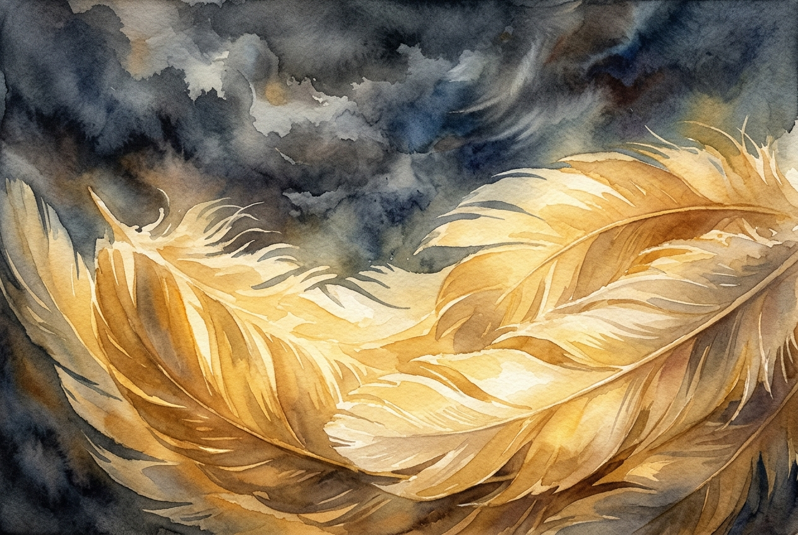

# Daily Reading: Psalm 91

*May 22, 2026*



> *(Image: A close-up view of soft, massive bird feathers glowing with a warm golden light against a dark, turbulent sky, evoking a profound sense of shelter and peace.)*

## The Reading (NLT)

**Psalm 91**

> Those who live in the shelter of the Most High will find rest in the shadow of the Almighty. This I declare about the Lord: He alone is my refuge, my place of safety; he is my God, and I trust him. For he will rescue you from every trap and protect you from deadly disease. He will cover you with his feathers. He will shelter you with his wings. His faithful promises are your armor and protection. Do not be afraid of the terrors of the night, nor the arrow that flies in the day. Do not dread the disease that stalks in darkness, nor the disaster that strikes at midday. Though a thousand fall at your side, though ten thousand are dying around you, these evils will not touch you. Just open your eyes, and see how the wicked are punished. If you make the Lord your refuge, if you make the Most High your shelter, no evil will conquer you; no plague will come near your home. For he will order his angels to protect you wherever you go. They will hold you up with their hands so you won't even hurt your foot on a stone. You will trample upon lions and cobras; you will crush fierce lions and serpents under your feet! The Lord says, I will rescue those who love me. I will protect those who trust in my name. When they call on me, I will answer; I will be with them in trouble. I will rescue and honor them. I will reward them with a long life and give them my salvation.

## The Story

This ancient poem paints a vivid picture of a world fraught with danger. The psalmist lists the very real terrors of their time, from hidden traps and sudden disease to the violence of war and the deep anxieties of the night. Yet, amidst this chaotic landscape, the writer introduces an image of profound tenderness. God is described like a mother bird shielding her young beneath her feathers, shifting the focus from fear to an intimate, vast protection.

## Application for Today

It is tempting to read this passage as a guarantee that we will never face hardship, illness, or pain. However, a deeper look reveals a God who joins us in the midst of our deepest fears. The promise is not a life completely free from trouble, but the assurance that trouble does not have the final word. When the night feels dark or the news cycle sparks panic, we are invited to seek shelter in a love that outlasts our circumstances. Resting in that shelter changes how we walk through the world. We can face our daily anxieties knowing we are held securely, regardless of what the day brings.

---

*Scripture quotations are taken from the Holy Bible, New Living Translation, copyright © 1996, 2004, 2015 by Tyndale House Foundation. Used by permission of Tyndale House Publishers.*

## Behind the Scenes: The AI Data

For curiosity: the JSON the generator received from the text model and the prompt used for the image.

```json
{
  "reference": "Psalm 91",
  "passage": "Those who live in the shelter of the Most High will find rest in the shadow of the Almighty. This I declare about the Lord: He alone is my refuge, my place of safety; he is my God, and I trust him. For he will rescue you from every trap and protect you from deadly disease. He will cover you with his feathers. He will shelter you with his wings. His faithful promises are your armor and protection. Do not be afraid of the terrors of the night, nor the arrow that flies in the day. Do not dread the disease that stalks in darkness, nor the disaster that strikes at midday. Though a thousand fall at your side, though ten thousand are dying around you, these evils will not touch you. Just open your eyes, and see how the wicked are punished. If you make the Lord your refuge, if you make the Most High your shelter, no evil will conquer you; no plague will come near your home. For he will order his angels to protect you wherever you go. They will hold you up with their hands so you won't even hurt your foot on a stone. You will trample upon lions and cobras; you will crush fierce lions and serpents under your feet! The Lord says, I will rescue those who love me. I will protect those who trust in my name. When they call on me, I will answer; I will be with them in trouble. I will rescue and honor them. I will reward them with a long life and give them my salvation.",
  "story": "This ancient poem paints a vivid picture of a world fraught with danger. The psalmist lists the very real terrors of their time, from hidden traps and sudden disease to the violence of war and the deep anxieties of the night. Yet, amidst this chaotic landscape, the writer introduces an image of profound tenderness. God is described like a mother bird shielding her young beneath her feathers, shifting the focus from fear to an intimate, vast protection.",
  "lesson": "It is tempting to read this passage as a guarantee that we will never face hardship, illness, or pain. However, a deeper look reveals a God who joins us in the midst of our deepest fears. The promise is not a life completely free from trouble, but the assurance that trouble does not have the final word. When the night feels dark or the news cycle sparks panic, we are invited to seek shelter in a love that outlasts our circumstances. Resting in that shelter changes how we walk through the world. We can face our daily anxieties knowing we are held securely, regardless of what the day brings.",
  "tags": [
    "anxiety",
    "comfort",
    "presence",
    "protection",
    "trust"
  ],
  "image_prompt": "A close-up view of soft, massive bird feathers glowing with a warm golden light against a dark, turbulent sky, evoking a profound sense of shelter and peace."
}
```
