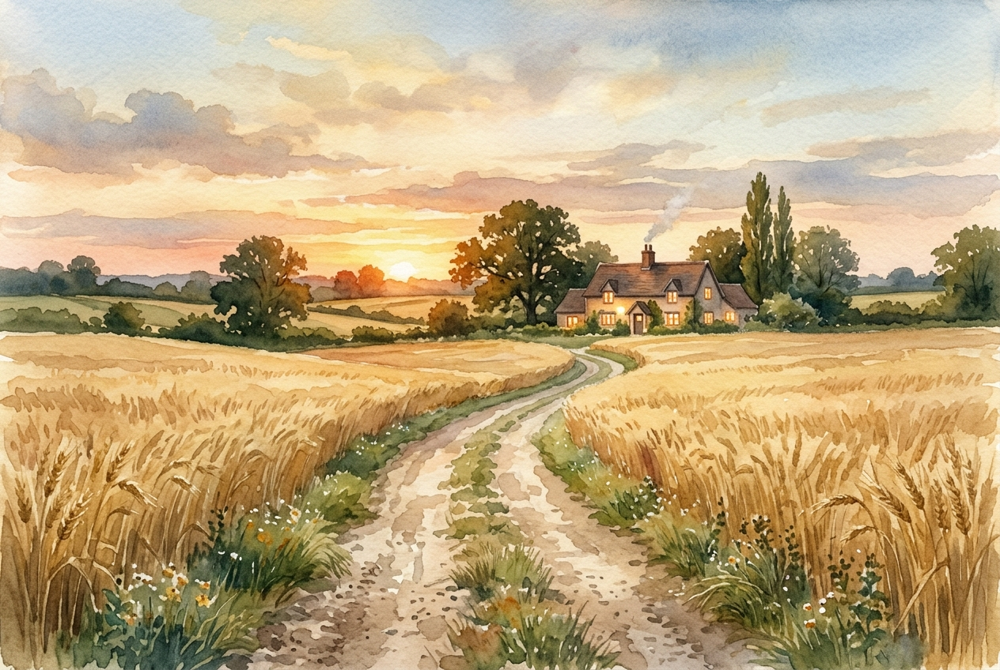

# Leitura Diária: Luke 15:11-32

*23 de maio de 2026*



> *(Image: A dusty dirt road stretching through golden wheat fields toward a warmly lit farmhouse at twilight, capturing a profound sense of anticipation and homecoming.)*

## A Leitura (PT-NVI)

**Luke 15:11-32**

> Jesus continuou: "Um homem tinha dois filhos. O mais novo disse ao seu pai: ‘Pai, quero a minha parte da herança’. Assim, ele repartiu sua propriedade entre eles. "Não muito tempo depois, o filho mais novo reuniu tudo o que tinha, e foi para uma região distante; e lá desperdiçou os seus bens vivendo irresponsavelmente. Depois de ter gasto tudo, houve uma grande fome em toda aquela região, e ele começou a passar necessidade. Por isso foi empregar-se com um dos cidadãos daquela região, que o mandou para o seu campo a fim de cuidar de porcos. Ele desejava encher o estômago com as vagens de alfarrobeira que os porcos comiam, mas ninguém lhe dava nada. "Caindo em si, ele disse: ‘Quantos empregados de meu pai têm comida de sobra, e eu aqui, morrendo de fome! Eu me porei a caminho e voltarei para meu pai, e lhe direi: Pai, pequei contra o céu e contra ti. Não sou mais digno de ser chamado teu filho; trata-me como um dos teus empregados’. A seguir, levantou-se e foi para seu pai. "Estando ainda longe, seu pai o viu e, cheio de compaixão, correu para seu filho, e o abraçou e beijou. "O filho lhe disse: ‘Pai, pequei contra o céu e contra ti. Não sou mais digno de ser chamado teu filho’. "Mas o pai disse aos seus servos: ‘Depressa! Tragam a melhor roupa e vistam nele. Coloquem um anel em seu dedo e calçados em seus pés. Tragam o novilho gordo e matem-no. Vamos fazer uma festa e comemorar. Pois este meu filho estava morto e voltou à vida; estava perdido e foi achado’. E começaram a festejar. "Enquanto isso, o filho mais velho estava no campo. Quando se aproximou da casa, ouviu a música e a dança. Então chamou um dos servos e perguntou-lhe o que estava acontecendo. Este lhe respondeu: ‘Seu irmão voltou, e seu pai matou o novilho gordo, porque o recebeu de volta são e salvo’. "O filho mais velho encheu-se de ira, e não quis entrar. Então seu pai saiu e insistiu com ele. Mas ele respondeu ao seu pai: ‘Olha! todos esses anos tenho trabalhado como um escravo ao teu serviço e nunca desobedeci às tuas ordens. Mas tu nunca me deste nem um cabrito para eu festejar com os meus amigos. Mas quando volta para casa esse seu filho, que esbanjou os teus bens com as prostitutas, matas o novilho gordo para ele! ’ "Disse o pai: ‘Meu filho, você está sempre comigo, e tudo o que tenho é seu. Mas nós tínhamos que comemorar e alegrar-nos, porque este seu irmão estava morto e voltou à vida, estava perdido e foi achado’ ".

## A História

Na cultura do Oriente Médio do primeiro século, exigir a herança com o patriarca ainda vivo equivalia a desejar a sua morte. A queda do irmão mais novo, culminando no trabalho com porcos, representava a degradação máxima para o público judeu original, ilustrando a perda total de identidade comunitária. No entanto, o ponto de virada da narrativa está na reação chocante do pai. Homens respeitáveis daquela época não corriam, pois isso exigia levantar as vestes e expor as pernas, um ato de profunda humilhação pública. Ao correr ao encontro do jovem, o patriarca atrai para si a vergonha que cairia sobre o filho. A trama então revela uma segunda tragédia através do irmão mais velho, que permanece ressentido do lado de fora da festa. Jesus utiliza essa dinâmica para confrontar seus ouvintes sobre a verdadeira natureza do amor divino e os perigos do moralismo.

## Aplicação para Hoje

É comum nos identificarmos com um dos dois filhos ao longo da vida. Às vezes somos o mais novo, buscando preenchimento em promessas vazias e voltando apenas quando nossos recursos se esgotam. Em outros momentos, agimos como o mais velho, cumprindo todas as regras enquanto nutrimos um ressentimento silencioso contra aqueles que parecem não sofrer as consequências de seus erros. O convite desta narrativa é desviar o olhar das nossas próprias falhas ou méritos e focar no caráter do pai. Deus não exige um discurso ensaiado de humilhação nem um histórico impecável para nos oferecer seu abraço. Somos apenas chamados a abandonar nossas defesas, aceitar a veste imerecida do perdão e entrar na festa.

---

*Citações bíblicas extraídas da Nova Versão Internacional (NVI), © 1993, 2000 por Biblica, Inc. Usado com permissão.*

## Nos Bastidores: Os Dados da IA

Por curiosidade: o JSON que o gerador recebeu do modelo de texto e o prompt usado para a imagem.

```json
{
  "reference": "Luke 15:11-32",
  "passage": "Jesus continuou: \"Um homem tinha dois filhos. O mais novo disse ao seu pai: ‘Pai, quero a minha parte da herança’. Assim, ele repartiu sua propriedade entre eles. \"Não muito tempo depois, o filho mais novo reuniu tudo o que tinha, e foi para uma região distante; e lá desperdiçou os seus bens vivendo irresponsavelmente. Depois de ter gasto tudo, houve uma grande fome em toda aquela região, e ele começou a passar necessidade. Por isso foi empregar-se com um dos cidadãos daquela região, que o mandou para o seu campo a fim de cuidar de porcos. Ele desejava encher o estômago com as vagens de alfarrobeira que os porcos comiam, mas ninguém lhe dava nada. \"Caindo em si, ele disse: ‘Quantos empregados de meu pai têm comida de sobra, e eu aqui, morrendo de fome! Eu me porei a caminho e voltarei para meu pai, e lhe direi: Pai, pequei contra o céu e contra ti. Não sou mais digno de ser chamado teu filho; trata-me como um dos teus empregados’. A seguir, levantou-se e foi para seu pai. \"Estando ainda longe, seu pai o viu e, cheio de compaixão, correu para seu filho, e o abraçou e beijou. \"O filho lhe disse: ‘Pai, pequei contra o céu e contra ti. Não sou mais digno de ser chamado teu filho’. \"Mas o pai disse aos seus servos: ‘Depressa! Tragam a melhor roupa e vistam nele. Coloquem um anel em seu dedo e calçados em seus pés. Tragam o novilho gordo e matem-no. Vamos fazer uma festa e comemorar. Pois este meu filho estava morto e voltou à vida; estava perdido e foi achado’. E começaram a festejar. \"Enquanto isso, o filho mais velho estava no campo. Quando se aproximou da casa, ouviu a música e a dança. Então chamou um dos servos e perguntou-lhe o que estava acontecendo. Este lhe respondeu: ‘Seu irmão voltou, e seu pai matou o novilho gordo, porque o recebeu de volta são e salvo’. \"O filho mais velho encheu-se de ira, e não quis entrar. Então seu pai saiu e insistiu com ele. Mas ele respondeu ao seu pai: ‘Olha! todos esses anos tenho trabalhado como um escravo ao teu serviço e nunca desobedeci às tuas ordens. Mas tu nunca me deste nem um cabrito para eu festejar com os meus amigos. Mas quando volta para casa esse seu filho, que esbanjou os teus bens com as prostitutas, matas o novilho gordo para ele! ’ \"Disse o pai: ‘Meu filho, você está sempre comigo, e tudo o que tenho é seu. Mas nós tínhamos que comemorar e alegrar-nos, porque este seu irmão estava morto e voltou à vida, estava perdido e foi achado’ \".",
  "story": "Na cultura do Oriente Médio do primeiro século, exigir a herança com o patriarca ainda vivo equivalia a desejar a sua morte. A queda do irmão mais novo, culminando no trabalho com porcos, representava a degradação máxima para o público judeu original, ilustrando a perda total de identidade comunitária. No entanto, o ponto de virada da narrativa está na reação chocante do pai. Homens respeitáveis daquela época não corriam, pois isso exigia levantar as vestes e expor as pernas, um ato de profunda humilhação pública. Ao correr ao encontro do jovem, o patriarca atrai para si a vergonha que cairia sobre o filho. A trama então revela uma segunda tragédia através do irmão mais velho, que permanece ressentido do lado de fora da festa. Jesus utiliza essa dinâmica para confrontar seus ouvintes sobre a verdadeira natureza do amor divino e os perigos do moralismo.",
  "lesson": "É comum nos identificarmos com um dos dois filhos ao longo da vida. Às vezes somos o mais novo, buscando preenchimento em promessas vazias e voltando apenas quando nossos recursos se esgotam. Em outros momentos, agimos como o mais velho, cumprindo todas as regras enquanto nutrimos um ressentimento silencioso contra aqueles que parecem não sofrer as consequências de seus erros. O convite desta narrativa é desviar o olhar das nossas próprias falhas ou méritos e focar no caráter do pai. Deus não exige um discurso ensaiado de humilhação nem um histórico impecável para nos oferecer seu abraço. Somos apenas chamados a abandonar nossas defesas, aceitar a veste imerecida do perdão e entrar na festa.",
  "tags": [
    "arrependimento",
    "família",
    "graça",
    "orgulho",
    "perdão"
  ],
  "image_prompt": "A dusty dirt road stretching through golden wheat fields toward a warmly lit farmhouse at twilight, capturing a profound sense of anticipation and homecoming."
}
```
