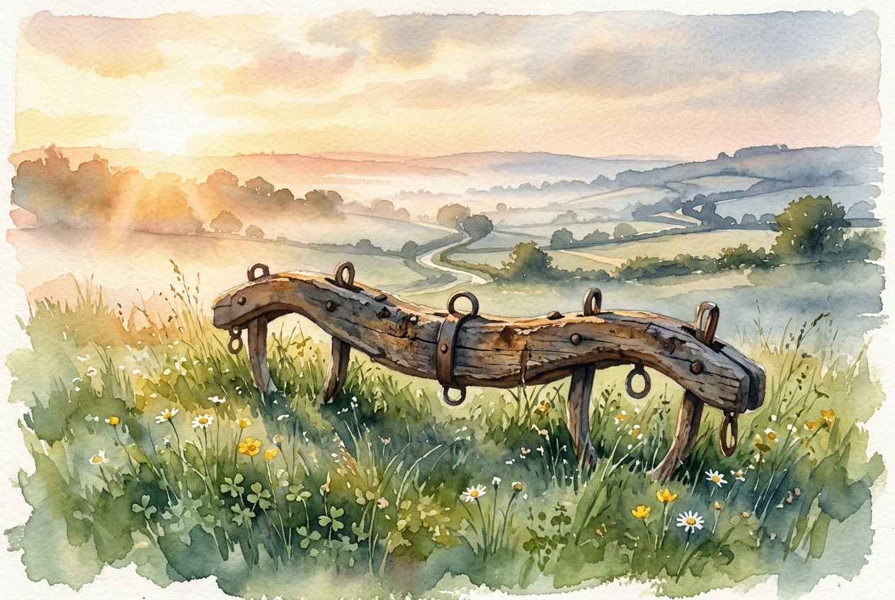

# Daily Reading: Matthew 11:28-30

*May 23, 2026*



> *(Image: A weathered wooden agricultural yoke resting peacefully on a patch of soft green grass bathed in warm morning sunlight, with a serene misty landscape in the background.)*

## The Reading (NLT)

**Matthew 11:28-30**

> Then Jesus said, Come to me, all of you who are weary and carry heavy burdens, and I will give you rest. Take my yoke upon you. Let me teach you, because I am humble and gentle at heart, and you will find rest for your souls. For my yoke is easy to bear, and the burden I give you is light.

## The Story

In the first-century agrarian world, a yoke was an everyday farming tool used to harness two animals together to pull a plow. Religious teachers of the time also used the word as a metaphor for their specific interpretation of God’s law. The people listening to this invitation were exhausted, carrying the crushing weight of endless religious rules and the daily grind of survival under an empire. The religious leaders had piled on impossible expectations without offering a hand to help carry them. Against this backdrop of spiritual and physical burnout, a new rabbi steps forward with a startlingly different approach to a life of faith.

## Application for Today

We still know what it means to be exhausted by expectations, whether from our culture, our workplaces, or even our religious communities. It is easy to treat faith as just another list of demands we must meet to earn our keep. But the invitation here is not to try harder or do more, but to learn a completely different rhythm of living from someone who is gentle. When we align our lives with his teachings, the load we carry shifts from a crushing obligation to a shared journey. True spiritual rest isn't the absence of work, but the presence of a companion who knows how to carry the weight.

---

*Scripture quotations are taken from the Holy Bible, New Living Translation, copyright © 1996, 2004, 2015 by Tyndale House Foundation. Used by permission of Tyndale House Publishers.*

## Behind the Scenes: The AI Data

For curiosity: the JSON the generator received from the text model and the prompt used for the image.

```json
{
  "reference": "Matthew 11:28-30",
  "passage": "Then Jesus said, Come to me, all of you who are weary and carry heavy burdens, and I will give you rest. Take my yoke upon you. Let me teach you, because I am humble and gentle at heart, and you will find rest for your souls. For my yoke is easy to bear, and the burden I give you is light.",
  "story": "In the first-century agrarian world, a yoke was an everyday farming tool used to harness two animals together to pull a plow. Religious teachers of the time also used the word as a metaphor for their specific interpretation of God’s law. The people listening to this invitation were exhausted, carrying the crushing weight of endless religious rules and the daily grind of survival under an empire. The religious leaders had piled on impossible expectations without offering a hand to help carry them. Against this backdrop of spiritual and physical burnout, a new rabbi steps forward with a startlingly different approach to a life of faith.",
  "lesson": "We still know what it means to be exhausted by expectations, whether from our culture, our workplaces, or even our religious communities. It is easy to treat faith as just another list of demands we must meet to earn our keep. But the invitation here is not to try harder or do more, but to learn a completely different rhythm of living from someone who is gentle. When we align our lives with his teachings, the load we carry shifts from a crushing obligation to a shared journey. True spiritual rest isn't the absence of work, but the presence of a companion who knows how to carry the weight.",
  "tags": [
    "burnout",
    "expectations",
    "grace",
    "peace",
    "rest"
  ],
  "image_prompt": "A weathered wooden agricultural yoke resting peacefully on a patch of soft green grass bathed in warm morning sunlight, with a serene misty landscape in the background."
}
```
