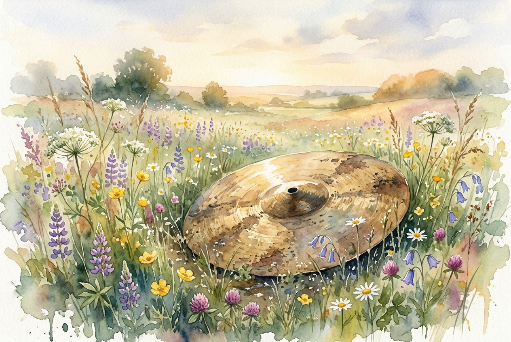

# Leitura Diária: 1 Corinthians 13

*24 de maio de 2026*



> *(Image: A weathered brass cymbal resting quietly in a field of blooming wildflowers under a soft morning light.)*

## A Leitura (PT-NVI)

**1 Corinthians 13**

> Ainda que eu fale as línguas dos homens e dos anjos, se não tiver amor, serei como o sino que ressoa ou como o prato que retine. Ainda que eu tenha o dom de profecia e saiba todos os mistérios e todo o conhecimento, e tenha uma fé capaz de mover montanhas, mas não tiver amor, nada serei. Ainda que eu dê aos pobres tudo o que possuo e entregue o meu corpo para ser queimado, mas não tiver amor, nada disso me valerá. O amor é paciente, o amor é bondoso. Não inveja, não se vangloria, não se orgulha. Não maltrata, não procura seus interesses, não se ira facilmente, não guarda rancor. O amor não se alegra com a injustiça, mas se alegra com a verdade. Tudo sofre, tudo crê, tudo espera, tudo suporta. O amor nunca perece; mas as profecias desaparecerão, as línguas cessarão, o conhecimento passará. Pois em parte conhecemos e em parte profetizamos; quando, porém, vier o que é perfeito, o que é imperfeito desaparecerá. Quando eu era menino, falava como menino, pensava como menino e raciocinava como menino. Quando me tornei homem, deixei para trás as coisas de menino. Agora, pois, vemos apenas um reflexo obscuro, como em espelho; mas, então, veremos face a face. Agora conheço em parte; então, conhecerei plenamente, da mesma forma como sou plenamente conhecido. Assim, permanecem agora estes três: a fé, a esperança e o amor. O maior deles, porém, é o amor.

## A História

O apóstolo Paulo escreveu esta carta para uma comunidade dividida e altamente competitiva na cidade de Corinto. As pessoas ali estavam obcecadas por status, dons espirituais e superioridade intelectual, frequentemente classificando umas às outras com base em habilidades impressionantes. Paulo interrompe suas instruções práticas para oferecer uma reorientação radical de valores. Ele esvazia o significado de qualquer conquista espiritual que não tenha como alicerce o cuidado genuíno pelo próximo. O texto contrasta o comportamento caótico e egoísta daquela sociedade com uma alternativa silenciosa e duradoura, capaz de superar o próprio brilhantismo humano.

## Aplicação para Hoje

Ainda hoje caímos na armadilha de medir nosso valor por aquilo que produzimos, sabemos ou conquistamos. É muito fácil construir um currículo admirável de boas ações ou opiniões corretas enquanto nutrimos ressentimento ou orgulho no íntimo. Esta passagem nos convida a avaliar nossas vidas por uma métrica completamente diferente. A verdadeira maturidade se revela na forma como tratamos as pessoas ao nosso redor, especialmente nos momentos de dificuldade. Todo o resto que construímos acabará desaparecendo ou se tornando obsoleto, restando apenas a nossa capacidade de oferecer graça e paciência.

---

*Citações bíblicas extraídas da Nova Versão Internacional (NVI), © 1993, 2000 por Biblica, Inc. Usado com permissão.*

## Nos Bastidores: Os Dados da IA

Por curiosidade: o JSON que o gerador recebeu do modelo de texto e o prompt usado para a imagem.

```json
{
  "reference": "1 Corinthians 13",
  "passage": "Ainda que eu fale as línguas dos homens e dos anjos, se não tiver amor, serei como o sino que ressoa ou como o prato que retine. Ainda que eu tenha o dom de profecia e saiba todos os mistérios e todo o conhecimento, e tenha uma fé capaz de mover montanhas, mas não tiver amor, nada serei. Ainda que eu dê aos pobres tudo o que possuo e entregue o meu corpo para ser queimado, mas não tiver amor, nada disso me valerá. O amor é paciente, o amor é bondoso. Não inveja, não se vangloria, não se orgulha. Não maltrata, não procura seus interesses, não se ira facilmente, não guarda rancor. O amor não se alegra com a injustiça, mas se alegra com a verdade. Tudo sofre, tudo crê, tudo espera, tudo suporta. O amor nunca perece; mas as profecias desaparecerão, as línguas cessarão, o conhecimento passará. Pois em parte conhecemos e em parte profetizamos; quando, porém, vier o que é perfeito, o que é imperfeito desaparecerá. Quando eu era menino, falava como menino, pensava como menino e raciocinava como menino. Quando me tornei homem, deixei para trás as coisas de menino. Agora, pois, vemos apenas um reflexo obscuro, como em espelho; mas, então, veremos face a face. Agora conheço em parte; então, conhecerei plenamente, da mesma forma como sou plenamente conhecido. Assim, permanecem agora estes três: a fé, a esperança e o amor. O maior deles, porém, é o amor.",
  "story": "O apóstolo Paulo escreveu esta carta para uma comunidade dividida e altamente competitiva na cidade de Corinto. As pessoas ali estavam obcecadas por status, dons espirituais e superioridade intelectual, frequentemente classificando umas às outras com base em habilidades impressionantes. Paulo interrompe suas instruções práticas para oferecer uma reorientação radical de valores. Ele esvazia o significado de qualquer conquista espiritual que não tenha como alicerce o cuidado genuíno pelo próximo. O texto contrasta o comportamento caótico e egoísta daquela sociedade com uma alternativa silenciosa e duradoura, capaz de superar o próprio brilhantismo humano.",
  "lesson": "Ainda hoje caímos na armadilha de medir nosso valor por aquilo que produzimos, sabemos ou conquistamos. É muito fácil construir um currículo admirável de boas ações ou opiniões corretas enquanto nutrimos ressentimento ou orgulho no íntimo. Esta passagem nos convida a avaliar nossas vidas por uma métrica completamente diferente. A verdadeira maturidade se revela na forma como tratamos as pessoas ao nosso redor, especialmente nos momentos de dificuldade. Todo o resto que construímos acabará desaparecendo ou se tornando obsoleto, restando apenas a nossa capacidade de oferecer graça e paciência.",
  "tags": [
    "amor",
    "comunidade",
    "graça",
    "maturidade",
    "paciência"
  ],
  "image_prompt": "A weathered brass cymbal resting quietly in a field of blooming wildflowers under a soft morning light."
}
```
