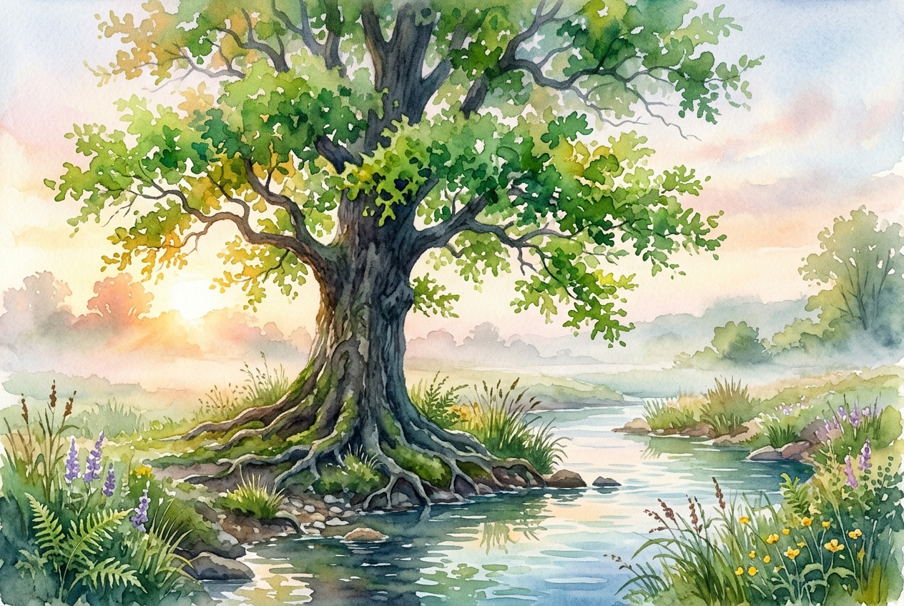

# Daily Reading: Psalm 1

*May 25, 2026*



> *(Image: A vibrant, deeply rooted tree growing beside a gently flowing stream at dawn, its leaves bright green against a soft morning mist.)*

## The Reading (NLT)

**Psalm 1**

> Oh, the joys of those who do not follow the advice of the wicked, or stand around with sinners, or join in with mockers. But they delight in the law of the Lord, meditating on it day and night. They are like trees planted along the riverbank, bearing fruit each season. Their leaves never wither, and they prosper in all they do. But not the wicked! They are like worthless chaff, scattered by the wind. They will be condemned at the time of judgment. Sinners will have no place among the godly. For the Lord watches over the path of the godly, but the path of the wicked leads to destruction.

## The Story

The Book of Psalms opens not with a prayer or a hymn of praise, but with a piece of wisdom literature. This gateway poem sets the stage for the entire collection by presenting two distinct ways to live. Ancient readers lived in an arid climate where water was a precious, life-giving resource. To them, a tree thriving beside a steady water source represented ultimate stability and vitality. The author contrasts this rootedness with the image of husks blown away by the wind, a common sight during the harvest winnowing process. It frames the spiritual life as a matter of where we choose to plant ourselves. The poem suggests that our ultimate trajectory is determined by what we allow to shape our thoughts and affections.

## Application for Today

It is easy to let the cynicism of our culture shape our inner lives. We are constantly surrounded by voices that encourage us to mock, detach, or prioritize our own advancement at the expense of others. This opening psalm invites us to intentionally root ourselves in a different kind of soil. True flourishing is not about material wealth or constant success, but about cultivating a quiet resilience. When we allow divine wisdom to nourish our minds, we develop the capacity to remain steadfast during difficult seasons. We begin to produce goodness that benefits the people around us right when they need it most. The invitation is simply to draw near to the water and let our roots grow deep.

---

*Scripture quotations are taken from the Holy Bible, New Living Translation, copyright © 1996, 2004, 2015 by Tyndale House Foundation. Used by permission of Tyndale House Publishers.*

## Behind the Scenes: The AI Data

For curiosity: the JSON the generator received from the text model and the prompt used for the image.

```json
{
  "reference": "Psalm 1",
  "passage": "Oh, the joys of those who do not follow the advice of the wicked, or stand around with sinners, or join in with mockers. But they delight in the law of the Lord, meditating on it day and night. They are like trees planted along the riverbank, bearing fruit each season. Their leaves never wither, and they prosper in all they do. But not the wicked! They are like worthless chaff, scattered by the wind. They will be condemned at the time of judgment. Sinners will have no place among the godly. For the Lord watches over the path of the godly, but the path of the wicked leads to destruction.",
  "story": "The Book of Psalms opens not with a prayer or a hymn of praise, but with a piece of wisdom literature. This gateway poem sets the stage for the entire collection by presenting two distinct ways to live. Ancient readers lived in an arid climate where water was a precious, life-giving resource. To them, a tree thriving beside a steady water source represented ultimate stability and vitality. The author contrasts this rootedness with the image of husks blown away by the wind, a common sight during the harvest winnowing process. It frames the spiritual life as a matter of where we choose to plant ourselves. The poem suggests that our ultimate trajectory is determined by what we allow to shape our thoughts and affections.",
  "lesson": "It is easy to let the cynicism of our culture shape our inner lives. We are constantly surrounded by voices that encourage us to mock, detach, or prioritize our own advancement at the expense of others. This opening psalm invites us to intentionally root ourselves in a different kind of soil. True flourishing is not about material wealth or constant success, but about cultivating a quiet resilience. When we allow divine wisdom to nourish our minds, we develop the capacity to remain steadfast during difficult seasons. We begin to produce goodness that benefits the people around us right when they need it most. The invitation is simply to draw near to the water and let our roots grow deep.",
  "tags": [
    "choices",
    "flourishing",
    "growth",
    "resilience",
    "wisdom"
  ],
  "image_prompt": "A vibrant, deeply rooted tree growing beside a gently flowing stream at dawn, its leaves bright green against a soft morning mist."
}
```
