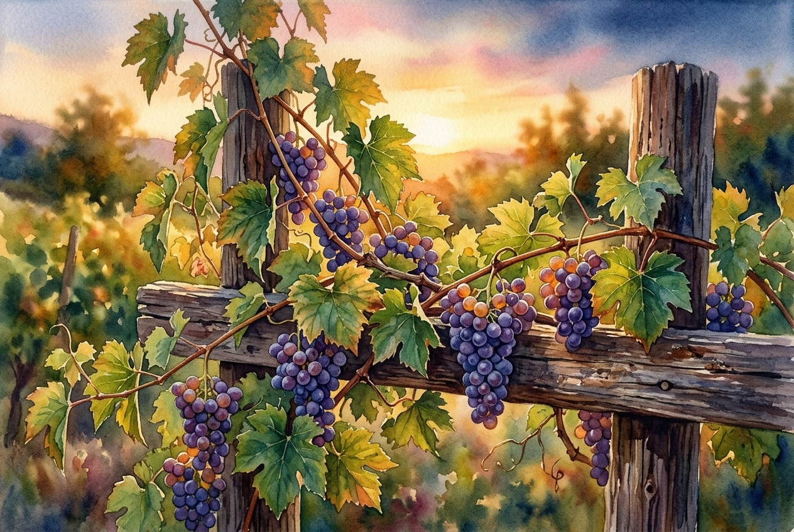

# Leitura Diária: John 15:1-11

*25 de maio de 2026*

> *(Image: A close-up view of a vibrant green grapevine resting on a rustic wooden trellis, illuminated by warm golden hour sunlight.)*

## A Leitura (PT-NVI)

**John 15:1-11**

> 1 "Eu sou a videira verdadeira, e meu Pai é o agricultor. 2 Todo ramo que, estando em mim, não dá fruto, ele corta; e todo que dá fruto ele poda, para que dê mais fruto ainda. 3 Vocês já estão limpos, pela palavra que lhes tenho falado. 4 Permaneçam em mim, e eu permanecerei em vocês. Nenhum ramo pode dar fruto por si mesmo, se não permanecer na videira. Vocês também não podem dar fruto, se não permanecerem em mim. 5 "Eu sou a videira; vocês são os ramos. Se alguém permanecer em mim e eu nele, esse dá muito fruto; pois sem mim vocês não podem fazer coisa alguma. 6 Se alguém não permanecer em mim, será como o ramo que é jogado fora e seca. Tais ramos são apanhados, lançados ao fogo e queimados. 7 Se vocês permanecerem em mim, e as minhas palavras permanecerem em vocês, pedirão o que quiserem, e lhes será concedido. 8 Meu Pai é glorificado pelo fato de vocês darem muito fruto; e assim serão meus discípulos. 9 "Como o Pai me amou, assim eu os amei; permaneçam no meu amor. 10 Se vocês obedecerem aos meus mandamentos, permanecerão no meu amor, assim como tenho obedecido aos mandamentos de meu Pai e em seu amor permaneço. 11 Tenho lhes dito estas palavras para que a minha alegria esteja em vocês e a alegria de vocês seja completa.

## A História

Na antiga Judeia, os vinhedos eram uma parte comum da paisagem, cultivados com atenção minuciosa para garantir uma boa colheita. Durante sua última refeição com os amigos mais próximos, Jesus usa essa imagem cotidiana para explicar como a relação deles funcionaria dali em diante. Ele descreve uma conexão viva e orgânica, onde ele é o tronco central e eles são os ramos. O processo agrícola mencionado envolve podas cuidadosas, e às vezes dolorosas, feitas por um agricultor experiente para promover a saúde da planta. Em vez de exigir um esforço independente, a ênfase está inteiramente em manter a união. O objetivo final dessa ligação não é apenas a sobrevivência, mas uma alegria profunda e transbordante.

## Aplicação para Hoje

Muitas vezes encaramos nossa vida espiritual como uma lista de tarefas a cumprir ou obstáculos morais a superar. No entanto, essa metáfora agrícola nos convida a uma maneira totalmente diferente de viver. O crescimento não acontece por pura força de vontade ou atividade frenética, mas por descansarmos intencionalmente em nossa fonte de vida. Quando passamos por épocas de perda ou diminuição, isso pode ser um molde cuidadoso destinado a trazer um amadurecimento mais profundo. Nossa principal responsabilidade é simplesmente nutrir essa conexão diária. Ao fazermos nossa morada nesse amor que nos sustenta, encontramos força para florescer e a capacidade de experimentar uma verdadeira alegria.

---

*Citações bíblicas extraídas da Nova Versão Internacional (NVI), © 1993, 2000 por Biblica, Inc. Usado com permissão.*
