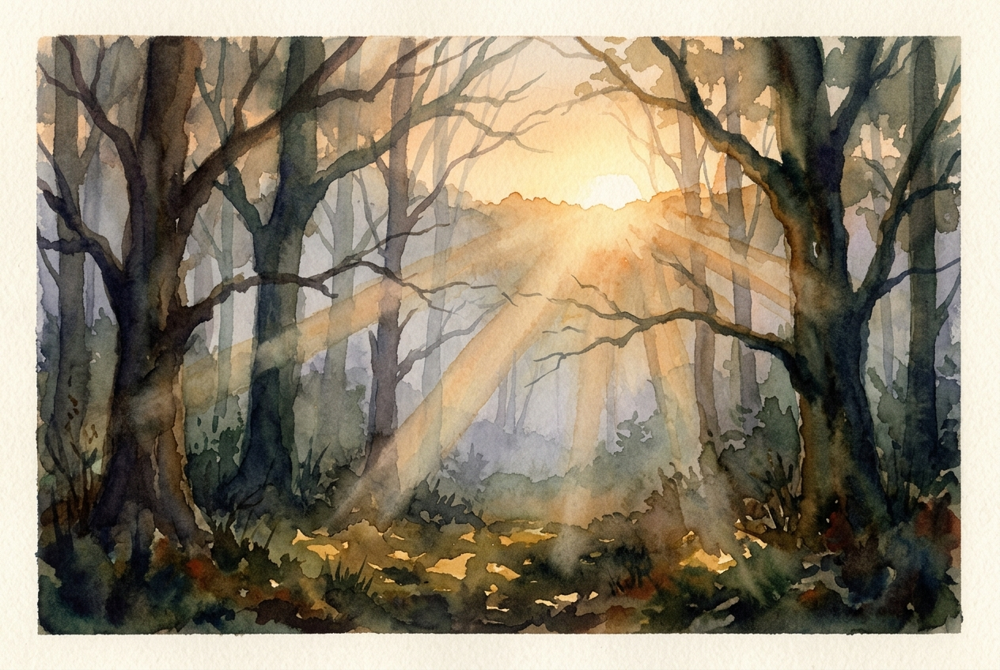

# Leitura Diária: John 3:16-21

*27 de maio de 2026*

> *(Image: A warm, golden sunrise slowly illuminating a deep, misty forest, casting long gentle rays of light that pierce through the shadowy canopy.)*

## A Leitura (PT-NVI)

**John 3:16-21**

> 16 "Porque Deus tanto amou o mundo que deu o seu Filho Unigênito, para que todo o que nele crer não pereça, mas tenha a vida eterna. 17 Pois Deus enviou o seu Filho ao mundo, não para condenar o mundo, mas para que este fosse salvo por meio dele. 18 Quem nele crê não é condenado, mas quem não crê já está condenado, por não crer no nome do Filho Unigênito de Deus. 19 Este é o julgamento: a luz veio ao mundo, mas os homens amaram as trevas, e não a luz, porque as suas obras eram más. 20 Quem pratica o mal odeia a luz e não se aproxima da luz, temendo que as suas obras sejam manifestas. 21 Mas quem pratica a verdade vem para a luz, para que se veja claramente que as suas obras são realizadas por intermédio de Deus".

## A História

Nicodemos, um líder religioso, procura Jesus sob o manto da noite, possivelmente com medo do julgamento alheio. É nesse encontro silencioso e secreto que Jesus muda o foco das regras para o resgate. Ele explica que o propósito divino não é a condenação, mas um amor expansivo e transformador. A conversa então se volta para o contraste profundo entre luz e escuridão. A verdadeira tragédia apresentada não é simplesmente falhar em um teste moral, mas o ato de se esconder ativamente da luz que traz cura. É um retrato fiel da natureza humana, mostrando nossa tendência de ocultar nossas falhas em vez de permitir que sejam iluminadas.

## Aplicação para Hoje

Muitas vezes carregamos o medo de que, se Deus realmente nos visse por inteiro, a resposta seria um julgamento severo. Escondemos nossos erros, nossas dúvidas e nossas feridas no escuro, convencidos de que a exposição resultará em rejeição. No entanto, essa mensagem inverte completamente essa lógica. A luz nos é oferecida como um refúgio, não como um holofote de interrogatório. Dar um passo em direção a ela significa confiar que o amor, e não a condenação, é a palavra final. Quando permitimos que nosso verdadeiro eu seja visto, não encontramos um juiz pronto para punir, mas um salvador pronto para restaurar. Somos convidados a parar de nos esconder e deixar que o calor desse amor alcance os lugares que costumamos manter trancados.

---

*Citações bíblicas extraídas da Nova Versão Internacional (NVI), © 1993, 2000 por Biblica, Inc. Usado com permissão.*
