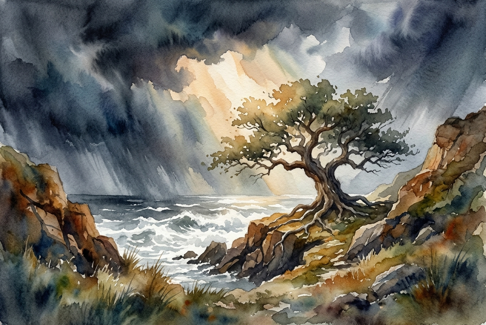

# Leitura Diária: Romans 8:31-39

*28 de maio de 2026*

> *(Image: A solitary ancient oak tree standing firm on a rugged cliffside as a powerful ocean storm swirls around it, illuminated by a single warm beam of sunlight piercing through heavy dark clouds.)*

## A Leitura (PT-NVI)

**Romans 8:31-39**

> 31 Que diremos, pois, diante dessas coisas? Se Deus é por nós, quem será contra nós? 32 Aquele que não poupou a seu próprio Filho, mas o entregou por todos nós, como não nos dará juntamente com ele, e de graça, todas as coisas? 33 Quem fará alguma acusação contra os escolhidos de Deus? É Deus quem os justifica. 34 Quem os condenará? Foi Cristo Jesus que morreu; e mais, que ressuscitou e está à direita de Deus, e também intercede por nós. 35 Quem nos separará do amor de Cristo? Será tribulação, ou angústia, ou perseguição, ou fome, ou nudez, ou perigo, ou espada? 36 Como está escrito: "Por amor de ti enfrentamos a morte todos os dias; somos considerados como ovelhas destinadas ao matadouro". 37 Mas, em todas estas coisas somos mais que vencedores, por meio daquele que nos amou. 38 Pois estou convencido de que nem morte nem vida, nem anjos nem demônios, nem o presente nem o futuro, nem quaisquer poderes, 39 nem altura nem profundidade, nem qualquer outra coisa na criação será capaz de nos separar do amor de Deus que está em Cristo Jesus, nosso Senhor.

## A História

A carta aos cristãos em Roma foi escrita à sombra de um império que exigia lealdade absoluta e frequentemente usava a violência para manter a ordem. Nesta seção, Paulo utiliza a linguagem de um tribunal para desconstruir qualquer medo que seus leitores ainda pudessem ter sobre sua posição diante do divino. Ele lista dificuldades extremas, desde privações físicas severas até a ameaça de execução, reconhecendo a dura realidade do mundo no primeiro século. No entanto, em vez de prometer uma fuga dessas provações, ele as descreve como impotentes diante de uma força muito maior. Ele varre o cosmos, nomeando entidades espirituais, dimensões do espaço e o próprio tempo, para fazer uma declaração definitiva sobre segurança. O argumento atinge seu clímax com a afirmação de que o universo não contém nenhuma força capaz de romper o vínculo forjado pelo Criador.

## Aplicação para Hoje

É fácil olhar para as nossas circunstâncias e presumir que as dificuldades são um sinal de abandono divino. Quando enfrentamos doenças, ruína financeira ou uma dor emocional profunda, o silêncio pode parecer uma acusação. Mas este texto nos convida a mudar radicalmente a nossa perspectiva sobre o sofrimento. A presença da luta não equivale à ausência de afeto divino. Em vez de vermos nossos problemas como evidência de uma conexão rompida, podemos descansar na certeza de que somos amparados através deles. Existe uma paz profunda em saber que a nossa segurança final não depende da nossa capacidade de resistir, mas da realidade de que estamos sendo sustentados. Não importa o quão caótico o mundo se torne ou quão profundo seja o nosso desespero pessoal, esse amor fundamental permanece inteiramente intacto.

---

*Citações bíblicas extraídas da Nova Versão Internacional (NVI), © 1993, 2000 por Biblica, Inc. Usado com permissão.*
