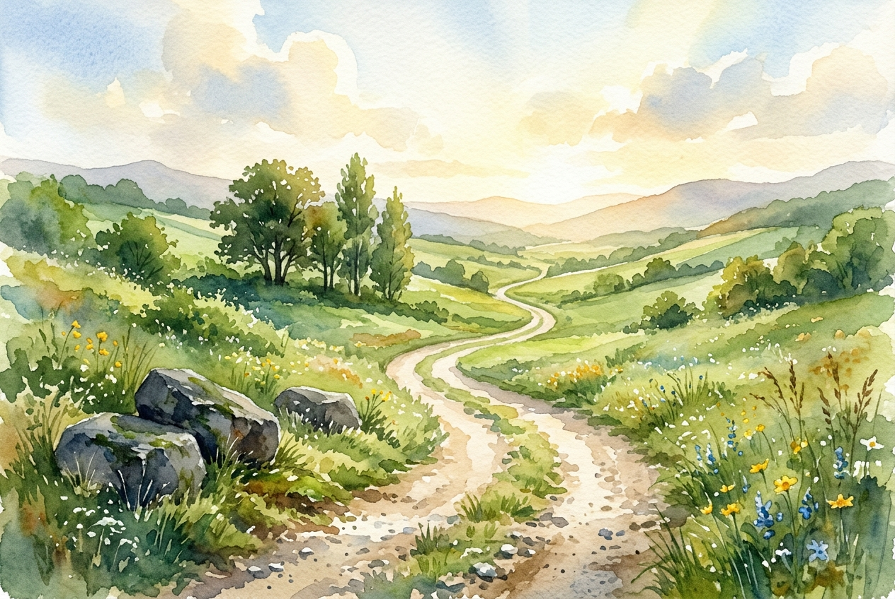

# Daily Reading: Hebrews 12:1-3

*May 29, 2026*

> *(Image: A sunlit dirt path winding through a serene green valley, with a few heavy stones left behind on the grassy shoulder, capturing a sense of moving forward with lightness and hope.)*

## The Reading (NLT)

**Hebrews 12:1-3**

> 1 Therefore, since we are surrounded by such a huge crowd of witnesses to the life of faith, let us strip off every weight that slows us down, especially the sin that so easily trips us up. And let us run with endurance the race God has set before us. 2 We do this by keeping our eyes on Jesus, the champion who initiates and perfects our faith. Because of the joy awaiting him, he endured the cross, disregarding its shame. Now he is seated in the place of honor beside God's throne. 3 Think of all the hostility he endured from sinful people; then you won't become weary and give up.

## The Story

The letter to the Hebrews draws on the familiar sights of a first-century athletic stadium to illustrate the spiritual journey. Its original audience was deeply fatigued, dealing with intense cultural pushback that made them consider walking away from their commitments. To bolster their spirits, the author evokes the image of an arena packed with historical heroes who have successfully finished their own grueling events. Ultimately, though, the athletes are told to look past the cheering stands toward the finish line. There stands the ultimate example, the one who endured unimaginable public shame and suffering, motivated entirely by the joyful outcome of his sacrifice.

## Application for Today

Life has a way of piling heavy burdens on our shoulders, from daily anxieties to deeply ingrained habits that trip us up. We frequently try to navigate our spiritual journey while dragging along luggage we were never meant to carry. This passage invites us to drop those heavy bags and travel light. When the road feels too long and the temptation to give up grows strong, the solution is not to look inward at our own fatigue. Instead, by shifting our focus to the one who already weathered the greatest storms, we discover the resilience to take the next steady step forward.

---

*Scripture quotations are taken from the Holy Bible, New Living Translation, copyright © 1996, 2004, 2015 by Tyndale House Foundation. Used by permission of Tyndale House Publishers.*
