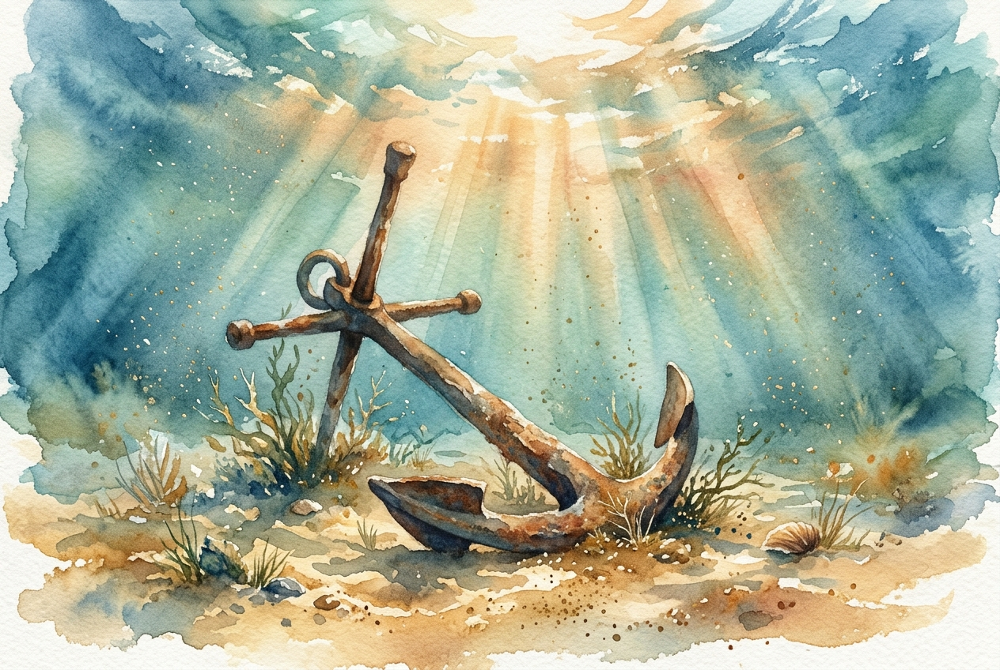

# Daily Reading: James 1:2-8

*May 29, 2026*

> *(Image: A heavy iron anchor resting peacefully on the serene ocean floor, surrounded by gentle rays of sunlight piercing through the turbulent water far above.)*

## The Reading (NLT)

**James 1:2-8**

> 2 Dear brothers and sisters, when troubles of any kind come your way, consider it an opportunity for great joy. 3 For you know that when your faith is tested, your endurance has a chance to grow. 4 So let it grow, for when your endurance is fully developed, you will be perfect and complete, needing nothing. 5 If you need wisdom, ask our generous God, and he will give it to you. He will not rebuke you for asking. 6 But when you ask him, be sure that your faith is in God alone. Do not waver, for a person with divided loyalty is as unsettled as a wave of the sea that is blown and tossed by the wind. 7 Such people should not expect to receive anything from the Lord. 8 Their loyalty is divided between God and the world, and they are unstable in everything they do.

## The Story

The opening of this letter challenges its original audience of scattered, weary believers to adopt a radically different view of their struggles. The author suggests that adversity is not a pointless interruption, but rather a necessary environment for cultivating deep resilience. This sustained resilience is what ultimately shapes a fully mature character. Recognizing that this perspective requires a profound shift in mindset, the text directs readers to seek divine insight. It emphasizes that this insight is freely given to those who approach God with a unified, steady reliance, rather than a fragmented allegiance that shifts with every passing storm.

## Application for Today

When difficulties arise, our reflex is usually to escape the discomfort as quickly as possible. We tend to hedge our bets, dividing our attention and energy across multiple backup plans until we feel exhausted and adrift. This teaching invites us to stay present in the challenge, trusting that something valuable is being constructed beneath the surface. Growing into spiritual adulthood is a slow process, often requiring the very friction we desperately want to avoid. By asking for the clarity to see our current hurdles as tools for growth, we can drop a solid anchor, maintaining our inner balance no matter how turbulent our circumstances become.

---

*Scripture quotations are taken from the Holy Bible, New Living Translation, copyright © 1996, 2004, 2015 by Tyndale House Foundation. Used by permission of Tyndale House Publishers.*
