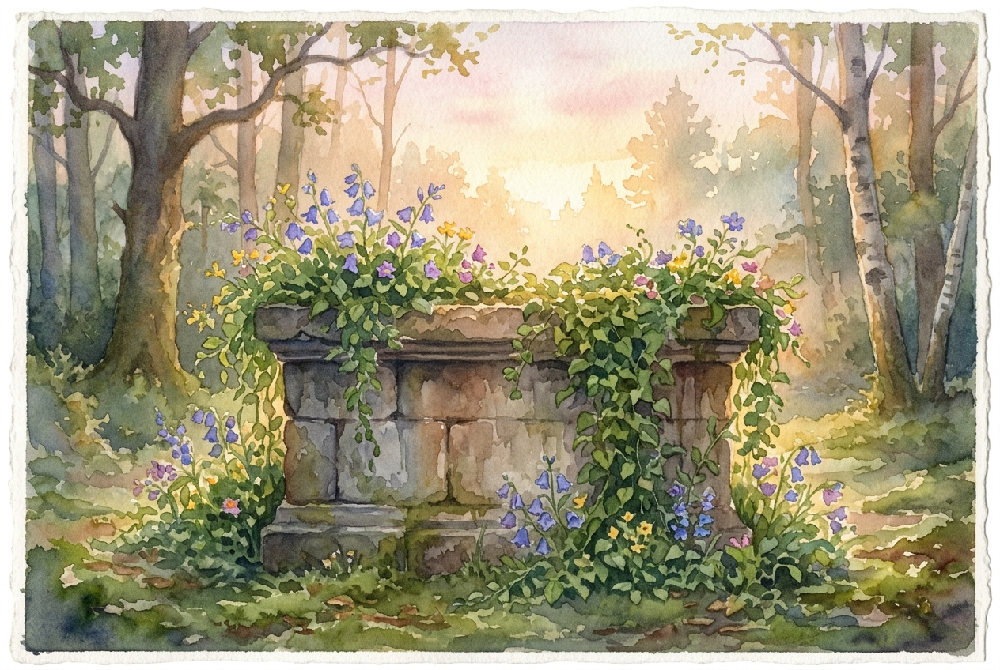

# Daily Reading: Romans 12:1-2

*May 30, 2026*

> *(Image: A weathered stone altar slowly being overgrown by vibrant, blooming green vines under the soft, golden light of dawn.)*

## The Reading (NLT)

**Romans 12:1-2**

> 1 And so, dear brothers and sisters, I plead with you to give your bodies to God because of all he has done for you. Let them be a living and holy sacrifice the kind he will find acceptable. This is truly the way to worship him. 2 Don't copy the behavior and customs of this world, but let God transform you into a new person by changing the way you think. Then you will learn to know God's will for you, which is good and pleasing and perfect.

## The Story

Paul is writing to a diverse community in Rome, a city filled with temples where worship meant offering something dead on an altar. Animals, grain, and wine were given to appease the gods and secure their favor. Paul completely upends this ancient script. He introduces the radical idea that the Creator doesn't want lifeless tributes, but rather the ongoing, breathing reality of our daily lives. In this framework, worship shifts from a localized ritual to an all-encompassing posture. The mind itself becomes the site of profound change, moving away from the empire's cultural scripts toward a completely different way of existing.

## Application for Today

We are constantly being shaped by the environments we inhabit. The culture around us offers endless blueprints for how to define success, pursue happiness, and handle conflict, often urging us to prioritize self-preservation and status. Yet we are invited into a steady, quiet rebellion against these exhausting patterns. By surrendering our ordinary moments—our work, our rest, our interactions—we allow our deepest motivations to be rewired. This isn't about trying harder to be good; it is about yielding to a process that changes how we see the world. As our perspective shifts, we slowly discover a path that feels deeply right, grounded in a peace that the frantic world cannot offer.

---

*Scripture quotations are taken from the Holy Bible, New Living Translation, copyright © 1996, 2004, 2015 by Tyndale House Foundation. Used by permission of Tyndale House Publishers.*
