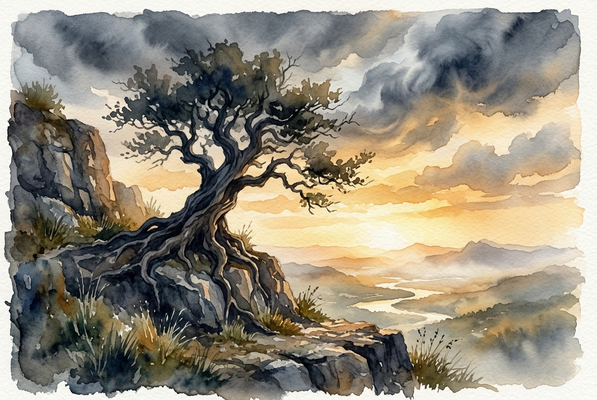

# Leitura Diária: 1 Peter 5:6-11

*31 de maio de 2026*

> *(Image: An ancient, deeply rooted tree standing on a solid rocky cliff face as dark storm clouds begin to clear, revealing a warm, golden sunrise.)*

## A Leitura (PT-NVI)

**1 Peter 5:6-11**

> 6 Portanto, humilhem-se debaixo da poderosa mão de Deus, para que ele os exalte no tempo devido. 7 Lancem sobre ele toda a sua ansiedade, porque ele tem cuidado de vocês. 8 Sejam sóbrios e vigiem. O diabo, o inimigo de vocês, anda ao redor como leão, rugindo e procurando a quem possa devorar. 9 Resistam-lhe, permanecendo firmes na fé, sabendo que os irmãos que vocês têm em todo o mundo estão passando pelos mesmos sofrimentos. 10 O Deus de toda a graça, que os chamou para a sua glória eterna em Cristo Jesus, depois de terem sofrido durante pouco de tempo, os restaurará, os confirmará, lhes dará forças e os porá sobre firmes alicerces. 11 A ele seja o poder para todo o sempre. Amém.

## A História

As primeiras comunidades cristãs espalhadas pela Ásia Menor enfrentavam intensa alienação social e perseguição. O autor desta carta reconhece a realidade visceral do medo que sentiam, comparando as ameaças físicas e espirituais a um predador à espreita. No entanto, em vez de prometer uma rota de fuga imediata, o texto pede firmeza espiritual e uma perspectiva mais ampla. Os leitores são lembrados de que não estão isolados em suas lutas; uma vasta comunidade invisível compartilha dos mesmos fardos. A passagem descreve o sofrimento atual como uma estação temporária, apontando para uma promessa divina de reconstrução e estabilidade definitivas.

## Aplicação para Hoje

É fácil nos sentirmos completamente sozinhos quando a ansiedade ou a dificuldade batem à porta. Muitas vezes carregamos nossas preocupações como se tivéssemos que resolver cada crise por conta própria, o que nos deixa vulneráveis ao desespero. Esta passagem nos convida a soltar esse controle exaustivo e entregar nossos medos a um Deus que cuida ativamente do nosso bem-estar. Ser vigilante não significa viver em paranoia constante; significa reconhecer as forças destrutivas que tentam roubar nossa paz. Quando lembramos que a adversidade é uma experiência humana compartilhada, o isolamento de nossas lutas começa a desaparecer. Podemos confiar que Deus está agindo, pronto para restaurar nossa força e colocar nossos pés de volta em terreno seguro.

---

*Citações bíblicas extraídas da Nova Versão Internacional (NVI), © 1993, 2000 por Biblica, Inc. Usado com permissão.*
