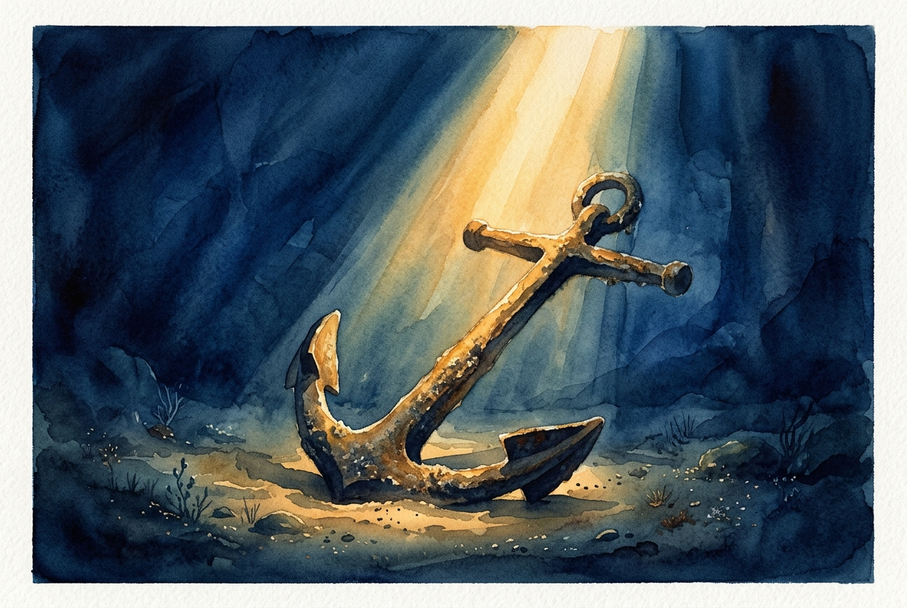

# Daily Reading: Romans 8:31-39

*June 2, 2026*

> *(Image: A heavy, ancient anchor resting peacefully on the deep ocean floor, illuminated by a single, unwavering shaft of golden sunlight piercing through the dark blue water.)*

## The Reading (NLT)

**Romans 8:31-39**

> 31 What shall we say about such wonderful things as these? If God is for us, who can ever be against us? 32 Since he did not spare even his own Son but gave him up for us all, won't he also give us everything else? 33 Who dares accuse us whom God has chosen for his own? No one for God himself has given us right standing with himself. 34 Who then will condemn us? No one for Christ Jesus died for us and was raised to life for us, and he is sitting in the place of honor at God's right hand, pleading for us. 35 Can anything ever separate us from Christ's love? Does it mean he no longer loves us if we have trouble or calamity, or are persecuted, or hungry, or destitute, or in danger, or threatened with death? 36 (As the Scriptures say, For your sake we are killed every day; we are being slaughtered like sheep.) 37 No, despite all these things, overwhelming victory is ours through Christ, who loved us. 38 And I am convinced that nothing can ever separate us from God's love. Neither death nor life, neither angels nor demons, neither our fears for today nor our worries about tomorrow not even the powers of hell can separate us from God's love. 39 No power in the sky above or in the earth below indeed, nothing in all creation will ever be able to separate us from the love of God that is revealed in Christ Jesus our Lord.

## The Story

Paul is writing to a church in Rome that faced real threats, from political instability and marginalization to the looming shadow of imperial persecution. He builds a courtroom scene, asking who could possibly bring a charge or secure a conviction against those God has claimed. Then, shifting from legal language to deeply personal terms, he lists every conceivable force in the ancient world. He includes cosmic powers, earthly authorities, physical suffering, and death itself. He acknowledges that believers will face brutal realities, recognizing the severe physical dangers of their era. Yet, he insists these very real hardships do not indicate an absence of divine affection. The passage serves as a rhetorical masterpiece, climaxing in the absolute assurance of God’s enduring attachment to humanity.

## Application for Today

We often measure God's favor by how smoothly our lives are going. When grief strikes, when finances crumble, or when illness lingers, a quiet voice whispers that we have been abandoned. Paul dismantles this lie entirely. He assures us that hardship is not a sign of heaven's rejection, but a landscape where God's presence remains fiercely active. You do not have to earn this security, and your worst days cannot sever it. Whatever you are facing today, whether it is a tangible crisis or an invisible anxiety about the future, you are held fast. You are anchored to a love that outlasts the stars.

---

*Scripture quotations are taken from the Holy Bible, New Living Translation, copyright © 1996, 2004, 2015 by Tyndale House Foundation. Used by permission of Tyndale House Publishers.*
