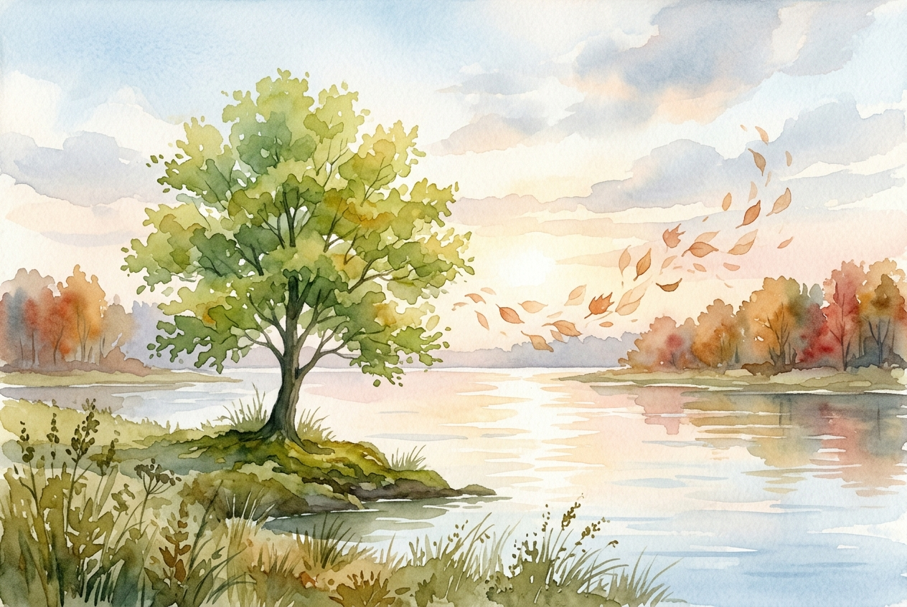

# Daily Reading: Psalm 1

*June 3, 2026*

> *(Image: A solitary, vibrant green tree growing on the edge of a calm, reflective river under a soft morning light, with dry autumn leaves gently blowing away in the background.)*

## The Reading (NLT)

**Psalm 1**

> 1 Oh, the joys of those who do not follow the advice of the wicked, or stand around with sinners, or join in with mockers. 2 But they delight in the law of the Lord, meditating on it day and night. 3 They are like trees planted along the riverbank, bearing fruit each season. Their leaves never wither, and they prosper in all they do. 4 But not the wicked! They are like worthless chaff, scattered by the wind. 5 They will be condemned at the time of judgment. Sinners will have no place among the godly. 6 For the Lord watches over the path of the godly, but the path of the wicked leads to destruction.

## The Story

The opening of the psalter serves as a gateway to the entire collection of ancient songs, setting up a fundamental choice for the reader. Wisdom literature from this era frequently uses the motif of two distinct paths to illustrate the shape of a human life. The poetry contrasts a deeply anchored sapling with the dry husks of grain blown away during the harvest. The healthy plant thrives not because of its own inherent strength, but because of its proximity to a constant source of water. Meanwhile, the discarded husks have no anchor, entirely at the mercy of the prevailing winds. This introductory song suggests that true flourishing depends completely on where we draw our nourishment.

## Application for Today

We are constantly offered input on how to live, what to value, and who deserves our scorn. It is incredibly easy to drift into cynicism or chase after fleeting definitions of success, becoming untethered in the process. The invitation here is to examine where our roots are sinking. Finding joy in sacred teachings is not about rigid rule-following; it is about orienting our deepest affections toward the source of life. When we anchor ourselves in God's presence, we find a steady current that sustains us through dry seasons. We do not have to manufacture our own vitality, but simply remain planted where grace flows.

---

*Scripture quotations are taken from the Holy Bible, New Living Translation, copyright © 1996, 2004, 2015 by Tyndale House Foundation. Used by permission of Tyndale House Publishers.*
