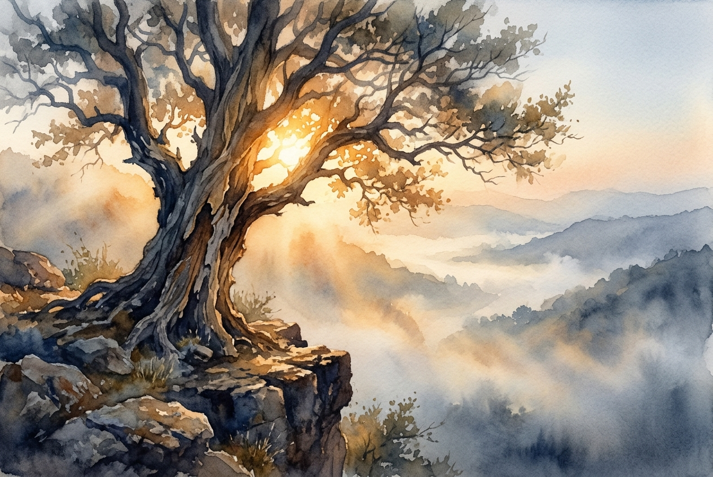

# Leitura Diária: 2 Corinthians 4:16-18

*4 de junho de 2026*

> *(Image: A weathered, ancient tree with rough, peeling bark standing firm on a rocky precipice, illuminated from within its branches by a warm, enduring golden light breaking through heavy morning mist.)*

## A Leitura (PT-NVI)

**2 Corinthians 4:16-18**

> 16 Por isso não desanimamos. Embora exteriormente estejamos a desgastar-nos, interiormente estamos sendo renovados dia após dia, 17 pois os nossos sofrimentos leves e momentâneos estão produzindo para nós uma glória eterna que pesa mais do que todos eles. 18 Assim, fixamos os olhos, não naquilo que se vê, mas no que não se vê, pois o que se vê é transitório, mas o que não se vê é eterno.

## A História

A relação do apóstolo com a comunidade de Corinto era complexa, e sua própria trajetória foi marcada por extremas dificuldades físicas e perseguições. Escrevendo de um lugar de profunda exaustão, ele reconhece a realidade inegável do desgaste do corpo e das adversidades circunstanciais. No entanto, ele propõe uma mudança radical de perspectiva. Em vez de se fixar no imediatismo de seu cansaço, ele aponta para uma realidade duradoura e invisível que está silenciosamente ganhando forma. Ele descreve a perseverança não como uma mera questão de força de vontade, mas como um redirecionamento intencional do foco para aquilo que sobrevive às nossas lutas atuais.

## Aplicação para Hoje

É muito fácil sermos consumidos por aquilo que está bem diante dos nossos olhos. A dor, o envelhecimento, o luto e as frustrações diárias exigem nossa atenção e podem nos convencer de que são as únicas coisas reais no mundo. Somos convidados a cultivar um tipo diferente de visão. Essa prática não significa fingir que nossas lutas são uma ilusão, mas sim recusar dar a elas a palavra final. Ao escolhermos ancorar nossa atenção nas realidades eternas do amor e da restauração divina, encontramos um sustento diário e silencioso. Mesmo quando as bordas externas de nossas vidas parecem desfiadas, há um núcleo firme sendo construído em nosso interior.

---

*Citações bíblicas extraídas da Nova Versão Internacional (NVI), © 1993, 2000 por Biblica, Inc. Usado com permissão.*
