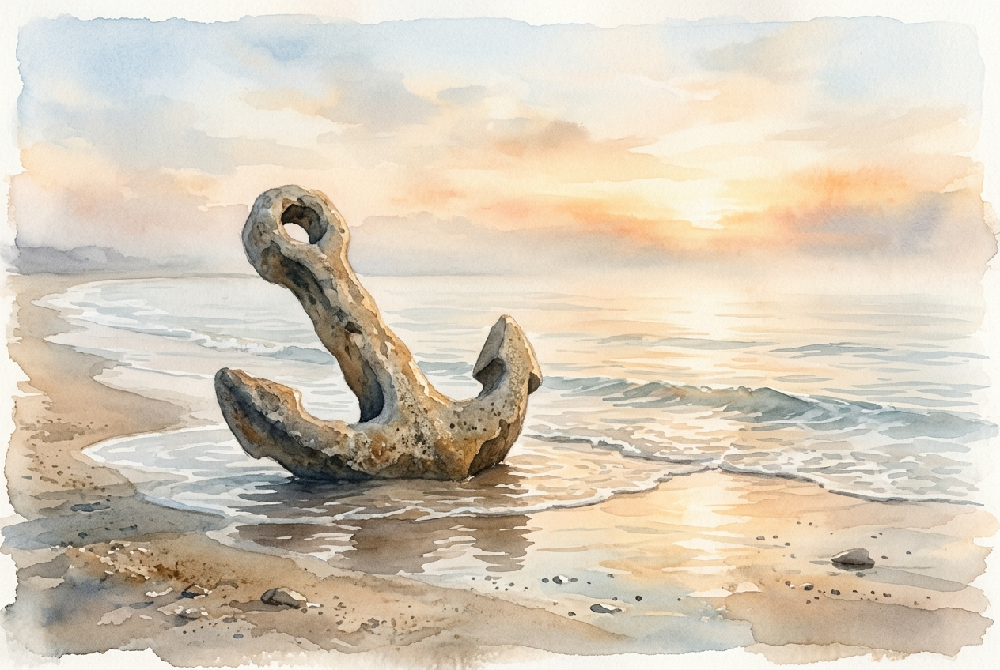

# Leitura Diária: 1 Peter 5:6-11

*6 de junho de 2026*

> *(Image: A solitary ancient stone anchor resting on a calm shoreline at dawn, with gentle waves washing over its base and soft golden light illuminating the misty horizon.)*

## A Leitura (PT-NVI)

**1 Peter 5:6-11**

> 6 Portanto, humilhem-se debaixo da poderosa mão de Deus, para que ele os exalte no tempo devido. 7 Lancem sobre ele toda a sua ansiedade, porque ele tem cuidado de vocês. 8 Sejam sóbrios e vigiem. O diabo, o inimigo de vocês, anda ao redor como leão, rugindo e procurando a quem possa devorar. 9 Resistam-lhe, permanecendo firmes na fé, sabendo que os irmãos que vocês têm em todo o mundo estão passando pelos mesmos sofrimentos. 10 O Deus de toda a graça, que os chamou para a sua glória eterna em Cristo Jesus, depois de terem sofrido durante pouco de tempo, os restaurará, os confirmará, lhes dará forças e os porá sobre firmes alicerces. 11 A ele seja o poder para todo o sempre. Amém.

## A História

Os primeiros seguidores de Jesus viviam à margem da sociedade, enfrentando pressões sociais implacáveis e hostilidade constante. Pedro escreve a essas comunidades vulneráveis para oferecer uma perspectiva de sobrevivência e perseverança. Ele reconhece que a ameaça é real, descrevendo um adversário que se aproveita do isolamento e do cansaço. Em vez de prometer um resgate imediato das dificuldades, ele os orienta a adotar uma postura de profunda dependência divina. O apóstolo os lembra de que a dor não é um fardo solitário, mas uma experiência compartilhada por outros irmãos ao redor do mundo. A grande garantia é que a aflição é passageira quando comparada ao alicerce duradouro que está sendo preparado para eles.

## Aplicação para Hoje

É exaustivo carregar o peso da nossa própria sobrevivência, especialmente quando nos sentimos cercados por ameaças à nossa paz. Muitas vezes, tentamos gerenciar nossas ansiedades mantendo o controle de tudo, esquecendo que não fomos criados para nos sustentarmos sozinhos. O texto nos convida a afrouxar as mãos e entregar nossas preocupações mais profundas a um Criador que se importa ativamente com o nosso bem-estar. Também serve como um alerta para nos mantermos despertos, pois o cinismo e o desespero são predadores em busca de consumir nossa esperança. Quando permanecemos firmes juntos, reconhecendo nossas lutas humanas, abrimos espaço para a renovação de nossas forças. No fim das contas, é a graça divina, e não o nosso próprio esforço, que firma nossos pés em um terreno inabalável.

---

*Citações bíblicas extraídas da Nova Versão Internacional (NVI), © 1993, 2000 por Biblica, Inc. Usado com permissão.*
