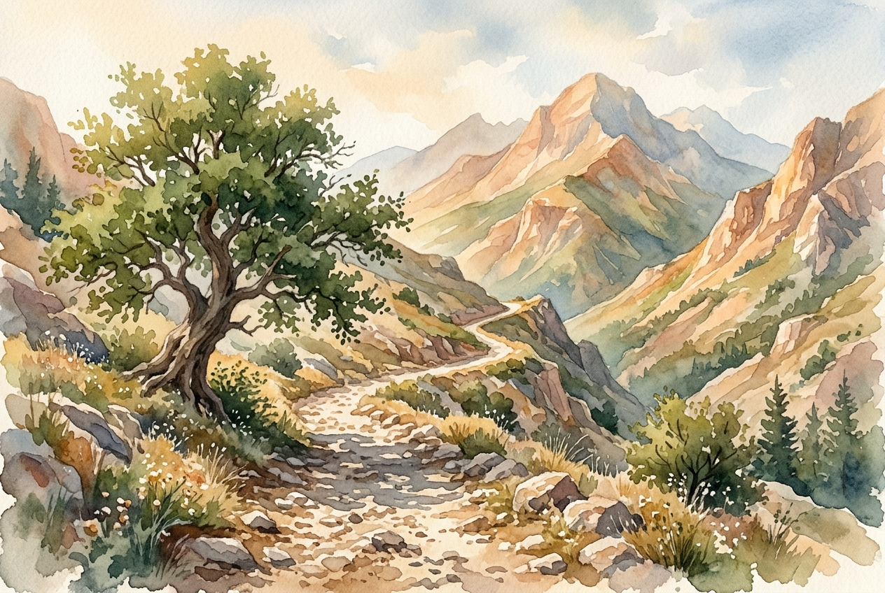

# Leitura Diária: Psalm 121

*7 de junho de 2026*

> *(Image: A rugged winding path ascending through ancient sunlit mountains with the soft shade of a large tree falling across the rocky trail.)*

## A Leitura (PT-NVI)

**Psalm 121**

> 1 Levanto os meus olhos para os montes e pergunto: De onde me vem o socorro? 2 O meu socorro vem do Senhor, que fez os céus e a terra. 3 Ele não permitirá que você tropece; o seu protetor se manterá alerta, 4 sim, o protetor de Israel não dormirá, ele está sempre alerta! 5 O Senhor é o seu protetor; como sombra que o protege, ele está à sua direita. 6 De dia o sol não o ferirá, nem a lua, de noite. 7 O Senhor o protegerá de todo o mal, protegerá a sua vida. 8 O Senhor protegerá a sua saída e a sua chegada, desde agora e para sempre.

## A História

O Salmo 121 é tradicionalmente conhecido como um cântico dos degraus, entoado por peregrinos que viajavam em direção a Jerusalém. A jornada costumava ser perigosa e cheia de subidas íngremes, clima severo e a ameaça constante de saqueadores escondidos nas colinas rochosas. Quando o salmista olha para o horizonte, os picos imponentes representam tanto o destino final quanto o perigo iminente. Em vez de buscar conforto na própria paisagem, o viajante se lembra do Criador daquele cenário. O cântico muda de uma questão solitária de sobrevivência para uma declaração comunitária de vigilância divina, lembrando ao peregrino cansado que sua segurança definitiva não está na ausência de riscos na estrada, mas na atenção incessante de Deus.

## Aplicação para Hoje

Todos nós enfrentamos períodos na vida que parecem uma subida íngreme e desprotegida. Os obstáculos que se erguem à nossa frente podem facilmente dominar nossa visão e nos fazer questionar como encontraremos forças para seguir adiante. Esta oração antiga nos convida a ajustar nosso foco. Nossa segurança não depende de um caminho perfeitamente seguro ou da nossa própria capacidade de prever cada perigo. Em vez disso, somos chamados a confiar em um Deus que permanece profundamente atento à nossa realidade, oferecendo uma presença constante e protetora nos dias mais claros e nas noites mais escuras. Podemos dar o próximo passo com confiança, sabendo que Aquele que moldou o universo está intimamente comprometido com a nossa jornada diária, guardando cada uma de nossas partidas e chegadas.

---

*Citações bíblicas extraídas da Nova Versão Internacional (NVI), © 1993, 2000 por Biblica, Inc. Usado com permissão.*
