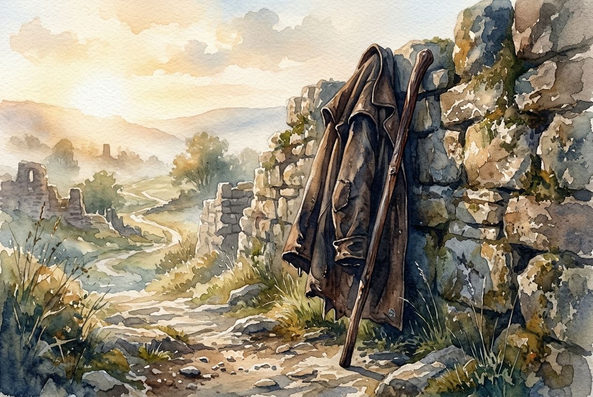

# Leitura Diária: Colossians 3:12-17

*7 de junho de 2026*

> *(Image: A well-worn leather traveler's cloak and a walking stick resting against a stone wall bathed in warm morning light.)*

## A Leitura (PT-NVI)

**Colossians 3:12-17**

> 12 Portanto, como povo escolhido de Deus, santo e amado, revistam-se de profunda compaixão, bondade, humildade, mansidão e paciência. 13 Suportem-se uns aos outros e perdoem as queixas que tiverem uns contra os outros. Perdoem como o Senhor lhes perdoou. 14 Acima de tudo, porém, revistam-se do amor, que é o elo perfeito. 15 Que a paz de Cristo seja o juiz em seus corações, visto que vocês foram chamados a viver em paz, como membros de um só corpo. E sejam agradecidos. 16 Habite ricamente em vocês a palavra de Cristo; ensinem e aconselhem-se uns aos outros com toda a sabedoria, e cantem salmos, hinos e cânticos espirituais com gratidão a Deus em seus corações. 17 Tudo o que fizerem, seja em palavra ou em ação, façam-no em nome do Senhor Jesus, dando por meio dele graças a Deus Pai.

## A História

A carta aos colossenses foi escrita para uma comunidade jovem que tentava descobrir como conviver em um mundo diverso e frequentemente hostil. O autor usa a metáfora do vestuário para descrever como eles deveriam se preparar para a vida em comum. No mundo antigo, colocar uma vestimenta era um ato deliberado, muitas vezes indicando o papel de uma pessoa ou sua prontidão para uma tarefa específica. Ao encorajar esses primeiros cristãos a adotarem deliberadamente um conjunto específico de virtudes comunitárias, o texto apresenta essas qualidades não apenas como sentimentos internos, mas como ações externas e intencionais. Elas são o equipamento prático necessário para lidar com o atrito das relações humanas. A passagem aponta para uma virtude suprema que atua como a camada final, mantendo todas as outras peças firmemente no lugar.

## Aplicação para Hoje

Quando saímos para o mundo todos os dias, somos inteiramente responsáveis pelo que trazemos para nossas interações com as outras pessoas. Não podemos controlar os perigos que enfrentaremos ou os comportamentos difíceis daqueles que encontramos pelo caminho, mas podemos escolher nossa própria postura. Decidir praticar a graça deliberadamente é como colocar um equipamento de proteção para a alma, que nos abriga do desgaste dos conflitos inevitáveis. Isso exige uma decisão consciente de abrir espaço para as falhas de nossos companheiros de viagem, reconhecendo que também dependemos da boa vontade deles. Deixar que uma tranquilidade interior guie nossas decisões nos ajuda a manter o equilíbrio quando o caminho se torna difícil. Tudo o que fazemos se transforma em uma oportunidade de expressar profunda apreciação pela companhia e pela própria jornada.

---

*Citações bíblicas extraídas da Nova Versão Internacional (NVI), © 1993, 2000 por Biblica, Inc. Usado com permissão.*
