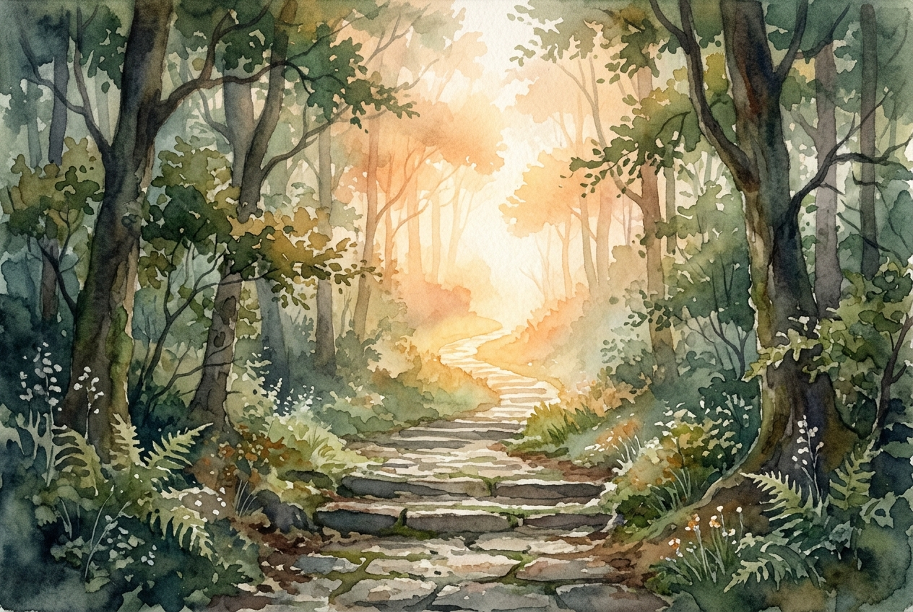

# Daily Reading: 2 Corinthians 4:16-18

*June 9, 2026*

> *(Image: A weathered stone path winding through a dense forest, leading toward a brilliant, warm light breaking through the morning mist.)*

## The Reading (NLT)

**2 Corinthians 4:16-18**

> 16 That is why we never give up. Though our bodies are dying, our spirits are being renewed every day. 17 For our present troubles are small and won't last very long. Yet they produce for us a glory that vastly outweighs them and will last forever! 18 So we don't look at the troubles we can see now; rather, we fix our gaze on things that cannot be seen. For the things we see now will soon be gone, but the things we cannot see will last forever.

## The Story

Paul wrote to a community living in a high-stakes, physically demanding world. As an itinerant church builder, his own life was marked by shipwrecks, beatings, exhaustion, and the natural aging process in an era without modern medicine. He understood intimately what it meant for the physical body to wear down under the friction of daily life. Yet he framed his staggering list of hardships as fleeting and relatively light. He was not denying his pain, but rather placing it on a scale against an entirely different kind of reality. He invited his readers to recognize a hidden, inward transformation happening even as their outward strength faded.

## Application for Today

We often evaluate our lives by what we can measure, touch, and track. Declining health, financial stress, or simply the exhaustion of a long week can easily dominate our field of vision. When the visible world demands all our attention, it is difficult to imagine that something invisible is quietly being built within us. The invitation here is to practice a different kind of seeing. We are asked to trust that our present struggles are not the final word, but rather a temporary season making way for profound endurance and grace. By shifting our focus from the immediate pressures to the quiet, enduring work of the Spirit, we find the resilience to keep going.

---

*Scripture quotations are taken from the Holy Bible, New Living Translation, copyright © 1996, 2004, 2015 by Tyndale House Foundation. Used by permission of Tyndale House Publishers.*
