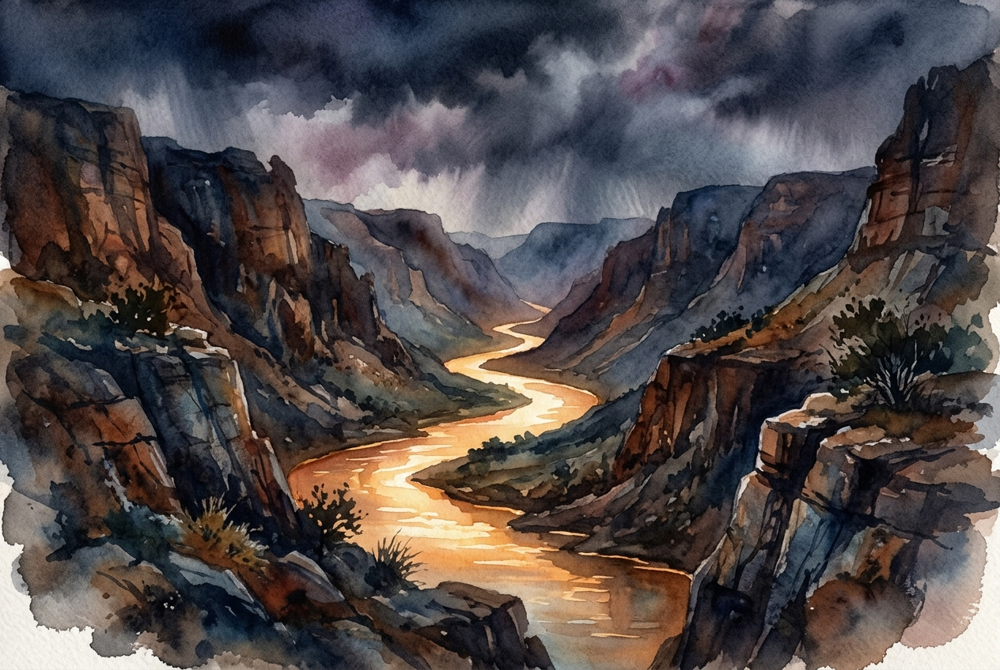

# Daily Reading: Psalm 46

*June 10, 2026*

> *(Image: A serene, glowing river flowing steadily through a deep, rocky canyon beneath a dark and stormy sky, painted in a contemplative, atmospheric style.)*

## The Reading (NLT)

**Psalm 46**

> 1 God is our refuge and strength, always ready to help in times of trouble. 2 So we will not fear when earthquakes come and the mountains crumble into the sea. 3 Let the oceans roar and foam. Let the mountains tremble as the waters surge! Interlude 4 A river brings joy to the city of our God, the sacred home of the Most High. 5 God dwells in that city; it cannot be destroyed. From the very break of day, God will protect it. 6 The nations are in chaos, and their kingdoms crumble! God's voice thunders, and the earth melts! 7 The Lord of Heaven's Armies is here among us; the God of Israel is our fortress. Interlude 8 Come, see the glorious works of the Lord: See how he brings destruction upon the world. 9 He causes wars to end throughout the earth. He breaks the bow and snaps the spear; he burns the shields with fire. 10 Be still, and know that I am God! I will be honored by every nation. I will be honored throughout the world. 11 The Lord of Heaven's Armies is here among us; the God of Israel is our fortress. Interlude

## The Story

The ancient poets often used the sea to represent ultimate chaos and untamed danger. In this song, the writer imagines the worst-case scenarios for their world, describing solid mountains collapsing into turbulent waters and entire political systems falling apart. Yet, right in the middle of this catastrophic imagery, the focus shifts to a gentle, life-giving river flowing through a secure city. The contrast is deliberate, showing that divine presence does not necessarily prevent the earth from shaking, but provides an unshakable center within it. The composition culminates in a divine command to drop weapons and cease frantic efforts, recognizing a power greater than human striving.

## Application for Today

When our personal landscapes shift unexpectedly, our first instinct is usually to fight for control. We try to manage the crisis, outthink the problem, or brace ourselves against the next wave of bad news. But the invitation here is fundamentally different, asking us to stop striving and simply recognize who is holding us. Letting go of our defenses feels counterintuitive when everything around us feels unstable. Yet true security is not found in our ability to hold our world together, but in trusting the quiet, enduring presence that remains when our own strength runs out. We can find peace not by fighting the storm, but by resting in the refuge.

---

*Scripture quotations are taken from the Holy Bible, New Living Translation, copyright © 1996, 2004, 2015 by Tyndale House Foundation. Used by permission of Tyndale House Publishers.*
