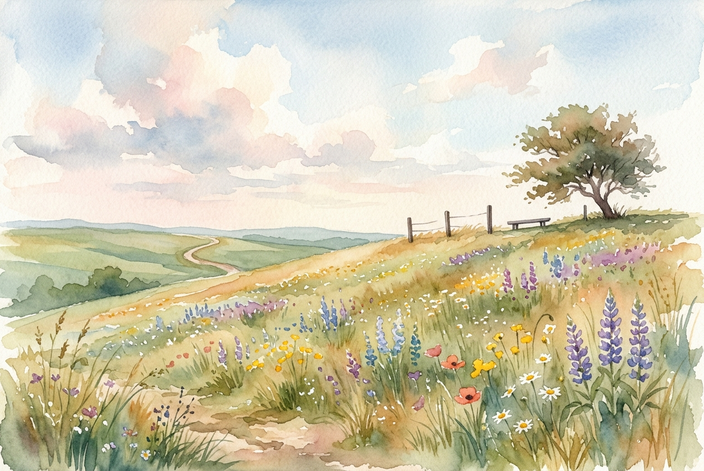

# Leitura Diária: Matthew 5:1-12

*11 de junho de 2026*

> *(Image: A serene, sunlit grassy hillside scattered with wildflowers beneath a vast, open sky, evoking a quiet place of retreat and reflection.)*

## A Leitura (PT-NVI)

**Matthew 5:1-12**

> 1 Vendo as multidões, Jesus subiu ao monte e se assentou. Seus discípulos aproximaram-se dele, 2 e ele começou a ensiná-los, dizendo: 3 "Bem-aventurados os pobres em espírito, pois deles é o Reino dos céus. 4 Bem-aventurados os que choram, pois serão consolados. 5 Bem-aventurados os humildes, pois eles receberão a terra por herança. 6 Bem-aventurados os que têm fome e sede de justiça, pois serão satisfeitos. 7 Bem-aventurados os misericordiosos, pois obterão misericórdia. 8 Bem-aventurados os puros de coração, pois verão a Deus. 9 Bem-aventurados os pacificadores, pois serão chamados filhos de Deus. 10 Bem-aventurados os perseguidos por causa da justiça, pois deles é o Reino dos céus. 11 "Bem-aventurados serão vocês quando, por minha causa os insultarem, perseguirem e levantarem todo tipo de calúnia contra vocês. 12 Alegrem-se e regozijem-se, porque grande é a recompensa de vocês nos céus, pois da mesma forma perseguiram os profetas que viveram antes de vocês".

## A História

As multidões que seguiam o mestre frequentemente esperavam um líder militar ou uma solução imediata para a opressão romana. Em vez de convocar um exército ou prometer poder terreno, ele sobe uma encosta e senta-se, adotando a postura clássica de um mestre judaico. A visão apresentada ali subverte completamente os valores daquela época e de qualquer império humano. Em vez de exaltar os fortes, os implacáveis ou os socialmente vitoriosos, o ensino foca naqueles que estão à margem da sociedade. A vulnerabilidade e o sofrimento deixam de ser vistos como castigos e passam a ser os lugares exatos onde a presença divina se manifesta com maior clareza.

## Aplicação para Hoje

Passamos grande parte de nossos dias tentando alcançar segurança, influência e uma vida livre de dores. No entanto, a mensagem da montanha nos convida a abandonar essa busca incessante pelos padrões de sucesso do mundo. Quando nos vemos exaustos, em luto ou dolorosamente conscientes de nossa própria fragilidade espiritual, não estamos fracassando. É justamente nesses momentos de esvaziamento que somos acolhidos por uma nova realidade. Somos chamados a praticar a misericórdia, a construir a paz e a manter a integridade, mesmo quando isso nos traz incompreensão. A verdadeira felicidade floresce quando alinhamos nossos corações a essa maneira silenciosa e transformadora de viver.

---

*Citações bíblicas extraídas da Nova Versão Internacional (NVI), © 1993, 2000 por Biblica, Inc. Usado com permissão.*
