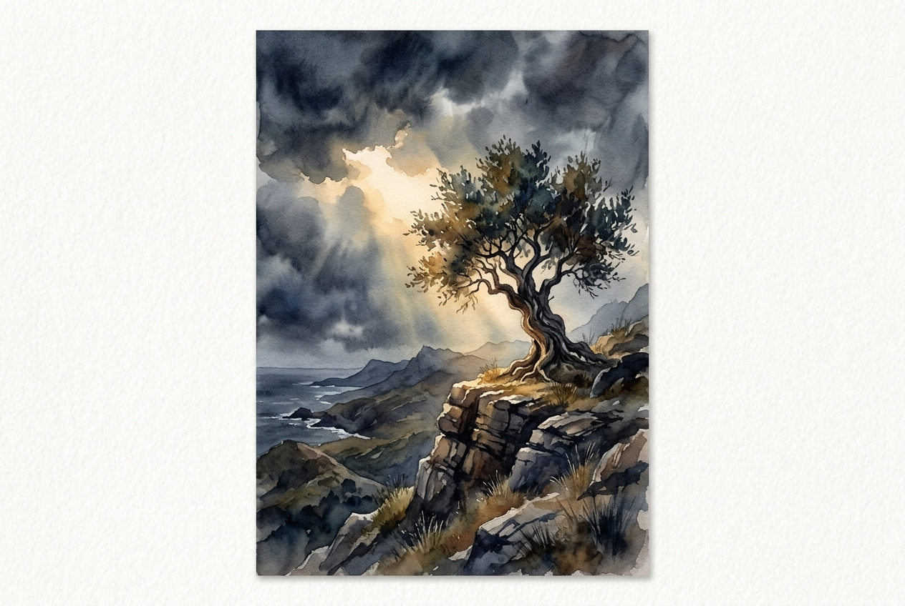

# Leitura Diária: 1 Peter 5:6-11

*11 de junho de 2026*

> *(Image: A solitary ancient olive tree standing strong on a rocky cliff face, illuminated by a warm beam of sunlight breaking through dark and turbulent storm clouds.)*

## A Leitura (PT-NVI)

**1 Peter 5:6-11**

> 6 Portanto, humilhem-se debaixo da poderosa mão de Deus, para que ele os exalte no tempo devido. 7 Lancem sobre ele toda a sua ansiedade, porque ele tem cuidado de vocês. 8 Sejam sóbrios e vigiem. O diabo, o inimigo de vocês, anda ao redor como leão, rugindo e procurando a quem possa devorar. 9 Resistam-lhe, permanecendo firmes na fé, sabendo que os irmãos que vocês têm em todo o mundo estão passando pelos mesmos sofrimentos. 10 O Deus de toda a graça, que os chamou para a sua glória eterna em Cristo Jesus, depois de terem sofrido durante pouco de tempo, os restaurará, os confirmará, lhes dará forças e os porá sobre firmes alicerces. 11 A ele seja o poder para todo o sempre. Amém.

## A História

As primeiras comunidades cristãs espalhadas pela Ásia Menor estavam exaustas. Vivendo como forasteiros, enfrentavam intensa pressão social, desconfiança e perseguição silenciosa de seus vizinhos. Nesta carta, eles recebem um reconhecimento de sua profunda ansiedade e das ameaças reais que os cercavam. O autor usa a imagem aterrorizante de um predador à espreita para validar a hostilidade que sentiam em seu cotidiano. No entanto, eles são lembrados de que suas lutas não são isoladas, pois pertencem a uma família global que suporta as mesmas provações. A mensagem desvia o foco da autossuficiência, orientando-os a se renderem a um Criador que enxerga o cansaço que carregam.

## Aplicação para Hoje

Quando nos sentimos cercados por hostilidade ou sobrecarregados por nossas próprias ansiedades, nosso instinto costuma ser lutar com mais força ou nos preocuparmos ainda mais. Este texto oferece um ritmo diferente, convidando-nos a abrir mão da nossa necessidade de controle e entregar nossos medos mais profundos a um Deus que cuida ativamente de nós. Somos chamados a manter a atenção contra as forças destrutivas do desespero e da divisão, mas a partir de uma postura de confiança enraizada em vez de pânico. Ajuda lembrar que nossas estações de dor são compartilhadas, conectando-nos a uma comunidade muito maior. A promessa final não é uma fuga imediata das dificuldades, mas uma restauração divina que nos reconstrói sobre alicerces inabaláveis.

---

*Citações bíblicas extraídas da Nova Versão Internacional (NVI), © 1993, 2000 por Biblica, Inc. Usado com permissão.*
